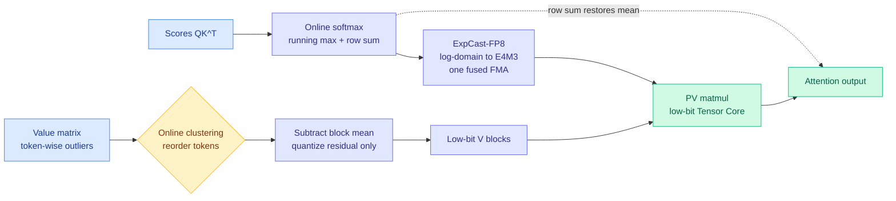

# VC-Attention: value smoothing and softmax casting for low-bit attention

**Source:** HuggingFace Daily Papers · [arXiv 2609.15810](https://arxiv.org/abs/2609.15810) · [raw](../../raw/huggingface/2026-09-17-vc-attention-value-smoothing-and-softmax-casting-for-low-bit.md)
**Authors:** Xingyang Li (MIT), Dongyun Zou (Nunchux AI), Shining Zhang (CMU), Jiacheng Chen, Haocheng Xi (Berkeley), Lvmin Zhang (Stanford), Jun-Yan Zhu (CMU), Song Han (MIT/NVIDIA), Zhekai Zhang, Yujun Lin, Muyang Li

## TL;DR

Low-bit attention kernels (running attention in INT8/INT4/FP8 instead of BF16) have spent two years fighting outliers in the query and key matrices. VC-Attention measures where the remaining error actually lives and finds it is the **value** matrix: after query-key smoothing and rotation, the value term accounts for roughly **82%** of output error on Wan2.2. Value outliers are structurally different from query-key outliers. Query-key outliers sit in a few fixed channels shared across tokens, so a channel-wise transform fixes them; value outliers sit in individual **tokens**, and the affected channels move between heads, layers and denoising steps, so no fixed channel transform can catch them. VC-Attention's answer is to reorder value tokens by cheap online clustering so that tokens landing in the same hardware block quantize well together, then quantize only the residual after subtracting the block mean, restoring that mean from the row sum the online softmax already computes for free. The second half of the paper attacks a pipeline problem rather than an accuracy problem: once both matmuls run on low-bit Tensor Cores, the high-precision FP32 exponential inside softmax becomes the longest stage. **ExpCast-FP8** maps log-domain scores straight to E4M3 probability codes with a single fused multiply-add, deleting the exponential and the format conversion. Training-free. **1.46-1.59x over BF16 FlashAttention-4 on datacenter Blackwell and Hopper, 2.3-3.6x on workstation cards**, and 1.13-1.70x end-to-end clip generation.

## Mechanism

## Key findings

- **The error budget was mismeasured.** After the standard query-key treatments (channel centering, scaling, Hadamard rotation), roughly 82% of the remaining attention output error on Wan2.2 comes from the value side. Every prior low-bit attention method (INT-FlashAttention, SageAttention 1/2/3, FlashAttention-3) optimized the smaller term.
- **Value outliers are token-structured, not channel-structured.** That is why they survived: a channel-wise smoothing transform is the wrong shape for them. One large token sets the quantization scale for its entire hardware block and squeezes every other token in that block into a narrow range of representable values.
- **V-Smooth is a permutation plus a mean subtraction, not a learned transform.** Lightweight online clustering reorders tokens so that similar-magnitude tokens co-locate in a block; only the residual after removing the block mean is quantized; the mean comes back from the row sum that online softmax already maintains. No calibration data, no training, no extra pass over the tensor.
- **The softmax became the bottleneck because the matmuls stopped being one.** This is the load-bearing hardware observation. Low-bit Tensor Cores accelerate only the two matrix multiplications, so the scalar FP32 exponential between them becomes the longest pipeline stage on datacenter GPUs. ExpCast-FP8 removes it by emitting E4M3 probability codes directly from log-domain scores.
- **Measured across five GPUs and four video models.** B200, B300, H200, RTX PRO 6000, RTX 5090; Wan2.2, LongCat-Video, HunyuanVideo-1.5, MiniMax-H3. Kernel speedup 1.46-1.59x on datacenter parts, 2.3-3.6x on workstation parts; end-to-end 1.13-1.19x and 1.36-1.70x respectively.
- **Attention is 64%+ of generation time** for a 720p five-second Wan2.2 clip (~70,000 tokens), which is why a kernel-level win converts into a visible end-to-end win at all.

## How this relates to what the wiki already knows

**It completes a claim [Why Does Post-Training Quantization Work? (09-11)](2026-09-11-why-post-training-quantization-works.md) made about weights and nobody had made about activations.** That paper explained why quantizing pretrained weights does not destroy the model: the error a layer newly introduces tends to **oppose** the error it inherits, so the discrepancy between the full-precision and quantized forward passes grows slowly, and the LM head's geometry preferentially preserves the scores of high-ranked tokens. That is a story about error that cancels itself over depth. VC-Attention is about error that does **not** cancel, because it is created inside a single fused kernel by a block-scaling decision, and no amount of downstream residual structure removes it. The two results together give a cleaner rule than either alone: **quantization error that flows through the residual stream gets attenuated by pretraining; quantization error created by a block quantizer's scale choice does not, and has to be fixed where it is made.**

**It is the third result in eight days saying that the interesting axis inside an attention kernel is no longer FLOPs.** [Hardware-aware attention kernels (09-13)](../hardware/2026-09-13-hardware-aware-attention-kernels.md) and [the online-softmax worklog (09-16)](../hardware/2026-09-16-softmax-kernel-worklog-online-softmax.md), which derived rather than asserted why a running maximum can be corrected with one multiplicative factor and therefore why tiled attention works at all, both landed on the same point from the bandwidth side. VC-Attention lands on it from the numeric-format side and adds the sharper version: **when you succeed at making the matmuls cheap, the scalar transcendental you left in the middle becomes the critical path.** That is a general statement about quantized kernels, not a video-diffusion statement.

**It sits opposite [SAS (09-14)](2026-09-14-sas-attention-sparsification-end-to-end.md) in the design space, and the two do not conflict.** SAS trains an end-to-end selector inside the softmax to decide which context to keep, reducing the **number** of token interactions. VC-Attention keeps every interaction and reduces the **cost of each one**. Both target the same kernel and neither cites the other; they are composable in principle, and nobody has composed them. That composition is the obvious next experiment: a sparse low-bit attention kernel where the selector picks the block and V-Smooth fixes the block's scale.

**It also gives [extreme quantization on Blackwell (09-10)](2026-09-10-extreme-quantization-blackwell-fp4-native-fp8.md) a missing term.** That page recorded the FP4/FP8 native-format story as a weights-and-activations question. VC-Attention says the probability matrix is a third quantizable object with its own format decision, and that emitting it directly in E4M3 rather than converting into E4M3 is worth a pipeline stage.

## Gaps

Every model evaluated is a **video diffusion transformer**. The value-outlier diagnosis is measured on Wan2.2 and the paper does not report the same error decomposition for an autoregressive LLM, where the value matrix carries KV-cache state rather than spatiotemporal features and the outlier structure may be entirely different. The 82% figure is the paper's central motivation and it is single-model. There is also no accuracy-versus-speed frontier against sparse attention at matched quality, and no measurement of what the online clustering costs when sequence length grows past the ~70K tokens tested.

## Research angle

The token-versus-channel distinction is the transferable idea and it is under-exploited. If value outliers are token-structured in video DiTs, the same question is open for the KV cache in long-context LLMs: are the outliers that force KV cache quantization to 8 bits rather than 4 bits channel-structured (fixable by a transform, which is what most KV quantizers assume) or token-structured (fixable only by reordering, which no KV quantizer does because it would break positional layout)? Nobody has published the decomposition. The answer decides whether KV-cache quantization has a factor of two sitting unclaimed.

## Related

- [quantization.md](quantization.md) · [kv-cache.md](kv-cache.md) · [gpu-kernels.md](../hardware/gpu-kernels.md)
- [Why Does Post-Training Quantization Work? (09-11)](2026-09-11-why-post-training-quantization-works.md)
- [HyQuant: hybrid-precision attention (09-11)](2026-09-11-hyquant-hybrid-precision-attention.md)
- [SAS: end-to-end attention sparsification (09-14)](2026-09-14-sas-attention-sparsification-end-to-end.md)
- [Making Softmax Fast (09-16)](../hardware/2026-09-16-softmax-kernel-worklog-online-softmax.md)
