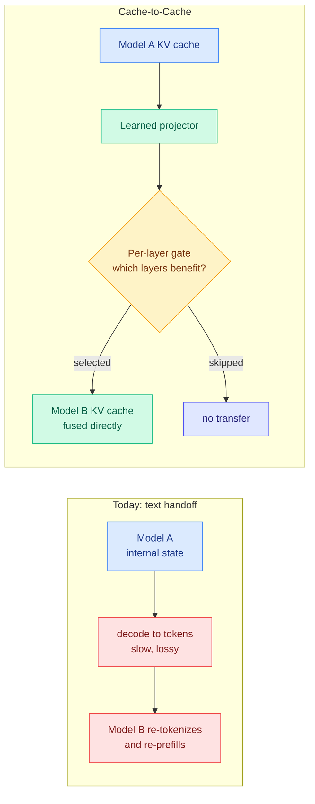

# Cache-to-Cache: two models talk by fusing KV caches instead of writing sentences

**Source:** X home feed + saved bookmark, 2026-09-18 (Tsinghua + Infinigence, reported as ICLR 2026, code open-sourced) · [@thesupermannx](https://x.com/thesupermannx/status/2100636553576124595) · [@AYi_AInotes](https://x.com/AYi_AInotes/status/2100925284539076924)

> **Evidence note.** This page is built from two social posts describing the paper, one of them the reader's own saved bookmark, not from the paper text. The mechanism is coherent and the venue claim is specific, but every number below is second-hand and should be treated as unverified until the arXiv entry is read directly.

## TL;DR

When two LLM agents cooperate today, the first one **decodes its internal state into human text** and the second one **re-tokenizes and re-prefills that text**. Cache-to-Cache (C2C) deletes that round trip. A learned neural projector maps the source model's **KV cache** (the stored attention keys and values that hold everything the model has computed about the context so far) directly into the target model's cache, with a **learnable gate selecting which layers actually benefit from the transfer**. Reported: accuracy up to **14.2 percent above the individual models**, over **5 percent above text-based agent communication**, and a **2.5x overall speedup** from skipping intermediate generation entirely.

## Why the framing is right even if the numbers are not yet verified

The cost argument is straightforward and does not depend on the benchmark. Text handoff between two models on the same machine pays **three separate taxes**: sequential decoding of the message, which is memory-bandwidth-bound and therefore the slowest thing a model does; re-prefilling on the receiving side, which is FLOP-bound; and **semantic loss**, because a high-dimensional internal state is being squeezed through a discrete vocabulary designed for humans. C2C removes the first two entirely and argues it reduces the third.

The gate is the part that suggests the authors understood the hard problem. A naive cache transfer would dump every layer's state across, which cannot be right: **the two models' layers are not in correspondence**, and early layers in particular encode surface form that is model-specific. Learning which layers benefit is the admission that the mapping is partial, and it converts the method from "share the cache" into "share the parts of the cache that transfer."

## How this relates to prior wiki pages

**It is a genuinely new use for the KV cache and [kv-cache.md](kv-cache.md) has no category for it.** Every entry on that page treats the cache as a **cost** to be compressed, evicted, quantized, placed on a cheaper tier or shared across layers. The 08-29 four-layers entry separated per-request KV, server-side prefix caching, provider-billed prompt caching and semantic caching, and all four are framings of the cache as an expense. **C2C treats the cache as a communication medium, an asset with content worth transmitting.** That is an axis the page does not currently have and should.

**It composes with the depth-sharing pattern the page has been building, in a way neither side has noticed.** The page's 09-10 and 09-14 entries established that transformer depth contains repeated computation that can be shared, reused or removed, across four instances: [DeepSeek V4.1 Flash](2026-09-18-deepseek-v41-flash-kv-cache-compression.md)'s CSA2 cross-layer reuse, WRP forward-free depth pruning, KVShare's finding that adjacent layers' KV projections are highly similar, and an external retrofit that predicts back-half KV states from front-half hidden states on a frozen Qwen3-8B. **All four share cache state across depth inside one model. C2C shares it across models.** If adjacent layers within a model are similar enough to substitute for each other, the question of how much structure two different models' caches share is the natural next one, and C2C's per-layer gate is effectively measuring exactly that. Nobody has connected these.

**It is the strongest available attack on a cost [multi-agent-systems.md](../agentic-systems/multi-agent-systems.md) has treated as fixed.** Multi-agent work on this wiki prices coordination in messages and rounds. **The text-serialization tax between agents has been an unexamined constant.** If it is removable for co-located models, then a large part of the multi-agent overhead literature is measuring an artifact of the interface rather than a property of coordination.

**It sharpens the 09-16 routing question rather than answering it.** [llm-routing.md](../ai-routing/llm-routing.md)'s 09-16 entry set up an unresolved head-to-head: [Gavel](../ai-routing/2026-09-16-gavel-native-skill-routing-frozen-llm.md) says the routing signal is already inside the agent model and should be read out of its hidden states for free, while [Jev](../ai-routing/2026-09-16-jev-decision-only-model.md) says it should come from a separate purpose-built model that never generates text. **C2C is evidence for Gavel's half of the argument**: it says model-internal state is rich enough to be worth moving directly, and that forcing it through text destroys something. That does not settle the routing question, but it is a point on the board for reading internals rather than re-deriving them.

## Gaps

Everything, at the moment. **No paper read, no arXiv ID captured, no independent reproduction.** The claimed +14.2 percent has no named benchmark attached in either social post. The critical unanswered question is **how general the projector is**: whether it must be trained per source-target model pair, which would make it a research result rather than an infrastructure primitive, or whether one projector serves a family. Also unaddressed in what was captured: whether this works across different tokenizers and different hidden dimensions, what it costs to train the projector, and whether the transferred cache can carry a prompt injection from the source model into the target with no text ever available to inspect. **That last one is a real safety property being removed**, since text handoff is currently the only point where a multi-agent system can be audited.

## Industrial implication

If the projector generalizes, the effect is structural: **co-located multi-agent systems stop paying for language.** The serving win is concentrated in exactly the workload that is growing fastest, long-horizon agent pipelines with many internal handoffs, where today every handoff is a full decode plus a full prefill. The 2.5x claim is plausible on mechanism alone for chains with several hops.

The strategic catch is the auditability one. Every multi-agent safety story on this wiki assumes the messages between agents are readable, because they are English. **C2C makes the inter-agent channel a tensor.** An architecture where agents coordinate in a representation no human can read, adopted because it is faster and cheaper, is a supervision problem being created for a serving reason, and the paper's framing as "bypassing human language" suggests the authors see that as the feature. **Track this one for what it does to oversight, not just for what it does to latency.**

## Related pages

- [kv-cache.md](kv-cache.md)
- [multi-agent-systems.md](../agentic-systems/multi-agent-systems.md)
- [llm-routing.md](../ai-routing/llm-routing.md)
- [DeepSeek-V4.1-Flash (09-18)](2026-09-18-deepseek-v41-flash-kv-cache-compression.md)
