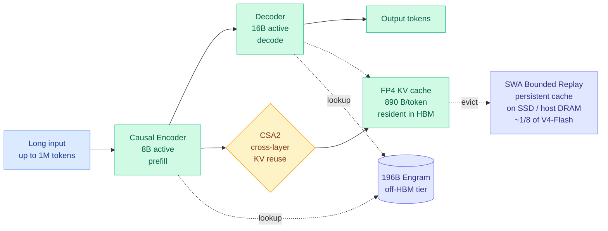

# DeepSeek-V4.1-Flash: 890 bytes per token, and the cache budget becomes an architecture

**Source:** HuggingFace Daily Papers, 2026-09-18 · [arXiv 2609.19969](https://arxiv.org/abs/2609.19969) · [Weights](https://huggingface.co/deepseek-ai/DeepSeek-V4.1-Flash) · [raw](../../raw/huggingface/2026-09-18-deepseek-v41-flash-pushing-the-limits-of-kv-cache-compressio.md)

**Cross-source confirmed:** HuggingFace Daily Papers + a same-day [SemiAnalysis measurement study](../hardware/2026-09-18-semianalysis-engram-dram-ssd-offloading.md) of this exact model's offloading behaviour.

## TL;DR

DeepSeek published the formal paper behind the V4.1-Flash weights it shipped on 2026-09-10. The headline number is the one this wiki has been waiting for: the global KV cache (the per-token attention state that must stay resident in HBM, the expensive high-bandwidth memory soldered next to the GPU die) is **890 bytes per token, roughly a quarter of DeepSeek-V4-Flash**. The persistent cache, the prefix state parked on SSD or host memory between turns, drops to about **one eighth** of the previous generation via a deployment trick the paper calls SWA Bounded Replay. The model is a 552B-backbone multimodal mixture-of-experts with a further **196B Engram parameters**, supports a million tokens of context, and activates **16B parameters when writing but only 8B when reading**. The strategic claim is that with a smaller cache it is also *better* than the model it replaces, so cache compression is not being paid for in quality here.

## What it actually does

The paper's framing is that KV cache cost is not one number but three separate bills, and they have different physics. **Prefill compute** is the FLOP bill for reading a large input, and agentic workloads are input-heavy because every tool call re-submits a long prompt. **Runtime KV storage** is the HBM bill, and it caps how many concurrent sessions fit on a GPU. **Persistent KV storage** is the SSD-and-interconnect bill for prefix caches held between turns, which decides what cache migration costs. Prior compression work mostly attacks one of these and is silent on the others.

V4.1-Flash compresses the global KV along **three orthogonal dimensions at once**: the number of values per cache entry (FP4 quantization, four bits per value), the number of entries along the sequence (Compressed Sparse Attention 2 selecting which tokens are worth keeping), and the number of layers that maintain an independent cache at all (CSA2's cross-layer reuse). Multiplying three independent reductions is how you get to a quarter of the footprint rather than the 20 or 30 percent that any single axis buys.

**SWA Bounded Replay is the piece that is genuinely new and the easiest to underrate.** Sliding-window attention layers only ever look at a bounded local window, so their KV state is reconstructible from the raw tokens by replaying a bounded amount of computation. That means you do not have to *store* it persistently at all. You store the global state, and you regenerate the local state on demand with a fixed, known compute cost. It is a deliberate compute-for-storage trade priced at the persistent tier, where storage and transfer are the binding constraints rather than FLOPs.

The **asymmetric encoder-decoder** is the fourth mechanism and the one the 09-10 wiki page already described from the release notes: 8B active parameters while reading, 16B while writing, on the premise that ingesting a million tokens and emitting the next one were never the same computational task. The paper adds a **reasoning-effort control variable** that lets a caller trade output length against accuracy at request time, which makes the inference cost a dial rather than a fixed property of the model.

## How this relates to prior wiki pages

**It supplies the number that [kv-cache.md](kv-cache.md)'s 09-14 entry had to borrow from a third-party X post.** That entry recorded an external KV-approximation retrofit that ported V4.1-Flash's encoder-decoder prefill shape onto an unmodified Qwen3-8B and reported prefill time down close to half, and the page flagged it as the weakest evidence it carries: no paper, no repository, no reproduction. The 890-bytes-per-token figure it cited for V4.1-Flash was itself inferred rather than published. **It is now published, and it matches.** The retrofit's mechanism was sound; the wiki can stop hedging on the number it was built against.

**It confirms the depth-sharing pattern at the strongest available evidence level.** [kv-cache.md](kv-cache.md)'s 09-10 entry named a three-instance pattern (CSA2's Reuse mode, WRP forward-free depth pruning which deletes whole blocks by comparing weights across layers with no calibration data, and KVShare which found adjacent layers' KV projections highly similar) and argued that **transformer depth contains repeated computation that can be shared, reused or removed**. That pattern was assembled from a model release, a pruning paper and a similarity measurement. It now has a frontier lab's own tech report stating cross-layer KV reuse as a first-class design axis, composed with quantization and token sparsity rather than competing with them. The page's claim that the axes are multiplicative is the correct reading.

**It answers the 09-10 page's open question about where the compression is being paid for, and the answer is "not in quality."** The [09-10 architecture page](../llms-foundation-models/2026-09-10-deepseek-v41-flash-architecture.md) noted the benchmark deltas over GPT-5.6 Sol were single-digit and came from third-party posts rather than an independent harness. The paper claims better performance than V4-Flash at a quarter of the cache, which is the direction that matters, but it is still the vendor's own evaluation.

**It does not answer the hallucination question, which is now two releases old.** The [V4 page (04-24)](../llms-foundation-models/2026-04-24-deepseek-v4-architecture.md) flagged a 94% hallucination rate despite Engram's O(1) factual retrieval and asked whether Engram was retrieving correctly while the reasoning layers overrode it. V4.1-Flash now carries 196B Engram parameters, more than a third of the backbone's size, and the paper reports no hallucination figure. Two consecutive releases have doubled down on the mechanism without publishing the number that would show whether the original concern was resolved or inherited.

**It sits on the flat part of the failure curve [SemiAnalysis measured on 09-14](../hardware/2026-09-14-semianalysis-4hi-hbm-bandwidth-over-capacity.md).** That study restricted HBM utilization from 92% to 85% on Kimi K3 across 16 GB300 GPUs, cut the GPU KV budget 36%, and found throughput tracked the full-memory run until concurrency passed roughly 70, then fell about 30% as a cliff rather than a slope. Every compression result on [kv-cache.md](kv-cache.md) operates on the flat part of that curve and none report where their own cliff is. **A four-times-smaller cache moves the cliff to higher concurrency; it does not remove it.** The paper does not say where V4.1-Flash's cliff sits.

## Gaps

No hallucination rate, two releases running. No independent harness reproduction of the agentic benchmark claims, which matters because agentic evaluations are harness-dependent and models are usually tuned against one primary harness. **No concurrency sweep showing where the compressed cache saturates**, which is the single number that decides whether the quarter-footprint claim translates into a quarter-cost claim in production. FP4 KV quantization is reported as a design choice rather than an ablation, so the share of the 4x attributable to precision versus sparsity versus cross-layer reuse is not separable from the paper. And SWA Bounded Replay's compute-for-storage trade has a break-even point that depends on interconnect speed and replay length; the paper gives the storage saving without the compute it costs.

## Industrial implication

The three-bills framing is the transferable part, and it is more useful than the model. Anyone serving long-context agents is currently paying an HBM bill, an SSD bill and a prefill-FLOP bill, and almost every published technique quotes an improvement against exactly one of them. **Reporting all three, and being explicit that a saving in one can be a cost in another, should become the default form for cache work.** For serving economics specifically: at 890 bytes per token a million-token context is roughly 890 MB of resident state, which is the first point at which million-token agentic sessions are arithmetically plausible at scale on current parts rather than a demo. And the timing is not accidental. [SemiAnalysis reported the same day](../hardware/2026-09-18-semianalysis-engram-dram-ssd-offloading.md) that NVIDIA despec'd Rubin Ultra from 1024 GB to roughly 200 GB of HBM per chip. A lab that cannot count on HBM capacity growing responds by making its model need less of it, and V4.1-Flash is what that response looks like in full.

## Related pages

- [kv-cache.md](kv-cache.md)
- [quantization.md](quantization.md)
- [memory-hierarchy.md](../hardware/memory-hierarchy.md)
- [DeepSeek V4.1 Flash architecture (09-10)](../llms-foundation-models/2026-09-10-deepseek-v41-flash-architecture.md)
- [SemiAnalysis Engram offloading (09-18)](../hardware/2026-09-18-semianalysis-engram-dram-ssd-offloading.md)
