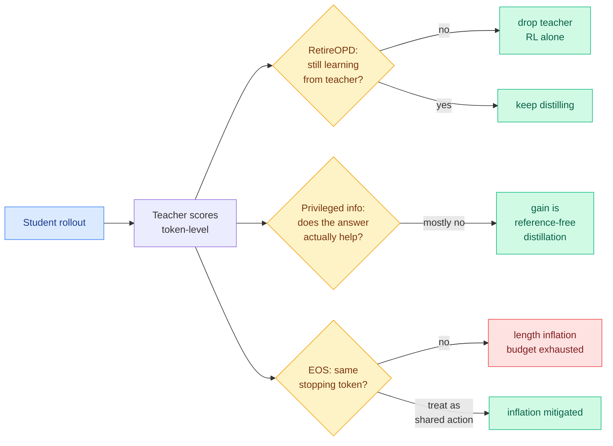

# Three on-policy distillation papers in one day, and they take the teacher apart from three sides

**Source:** HuggingFace Daily Papers, 2026-09-18
- **RetireOPD** · [arXiv 2609.20784](https://arxiv.org/abs/2609.20784) · [raw](../../raw/huggingface/2026-09-18-retireopd-self-retiring-on-policy-distillation-for-agentic-r.md)
- **What Does Privileged Information Add to On-Policy Self-Distillation?** · [arXiv 2609.20612](https://arxiv.org/abs/2609.20612) · [raw](../../raw/huggingface/2026-09-18-what-does-privileged-information-add-to-on-policy-self-disti.md)
- **When EOS Tokens Disagree** · [arXiv 2609.20511](https://arxiv.org/abs/2609.20511) · [raw](../../raw/huggingface/2026-09-18-when-eos-tokens-disagree-understanding-length-inflation-in-o.md)

## TL;DR

On-policy distillation (OPD) is the technique where a student model generates its own rollouts and a teacher scores them token by token, so the student gets dense supervision on its *own* trajectory rather than on the teacher's. Three papers landed on the same day, and each attacks a different assumption the technique rests on. **RetireOPD** attacks the schedule: the student should fire the teacher on its own, once it stops learning from it. **What Does Privileged Information Add** attacks the premise: giving the teacher the answer adds much less than the field assumes, and most of the gain is plain distillation. **When EOS Tokens Disagree** attacks the plumbing: students and teachers put stopping probability on *different* end-of-sequence tokens even when their declared stopping sets are identical, and that mismatch inflates output length. Together they are the sharpest single-day audit of OPD this wiki has recorded.

## RetireOPD: the student fires the teacher

Multi-turn agents trained with reinforcement learning get **one scalar reward per trajectory**, which is why self-distillation is attractive: a privileged teacher that has task skills the student lacks can supply dense token-level supervision to fill in that sparse signal. RetireOPD reports two findings that undermine the naive recipe. **Privileged information alone does not always make a teacher reliable**, and **the benefit of teacher supervision is stage-dependent**, strong early and fading later.

So it first trains a decoupled, skill-conditioned teacher against environment rewards, then trains a skill-free student jointly with RL and OPD under **Adaptive Retirement**: the student drops the teacher on its own once the discrepancy between them stops shrinking *and* it reaches a target fraction of the teacher's success rate, after which it continues with RL alone. Across Qwen2.5 from 1.5B to 7B it improves ALFWorld success rate over the RL baseline by **14.1 to 18.8 percent** and WebShop accuracy by **11.8 to 19.0 percent**, and **surpasses its own skill-conditioned teacher in every setting**.

That last clause is the important one. A student that beats its teacher is a student whose teacher became a ceiling, and the retirement rule is what lets it through.

## What Does Privileged Information Add: mostly not what you think

This paper builds **AMPLE-Math**, a reusable suite of 5,319 math problems with **six reasoning views that all share the same answer**, so you can compare each view against matched reference-free distillation and isolate what the privileged reference contributes beyond distillation itself. The result is deflationary. With a thinking-enabled teacher supervising direct-response rollouts, **reference-free distillation accounts for much of Qwen3-1.7B's improvement**, in domain and on external benchmarks. Evidence for an additional reference benefit is **modest**, strongest for a polished solution, and worth about **two percentage points in SmolLM3-3B at step 50**.

Two further results are the ones to carry. First, **the benefit is a property of the student, not the method**: at the same checkpoint, swapping short direct-response rollouts for long thinking-enabled rollouts turns gains into losses in both model families, with problems, references and evaluation all held fixed. Second, **changing token-level supervision can leave student behaviour largely unchanged**, which is an uncomfortable result for a field that spends most of its effort designing token-level losses.

The authors' interpretation is the most useful frame: OPD may be **improving access to reasoning capability the model already has**, through parameters shared between direct-response and thinking-enabled inference. The reference's value is what it adds to that cross-mode transfer, **not how much of the solution it reveals**.

## When EOS Tokens Disagree: the bug in the plumbing

Students trained with OPD often produce responses that grow until they exhaust the generation budget. This paper names a concrete cause: **termination-token mismatch**. Across Qwen3, Llama and Gemma, a base student and a post-trained teacher can place their stopping probability on **different EOS tokens even when their declared stopping sets are identical**. The distillation loss then suppresses the student's preferred stopping action without reliably transferring the teacher's preferred alternative, so the student learns to not stop.

The fix is the diagnostic. **Aligning the decoding stopping set alone is insufficient.** Treating functionally equivalent EOS tokens as a **shared semantic stopping action** substantially mitigates the inflation across all three families. The honest part: a stage-wise analysis across K2-Horizon training stages shows termination preferences shift substantially during training, and **a distinct length inflation appears late in the OPD run that persists even after termination alignment**. Mismatch is an important source, not the only one. They released an implementation with the corrections.

## How this relates to prior wiki pages

**The three of them together cross [knowledge-distillation.md](knowledge-distillation.md)'s threshold for declaring a pattern, and the pattern is that the teacher is being demoted.** The page has been moving this way for a month. The 08-25 entry recorded the shift from "most teacher tokens are useless" to "some are actively harmful." The 08-28 entry recorded the supervisor becoming optional and the label going with it. The 08-30 entry gave the teacher the right to abstain. The 09-11 entry recorded the teacher you build in order to be unlike it. **Today RetireOPD lets the student fire the teacher outright, the privileged-information study says the teacher's special knowledge was not what was helping, and the EOS paper says the teacher was corrupting a behaviour the student already had right.** Five weeks, one direction: the teacher's authority keeps getting narrowed, and today it narrowed on three axes at once.

**The privileged-information result directly qualifies the 09-16 entry.** That entry recorded that the teacher's reasoning distribution is a design parameter you are already setting whether or not you think about it. Today's paper agrees and then says something sharper: **the distribution matters, but the extra information you hand the teacher mostly does not.** If you are tuning what the teacher sees, you may be tuning the wrong knob; the knob that moved the numbers was whether the student's rollouts were short direct responses or long thinking traces.

**The EOS result explains a symptom [test-time-compute-allocation.md](test-time-compute-allocation.md) has treated as a modelling problem.** Length inflation in distilled students has been read as the student failing to learn when to stop, which invites reward shaping and length penalties as the fix. This paper says a meaningful share of it is **a tokenizer-level mismatch that no amount of length penalty addresses**, and that the cheap fix is to canonicalize functionally equivalent stopping tokens before training. **Anyone who added a length penalty to fix OPD inflation should check whether they were paying a reward-shaping cost to paper over a token-identity bug.**

**RetireOPD's stage-dependence finding confirms the shape of a claim this wiki has recorded twice before.** The 08-25 TIP-family result that most teacher-generated tokens carry no learning signal was a claim about *which tokens*. RetireOPD's is about *when*: the teacher's value decays over training. Both say teacher supervision is far less uniformly valuable than the loss function assumes, once along the token axis and once along the time axis.

## Gaps

RetireOPD tops out at 7B on two agentic benchmarks, and Adaptive Retirement has two thresholds (discrepancy plateau and target fraction of teacher success) whose sensitivity is not reported, which is exactly where a self-terminating schedule can fail quietly. The privileged-information study is math-only across two small model families, and its strongest claim, that OPD improves access to existing capability rather than adding capability, is an interpretation of the ablations rather than something directly measured. The EOS paper explicitly says termination mismatch is not exhaustive and leaves the late-training inflation unexplained. **None of the three measures compute cost**, which is notable for a family of methods whose main selling point over RL is sample efficiency.

## Industrial implication

The practical instruction is to stop treating OPD as one technique with one recipe. **Run the EOS canonicalization first, because it is nearly free and it is a correctness fix rather than a tuning choice.** Then check whether your privileged reference is earning its complexity, because the strongest available evidence says reference-free distillation captures most of the gain and the reference adds low single digits. Then add a retirement rule instead of a fixed schedule, because the teacher's value decays and a fixed schedule keeps paying for supervision after it stops helping. The through-line across all three is the same and it is a cost argument: **most of what teams currently spend on teacher infrastructure in OPD is buying less than they think.**

## Related pages

- [knowledge-distillation.md](knowledge-distillation.md)
- [test-time-compute-allocation.md](test-time-compute-allocation.md)
- [rl-for-llms.md](../llms-foundation-models/rl-for-llms.md)
