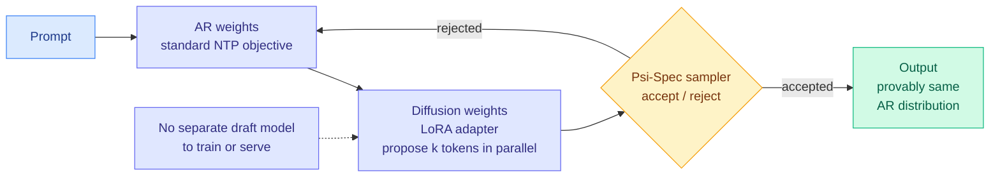

# Uno: a lossless speedup that needs no draft model

**Source:** X home feed, 2026-09-18 (the day's highest-ranked post) · [arXiv 2609.04010](https://arxiv.org/abs/2609.04010) · [Weights](https://huggingface.co/IFM/K2-Horizon-7B-Uno) · [Project page](https://s-sahoo.github.io/uno/) · [@IFM_AI](https://x.com/IFM_AI/status/2100618934915592640)

## TL;DR

Autoregressive generation emits one token at a time, and that sequential dependency is the hard floor on latency. The two standard escapes each give something up: **speculative decoding** needs a separate draft model to train, tune and keep resident, and **diffusion language models** emit many tokens at once but degrade the output distribution. Uno refuses both trades. It **decouples the parameters into two sets**: autoregressive weights trained with ordinary next-token prediction, and **lightweight diffusion weights** learned in a short distillation phase that adds negligible overhead to an existing training pipeline. The diffusion pathway only *proposes* several tokens in parallel; a sampler family called **Ψ-Spec** accepts them in a way that **provably reproduces the autoregressive model's own distribution**. Reported: higher throughput than leading speculative-decoding methods **at every evaluated batch size**, and **up to 3x over the base autoregressive model** including at the largest batch the device supports.

## Why "lossless" is doing real work here

The word is usually marketing. In this case it has a specific technical meaning worth stating: Ψ-Spec is constructed so that the accepted token sequence is distributed **exactly as the underlying autoregressive model would have produced it**. That is the same guarantee speculative decoding provides, and it is the reason speculative decoding was adoptable at all: you can turn it on without re-validating quality. Uno keeps that guarantee while deleting the draft model.

**The draft model is the part that has kept speculative decoding out of many stacks**, and this page has recorded that friction repeatedly. A draft model must be trained against the target, kept in sync when the target is updated, and held in memory alongside it. Uno's diffusion weights ship as a **LoRA adapter over the existing base**, Apache 2.0, so the serving change is an adapter load rather than a second model in the pool.

The paper also claims Uno can be **trained from scratch or built by augmenting existing open-weight autoregressive LLMs**, which is what makes it a retrofit rather than an architecture.

## How this relates to prior wiki pages

**It attacks the specific cost [speculative-decoding.md](speculative-decoding.md) identifies as the method's main adoption barrier.** Every variant on that page improves the draft, the verification, or the acceptance rate. None of them removes the draft model. Uno does, by making the "draft" a set of adapter weights inside the same forward pass rather than a separate network, which means it does not fragment the request stream or compete for HBM with the target.

**It belongs to the same-day pattern that [attention-mechanisms.md](../llms-foundation-models/attention-mechanisms.md) and the digest name as a per-unit computation decision.** [Video DeltaNet (09-18)](../llms-foundation-models/2026-09-18-video-deltanet-hybrid-attention.md) gates a cheap linear attention branch against an exact Softmax one and only applies the cheap path where the signal is redundant. Uno gates a cheap parallel proposal against an exact sequential fallback, accepting only when a verifier says the distribution is preserved. **Both are a cheap path plus an exactness guarantee, with a learned or principled decision about when the cheap path is allowed to stand.**

**It is orthogonal to everything on [kv-cache.md](kv-cache.md), and that matters for stacking.** Uno reduces the *number of sequential decode steps*; cache compression reduces the *bytes per step*. [DeepSeek-V4.1-Flash (09-18)](2026-09-18-deepseek-v41-flash-kv-cache-compression.md) got to 890 bytes per token by compressing precision, tokens and layers. Neither result touches the other's axis, so they should compose, and nobody has tried.

**It also intersects the routing page's batching concern in the good direction.** [The 09-14 routing entry](../ai-routing/llm-routing.md) flagged that fragmenting a request stream across a model pool shrinks batches, and [Sample Count Is Not Enough (09-18)](../hardware/2026-09-18-sample-count-generation-schedule-energy.md) measured small batches costing 4.64 to 4.86 times the energy of large ones. **Uno reports throughput wins at every batch size including the largest the device supports**, which is unusual: most decode-acceleration techniques lose their advantage as batching improves GPU utilization. If that holds under independent testing it is the most important claim in the paper and the abstract underplays it.

## Gaps

Vendor announcement plus an abstract, no independent reproduction. The tweet quotes **up to 2.2x** while the abstract quotes **up to 3x**, against different baselines (diffusion methods versus the base autoregressive model), and the gap should be understood before either number is cited. One model family at 7B, so nothing about whether the diffusion distillation phase stays cheap at frontier scale. **The claim that throughput wins hold at the largest supported batch size needs verification above all others**, because it is the one that contradicts the usual behaviour of decode-acceleration methods. And "negligible overhead to existing training pipelines" is a qualitative claim with no number attached.

## Industrial implication

If the batch-size claim survives scrutiny, this is the most immediately deployable efficiency result of the day, because the adoption cost is close to zero: an Apache-2.0 LoRA adapter over a base you already serve, with a distributional guarantee that removes the need to re-run quality evaluation. That combination is rare. The strategic read for anyone maintaining a speculative-decoding setup: **the draft model may be about to become optional**, and the operational saving from deleting a second model from the serving path is larger than the headline speedup for most teams.

## Related pages

- [speculative-decoding.md](speculative-decoding.md)
- [kv-cache.md](kv-cache.md)
- [attention-mechanisms.md](../llms-foundation-models/attention-mechanisms.md)
