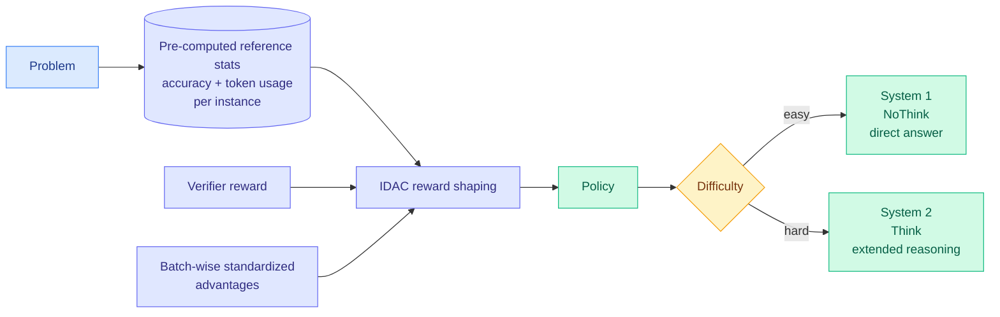

# When2Think: the efficiency tax gets priced, and then refused

**Source:** HuggingFace Daily Papers, 2026-09-18 · [arXiv 2609.19671](https://arxiv.org/abs/2609.19671) · [raw](../../raw/huggingface/2026-09-18-when2think-learning-difficulty-aware-length-control-for-effi.md)

## TL;DR

Large reasoning models overthink easy problems and underthink hard ones. The standard fixes, a uniform length penalty or a rigid router that sends a question to a thinking or non-thinking mode, both pay what this paper calls an **efficiency tax**: they buy reduced computation on easy instances with accuracy loss on hard ones. When2Think reformulates the problem as **instance-adaptive computation allocation** and introduces **Instance-level Difficulty-Aware Control (IDAC)**, a reward-shaping mechanism that uses pre-computed reference statistics (per-instance accuracy and token usage) to regulate reasoning depth. On AIME24 it raises Pass@3 by **10.0 percent while cutting token usage 27.9 percent** against the base model, which is the direction that says the tax was avoidable rather than intrinsic.

## The mechanism

The reference statistics are the trick. Rather than asking a model to judge difficulty at inference time, which is the fragile part of every routing scheme, When2Think **measures difficulty offline per training instance** by recording how often the base model gets it right and how many tokens it spends. Those two numbers become the reference against which the reward is shaped. An instance the base model solves reliably and cheaply should be answered directly; one it solves rarely and expensively earns extended reasoning.

The training setup is deliberately austere and that is part of the contribution. IDAC combines with verifier-based rewards and **batch-wise standardized advantages** to enable **critic-free optimization with no learned reward model and no online reference-model queries**. Every one of those omissions removes a serving-time or training-time cost that competing approaches pay. The output is a hybrid model that learns **when to use System 1 (NoThink) versus System 2 (Think)**, rather than being told by an external router.

On AIME25 it reaches 40.0 percent Pass@3, beating both compression baselines and routing-only baselines.

## How this relates to prior wiki pages

**It is the seventh decision on [test-time-compute-allocation.md](test-time-compute-allocation.md)'s growing list, and the first to be learned end-to-end from offline difficulty measurements.** The page has catalogued *whether* to spend, *how much*, *when* (08-29), and *what to do with the saving* (09-05). When2Think's contribution is to make the *how much* decision a learned function of per-instance difficulty statistics that cost nothing at inference. **That sidesteps the page's longest-running objection.**

**That objection is the unvalidated second estimator, and When2Think partially answers it.** The page has warned repeatedly that allocation methods depend on a selection signal nobody validated, most commonly the model's own confidence, which can be confidently wrong. [TASCO (09-12)](2026-09-12-tasco-stability-aware-test-time-adaptation.md) conditioned on confidence instead of defending or deleting it, on the observation that high confidence surviving a small perturbation is much more likely to be correct than high confidence that collapses. **When2Think takes the third option: it replaces the signal entirely with a measured one.** Offline per-instance accuracy is not an estimate of difficulty, it is a sample of it. The cost is that it is only available for instances you have already measured, so the signal must generalize from training instances to unseen ones, and the paper does not isolate how well it does that.

**It is the cleanest refutation on the page of the efficiency-tax framing.** Prior entries accepted a frontier where you trade accuracy for tokens. **Raising Pass@3 ten points while cutting tokens 28 percent is a move inside the frontier, not along it**, which says the base model's allocation was leaving both on the table. That is a stronger claim than any compression result on the page and it deserves independent reproduction before it is relied on.

**It composes with, and is partly measured by, [Sample Count Is Not Enough (09-18)](../hardware/2026-09-18-sample-count-generation-schedule-energy.md).** That paper shows the same candidate budget executed as eight serial calls instead of one batched call costs 4.64 to 4.86 times the GPU energy. **When2Think reduces tokens per instance; the scheduling result reduces energy per token budget. They are orthogonal and multiplicative, and neither paper measures the other's axis.**

## Gaps

Mathematical benchmarks only, and AIME specifically, where difficulty is unusually well-behaved and verifiers are exact. Whether pre-computed reference statistics transfer to open-ended domains with no verifier is the entire question for deployment and is untouched. **The cost of computing the reference statistics is not netted against the reported saving** anywhere visible, and it requires sampling the base model repeatedly per training instance. Pass@3 is a generous metric for an efficiency claim; the token reduction should be reported at Pass@1 as well. And no analysis of what happens on instances whose difficulty the base model mis-measures, which is precisely where an offline signal should fail.

## Industrial implication

The deployable shape is not the training recipe, it is the observation that **difficulty is cheaply measurable offline and does not need to be inferred online**. Any team with logs of which queries their model gets right and how many tokens it spent already has the raw material for a reference statistic, and that is a far more solid routing signal than a confidence score. The near-term product form is a per-query reasoning-effort default derived from historical difficulty on similar queries, which is one step from what [DeepSeek-V4.1-Flash (09-18)](2026-09-18-deepseek-v41-flash-kv-cache-compression.md) shipped as a caller-set reasoning-effort variable. **The model now exposes the dial; this paper says the dial can be set from data rather than by the user.**

## Related pages

- [test-time-compute-allocation.md](test-time-compute-allocation.md)
- [llm-routing.md](../ai-routing/llm-routing.md)
- [Sample Count Is Not Enough (09-18)](../hardware/2026-09-18-sample-count-generation-schedule-energy.md)
