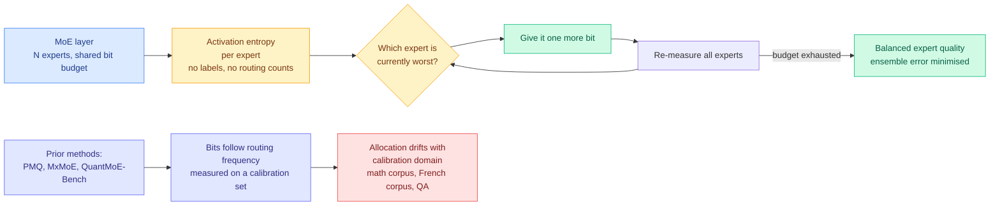

# Colla-Q: give the extra bits to the weakest expert, not the busiest one

**Date ingested:** 2026-09-19
**Source:** Kurate cs.LG weekly leaderboard (#19, the only entry on either board the farmer tagged as a core-efficiency topic). Absent from HuggingFace Daily Papers, so this is a quality-signal-only find.
**Links:** [arXiv 2609.18131](https://arxiv.org/abs/2609.18131) · [alphaXiv overview](https://www.alphaxiv.org/abs/2609.18131)
**Authors:** Eunju Shin, Jongbin Ryu (Ajou University, South Korea)
**Raw:** [raw/kurate/2026-09-19-cs-lg.md](../../raw/kurate/2026-09-19-cs-lg.md)

## TL;DR

Quantizing a mixture-of-experts model (MoE, the architecture where a router sends each token through a small subset of specialised sub-networks instead of the whole network) is harder than quantizing a dense model, for a reason that is obvious once stated. Each expert holds far fewer parameters than a whole dense model, so each expert is individually more fragile at low bit-width, and the layer's output is a weighted combination of whichever experts fired. **One badly damaged expert contaminates every token that routes through it.** Every existing mixed-precision MoE method, PMQ and MxMoE included, decides where to spend bits by asking which experts are *used most*, measured on a calibration set. Colla-Q asks a different question: which expert is currently *worst*, and hands the next bit to that one. It measures expert quality with an **activation-entropy** statistic that needs no labels, then runs a **minimax** allocation loop that repeatedly bumps the weakest expert. On Mixtral 8x7B at an average of **2.54 bits per weight it reaches 68.5% average accuracy across eight benchmarks, against 67.5% for PMQ, 65.1% for MxMoE and 42.9% for uniform GPTQ.**

## The mechanism

The justification is an ensemble argument and it is clean. Treat the MoE layer as an ensemble whose experts contribute roughly independent errors. Under approximately uniform average routing weights and a fixed total error budget, minimising the **sum of squared** expert errors drives you to a solution where all experts have similar error. A sum of squares punishes outliers, so the optimal allocation is the one with no weak link. That is a minimax objective, and it says the opposite of what frequency-based allocation says: a rarely-used expert that has been crushed by 2-bit quantization is a worse problem than a heavily-used expert that is merely slightly degraded, because when the rare expert does fire it produces garbage.

The second contribution is the metric. Routing-based importance has a structural flaw the paper names precisely: **routing frequency is a property of the calibration corpus, not of the model.** Calibrate on math and the experts that specialise in numerical reasoning look important; ship that allocation and it underperforms on general text. Activation entropy is computed from the expert's own output distribution and needs no labels and no task-specific traffic. The robustness numbers are the most persuasive part of the paper: across C4, math, French and QA calibration sets, Colla-Q's per-expert metric holds **cosine similarity above 0.98**, while PMQ's routing-based metric varies at **0.72 to 0.86**. A method whose allocation barely moves when you change the calibration corpus is a method you can ship without re-tuning.

## Key takeaways

- **Mixtral 8x7B at 2.54 average bits:** 68.5% average across eight benchmarks. PMQ 67.5%, MxMoE 65.1%, uniform GPTQ 42.9%. MMLU 59.4% against PMQ's 56.4%; ARC-Easy 79.8% against 77.1%.
- **At 1.57 average bits:** 54.5% against PMQ's 53.6%. The margin narrows as the budget tightens, which is honest and slightly disappointing, because sub-2-bit is where an allocation policy should matter most.
- **Calibration robustness:** metric cosine similarity above 0.98 across four very different calibration corpora, against 0.72 to 0.86 for the routing-based baseline.
- **Models covered:** Mixtral 8x7B (46.7B), DeepSeek-MoE-16B-Base, Phi3.5-MoE (42B).

## How this connects to what the wiki already knows

**This is the eleventh entry on the [quantization page](quantization.md) supporting its organising finding, that uniform precision is the wrong default, and the first one where the non-uniformity axis is "which sub-network is weakest" rather than "which tensor is most sensitive."** The page's prior axes have been per-layer, per-channel, per-tile ([TileMix, 08-25](2026-08-25-tilemix-tile-centric-mixed-precision-attention.md), FP16 or INT8 chosen per matrix tile), per-token, key-versus-value ([the 09-17 attention-kernel error-budget study](2026-09-17-vc-attention-low-bit-value-smoothing.md), which found the error budget sits on the value side), and direction-versus-magnitude ([09-16](2026-09-16-directional-decomposition-compression-error.md)). All of those are properties of a tensor. Colla-Q's axis is a property of a *routed component*, and it is the first that requires reasoning about the layer as an ensemble rather than as a matrix.

**The minimax framing contradicts the default assumption in the routing literature on this wiki, and the contradiction is worth naming rather than smoothing over.** Every router page entry, from [VoI-MoLE (08-05)](../ai-routing/2026-08-05-vi-mole-value-of-information-routing.md) onward, spends its budget where the traffic is, because that is where the expected value is. Colla-Q says that for a *quantization* budget the expected-value logic inverts, because the cost is not paid at allocation time but at the moment a neglected expert fires. **These are compatible once you see that one is optimising average-case throughput and the other is bounding worst-case output quality, but no paper on either side has stated the distinction, and the natural composition, route by frequency and quantize by weakness, has not been tried.**

**Third, it arrives directly into the week's dominant hardware constraint.** [SemiAnalysis on 09-18](../hardware/2026-09-18-semianalysis-engram-dram-ssd-offloading.md) reported that NVIDIA cut Rubin Ultra from 1024 GB to roughly 200 GB of HBM per chip, and the whole Engram-offloading argument exists because expert and embedding parameters no longer fit. **MoE parameters are the single largest thing that has to be either shrunk or paged out, so an MoE quantization method that holds quality at 2.54 bits is a direct substitute for offloading rather than a complement to it**, and nobody has priced the two options against each other. Ken Huang's [Chapter 7 on serving mega-MoE at scale](../hardware/2026-09-19-moe-decode-batch-fragmentation.md), published the same week, lists extreme quantization and parameter offloading as separate chapters and never compares them.

## Gaps

The result is a post-training-quantization comparison on three MoE models and eight accuracy benchmarks, with **no wall-clock or memory-footprint numbers at all**. Mixed-precision allocation at non-uniform bit-widths is notoriously hard to make fast, because the kernel has to handle heterogeneous expert formats, and a 1-point accuracy gain over PMQ is worth nothing if it costs 20% throughput. The paper also assumes approximately uncorrelated expert errors and approximately uniform average routing weights to derive the balanced solution, and both assumptions are known to be false in real MoE models with load-imbalanced routers. Finally, the margin over PMQ at 1.57 bits is under one point, which is inside the noise band for eight-benchmark averages unless variance is reported, and it is not.

## Related pages

- [quantization.md](quantization.md)
- [model-pruning-sparsity.md](model-pruning-sparsity.md)
- [llm-routing.md](../ai-routing/llm-routing.md)
- [memory-hierarchy.md](../hardware/memory-hierarchy.md)
