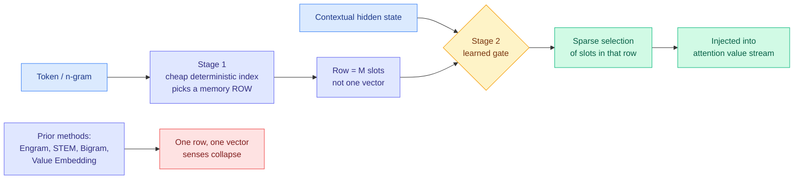

# MoME: giving the memory table a router, so "python" can mean two things

**Date ingested:** 2026-09-19
**Source:** X home feed via [@askalphaxiv](https://x.com/askalphaxiv/status/2101058654426235282) · alphaXiv
**Links:** [arXiv 2609.15126](https://arxiv.org/abs/2609.15126) · [alphaXiv overview](https://www.alphaxiv.org/abs/2609.15126) · [code](https://github.com/jojo23333/Mixutre-Of-Memory-Embedding)
**Authors:** Muchen Li, Leonid Sigal, Renjie Liao (UBC, Vector Institute)
**Raw:** [raw/twitter/feed/2026-09-19-morning-ranked.json](../../raw/twitter/feed/2026-09-19-morning-ranked.json)

## TL;DR

Conditional memory is the cheap-capacity trick where you bolt a trainable embedding table onto a transformer and let each token pull a vector out of it, so the model does not have to reconstruct common associations through layers of attention and feed-forward compute. DeepSeek's **Engram** is the best-known instance, and it is the reason a 189 GiB lookup table is currently the most discussed object in inference infrastructure. Every existing method, Engram included, indexes that table **deterministically by surface form**, so every occurrence of "python" retrieves the same vector whether the sentence is about a language or a snake. **MoME replaces each token's single memory row with a mixture of M slots and adds a learned gate over the hidden state to pick which slots to read.** It beats Value Embedding, Bigram, and STEM at equal parameters and equal training FLOPs across nanochat, Llama-3/MobileLLM and Qwen3 backbones, scales better with memory size at sub-billion scale, and the learned routes turn out to correspond to word senses.

## The mechanism

Retrieval happens in **two stages**. The first is the cheap deterministic index everyone already uses: the token or n-gram picks a row. The second is new: the model's own contextual hidden state routes among the slots *inside* that row. This is deliberately the mixture-of-experts pattern, where each token activates only a small subset of specialised sub-networks, transplanted from feed-forward compute onto memory lookup. It keeps the property that makes memory tables attractive, which is that a lookup is nearly free compared to a layer of computation, while removing the property that made them blunt.

**The interpretability result is the part that makes this more than a benchmark bump.** Routing analyses on polysemous tokens show the gate dispatching the same surface token to different slots under different senses. The router learned word-sense disambiguation as a side effect of being allowed to condition on context. That is unusual: a mechanism introduced for efficiency reasons produced a representation with a legible semantic structure, which is not what MoE routing usually does.

Results: outperforms the memory baselines at **iso-parameter and iso-training-FLOP** settings, a **better memory-size scaling trend** at sub-billion scale, and a sub-billion-parameter model competitive on CORE-22 against Qwen3-0.6B and Llama 3.2-1B. Code and pretrained models are public.

## How this relates to prior wiki state

**This lands directly on top of yesterday's Engram thread, and it was written without knowledge of it.** The [09-18 SemiAnalysis piece](../hardware/2026-09-18-semianalysis-engram-dram-ssd-offloading.md) reported that DeepSeek-V4.1-Flash's Engram table runs about **189 GiB**, that moving it out of HBM to DRAM or SSD makes the model *faster even when you had the HBM to spare* because the freed memory buys batch size, and that this codesign matters more now that NVIDIA despecced Rubin Ultra's HBM from 1024 GB to roughly 200 GB per chip. That analysis rests on one architectural property: **Engram's addresses depend on token IDs, not hidden states**, so the runtime can prefetch rows from host DRAM while earlier layers compute.

**MoME breaks that property, and the wiki should say so plainly.** Its second stage is gated on the hidden state. A row can still be prefetched by token ID, but *which slots inside the row get read* is not known until the hidden state exists. If M is small and slots are contiguous, you prefetch the whole row and the offloading story survives intact. If M is large, MoME's accuracy gain is bought partly with the prefetchability that makes Engram cheap to page out. **Nobody has measured this, and it is the single most decision-relevant open question the two papers jointly create.** SemiAnalysis's own finding cuts both ways here: they also reported that strong gate scores do **not** identify cache-hot rows, and that skipping reads based on a low gate does not save anything because computing the gate requires the retrieved key in the first place. MoME adds a second gate with the same structural problem.

**It also refines a claim the SemiAnalysis piece made about what memory is for.** Their ablations found that removing Engram degraded encyclopedia text and code badly but left GSM8K within run-to-run noise, and that forcing the ablated model to keep the original expert choices made things *worse* than letting it reroute. Their conclusion was that memory features and expert selection work together rather than splitting cleanly into "memory stores facts, experts reason." MoME is the constructive version of that same observation: if memory and routing are entangled anyway, **give the memory its own router** rather than pretending it is a passive dictionary.

## Gaps

- **Sub-billion scale only.** Every result is at a scale where memory tables are relatively larger compared to the backbone. The Engram results that matter commercially are at 1.6T-parameter MoE scale, and the wiki has no evidence the ranking survives the trip.
- **No serving-cost measurement.** The paper reports training and inference efficiency in FLOPs and parameters. It does not report what the hidden-state gate does to prefetch, offload, or memory bandwidth, which is precisely where Engram's production value lives.
- **No comparison against Engram itself at Engram's scale.** STEM and Bigram are the baselines; Engram is discussed as related work.
- Interpretability is reported qualitatively plus some quantitative correlation. "A degree of semantic interpretability" is the paper's own hedge, and it is the right one.
