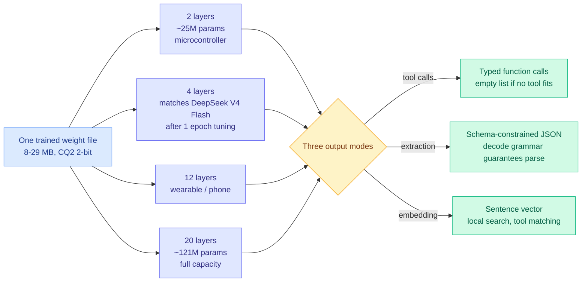

# Needle 3: one set of weights that is nineteen models, from 8 MB up

**Date ingested:** 2026-09-19
**Source:** Cactus Compute · [@cactuscompute](https://x.com/cactuscompute/status/2100685924401295764) (highest-ranked post in the day's X home feed)
**Links:** [Announcement + model page](https://cactuscompute.com/needle)
**Raw:** [raw/twitter/feed/2026-09-19-morning-ranked.json](../../raw/twitter/feed/2026-09-19-morning-ranked.json)

## TL;DR

Cactus released **Needle 3**, an automation model that ships as a single **8-29 MB binary** and contains **nineteen usable models inside it**. Every depth from 2 to 20 layers is a valid standalone sub-network with monotonically increasing capacity, so a developer picks a rung on the ladder rather than picking a checkpoint. It is **25-121M parameters at CQ2 (2-bit) quantisation**, built on Cactus's Simple Attention Network, trained on **360B tokens of structured data**, and decodes at **400 to 4,000 tokens/sec on a Raspberry Pi 5**. Cactus claims the **4-layer** slice matches **DeepSeek V4 Flash** on downstream tasks after one epoch of fine-tuning. It deliberately cannot chat. Every turn is a function call, a typed record, or an embedding.

## The mechanism: intelligence laddering

**Intelligence laddering** is the contribution worth naming. The usual way to serve a size range is to train a family, Qwen at 0.5B/1.5B/3B/7B, and ship four artifacts that share nothing at inference. Needle trains one network such that **every prefix of its layer stack is itself a competent model**, with capacity increasing monotonically as you add layers. You ship one binary; the deployment target decides where to cut. A microcontroller takes the 2-layer slice, an AR headset takes the 12, a laptop takes the 20, and all of them are reading the same weights.

The efficiency argument is not only about the size of the download. It is that **each sub-network is independently fine-tunable**, which is what makes the DeepSeek V4 Flash claim interesting. The 4-layer rung is not a lobotomised 20-layer model limping along; it is a target you can specialise, and Cactus's claim is that one epoch of downstream tuning on a 4-layer slice reaches the quality of a frontier-class flash model on the tasks it was tuned for.

## The trade being made, stated explicitly

Needle **does not chat**, and Cactus is unusually direct that this is the entire source of the gain. 121M parameters trained on structured data beat models **10x their size** on mobile tool calls and match **2-3x bigger** models on structured JSON extraction, because none of the capacity is spent on open-ended prose. Three behaviours follow from the design:

- Ask for two things, get two calls in order.
- Ask for something no tool covers, get an **empty list, not a guess**. The refusal is architectural, not a prompt instruction.
- Declare a shape, get typed fields back, with a **decode grammar that guarantees the output parses**.

The same model also returns sentence embeddings, so on-device semantic search, near-duplicate alert collapsing, and matching a request against hundreds of tools all run locally off one artifact. Prebuilt engines exist for macOS, Linux, Windows, Android, iOS, watchOS, tvOS, the browser and WASI hosts.

## How this relates to prior wiki state

**This is the compression-side twin of the day's other big story, and they were published hours apart.** The [Jev clone wave (09-19)](../ai-routing/2026-09-19-jev-open-clones-commoditization.md) arrives at "the decision layer should be a small local artifact" by reading typed choices straight out of a model's logits with no decode loop. Needle arrives at the same place by training a tiny structured-output model from scratch and slicing it. Different mechanism, identical product thesis, same week. **Two independent teams converging on "stop calling a frontier API to decide things" is the pattern, and the routing page should carry it as one.**

**It extends the wiki's elastic-inference thread rather than starting it.** The [looped-transformers page](../llms-foundation-models/looped-transformers.md) tracks the neighbouring idea that depth can be spent per-token at run time, which Sebastian Raschka reprised in a video the same day explaining Mixture-of-Recursions, where a learned router decides which tokens take extra passes through the same layers. Both make depth a variable. The difference is **who decides and when**: Mixture-of-Recursions decides per token at inference, Needle decides per deployment at build time. Needle's version is strictly less flexible and strictly more predictable, which for a microcontroller is the right trade.

**It is also a data point for the on-device thread in [hardware/](../hardware/2026-09-10-robot-inference-on-device-vs-datacenter.md).** A 2-bit, 8 MB model doing 4,000 tokens/sec of decode on a Raspberry Pi 5 sits well below the threshold where datacenter round-trips are defensible for tool selection.

## Gaps

- **Every number is vendor-reported.** The "4 layers matches DeepSeek V4 Flash" claim is the load-bearing one and it is qualified with "when tuned on downstream tasks for one epoch," which makes it a claim about a specialised model beating a general one on the specialisation. That is plausible and much weaker than it first reads.
- **No calibration reporting**, the same gap the Jev clones have. A tool-selector that returns an empty list when unsure is only useful if "unsure" is well estimated.
- **CQ2 is Cactus's own quantisation format**, not a standard one, so the 8-29 MB figure is not directly comparable to a GGUF or AWQ artifact of the same parameter count.
- No published eval on a third-party benchmark. Mobile tool calling has no standard leaderboard, which makes "beats models 10x its size" unfalsifiable as stated.
