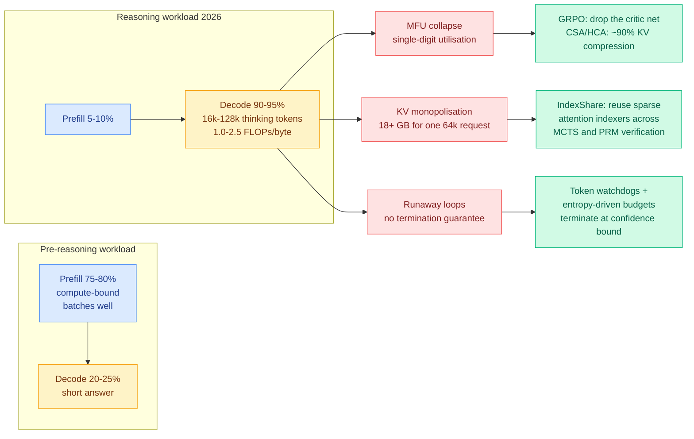

# The decode inversion: reasoning models turned serving clusters into memory-bandwidth machines

**Date:** 2026-09-20
**Topic:** inference-efficiency
**Source:** Ken Huang / DistributedApps.ai, *Chapter 8: Test-Time Compute & Reasoning Dynamics: DeepSeek-V4-Pro, GLM-5.3 & Kimi K3*
**Link:** [kenhuangus.substack.com](https://kenhuangus.substack.com/p/chapter-8-test-time-compute-and-reasoning)
**Raw:** `raw/rss/2026-09-19-agentic-ai-chapter-8-test-time-compute-reasoning-dynamics-deepseek.md`

---

## TL;DR

Chapter 8 of a ten-part engineering series on frontier LLM inference makes one structural claim and
then lists what production systems are doing about it. The claim: the arrival of long-reasoning
models has **inverted the computational profile of serving**. Historical LLM workloads spent 75% to
80% of cluster time in prefill, the phase that processes the input prompt and is compute-bound and
easy to batch. Frontier reasoning systems now spend **90% to 95% of GPU cycles in autoregressive
decode**, generating 16,000 to 128,000 internal thinking tokens before emitting an answer. Decode
runs at an arithmetic intensity of roughly 1.0 to 2.5 FLOPs per byte, which means the FLOPs are
irrelevant and the memory bus is the machine. A multi-million-dollar cluster bought for its compute
is now rate-limited by how fast it can move bytes.

Three consequences follow, and the chapter names them precisely: **MFU collapse** (model FLOPs
utilisation falls into single digits), **KV cache monopolisation** (one 64k-token reasoning request
consumes over 18 GB of GPU VRAM under standard grouped-query attention, starving every other tenant
on the node), and **execution stochasticity** (long reasoning trajectories can enter recursive
backtracking loops and burn tokens without terminating).

Most of the chapter is paywalled. The free portion carries the framing and the roadmap, which is
where the value is.

---

---

## The three infrastructure responses

**DeepSeek-V4-Pro: remove the critic, compress the cache.** Group Relative Policy Optimization
(GRPO, a reinforcement-learning method that estimates how good an action was by comparing it to
other samples from the same prompt) eliminates the separate value network that PPO-style training
normally carries. That network is a second full model held in memory during training, so dropping it
is a memory win before it is an algorithmic one. Alongside it, Compressed Sparse Attention (CSA) and
Heavily Compressed Attention (HCA) are reported to shrink reasoning KV caches by roughly 90%.

**Zhipu AI GLM-5.3: make the effort level an API parameter, and reuse the index.** A unified
reasoning engine exposes `reasoning_effort` at low, high and max, sustaining up to 128,000 output
tokens against a 1M-token context. Its IndexShare mechanism reuses sparse attention indexers across
Monte Carlo tree search and process-reward-model verification, so the structure computed once during
search is not recomputed during scoring.

**Moonshot AI Kimi K3 and Qwen 3.8: budget the thinking.** Hybrid linear attention (Kimi Delta
Attention) paired with token watchdogs and entropy-driven dynamic thinking budgets that terminate the
search when confidence stops improving rather than when a fixed token cap is hit.

---

## Why this matters against the rest of the wiki

**It states, as an operating fact, the thing the KV cache page has been assembling from papers.**
[The kv-cache page's 09-18 entry](kv-cache.md) recorded that SemiAnalysis reported NVIDIA despec'ing
Rubin Ultra from 1024 GB to roughly 200 GB of HBM per chip, and concluded that the cut "converts cache
compression from an optimization into an admission criterion." Chapter 8 supplies the demand side of
that same squeeze: a single 64k reasoning request already wants 18 GB. At 200 GB per chip, that is
eleven concurrent reasoning sessions before the memory is gone, ignoring weights entirely. **The
supply cut and the demand inversion are the same story and this wiki had only been carrying the supply
half.**

**It reframes the test-time compute page's accounting unit.** [The test-time-compute-allocation
page's 09-18 entry](test-time-compute-allocation.md) concluded that the compute unit was
under-specified. Chapter 8 gives the specification the page was missing: the unit is not FLOPs, it is
**bytes moved per generated token**, because at 1.0 to 2.5 FLOPs per byte nothing else binds. Any
allocation policy denominated in FLOPs is measuring a resource that is not scarce.

**It confirms the batching result from a second direction.** [Sample Count Is Not Enough
(09-18)](../hardware/2026-09-18-sample-count-generation-schedule-energy.md) found that eight serial
single-candidate calls cost 4.64 to 4.86 times the GPU energy of one batched call of eight. That
result is a direct consequence of decode being bandwidth-bound: an unbatched decode step pays full
weight-read cost to produce one token. Chapter 8 explains the mechanism the energy paper measured.

**The dynamic-budget thread now has three independent instances.** Kimi K3's entropy-driven
termination joins When2Think (09-18, a HuggingFace paper on difficulty-aware length control that predicts how long a chain of thought needs to be before generating it)
and GLM-5.3's explicit `reasoning_effort` tiers. The
[09-08 test-time-compute entry](test-time-compute-allocation.md) argued the field over-buys depth and
under-buys breadth; three production systems now shipping an explicit stop-early control is the
industrial answer to that, and it arrived without a paper settling the question.

---

## Gaps

Most of the technical substance sits behind a paywall, so the specific numbers (the 90% CSA/HCA
compression, the 18 GB figure, the 90-95% decode share) are the author's synthesis of vendor material
rather than independently measured. The 18 GB figure in particular depends on head count, head
dimension and precision, none of which are stated. Treat the direction as solid and every individual
number as an order-of-magnitude claim. No concurrency sweep is offered anywhere, which is the same
gap [DeepSeek-V4.1-Flash's own paper (09-18)](2026-09-18-deepseek-v41-flash-kv-cache-compression.md)
left open: a four-times-smaller cache moves the saturation cliff, it does not remove it, and nobody
has published where the new cliff sits.

---

## Related pages

- [KV cache](kv-cache.md)
- [Test-time compute allocation](test-time-compute-allocation.md)
- [Quantization](quantization.md)
- [Memory hierarchy](../hardware/memory-hierarchy.md)
- [GPU kernels](../hardware/gpu-kernels.md)
- [DeepSeek-V4.1-Flash KV cache compression (09-18)](2026-09-18-deepseek-v41-flash-kv-cache-compression.md)
- [RL for LLMs](../llms-foundation-models/rl-for-llms.md)
