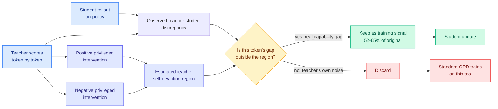

# Cal-OPD: subtract the teacher's own error from the training signal, keep 52 to 65 percent of it

**Date:** 2026-09-21
**Topic:** inference-efficiency (knowledge distillation)
**Source:** HuggingFace Daily Papers · [arXiv 2609.21619](https://arxiv.org/abs/2609.21619) · [raw](../../raw/huggingface/2026-09-21-calibrating-teacher-student-discrepancy-for-on-policy-distil.md)

---

## TL;DR

On-policy distillation (OPD) is the technique where a student model generates its own answers and a
stronger teacher scores them token by token, so the student gets dense feedback on its *own*
trajectory rather than on the teacher's. The whole method rests on one assumption: that the gap
between teacher and student probabilities measures the **capability gap**, and closing it makes the
student better. Cal-OPD's claim is that this assumption is false, and measurably so. The observed
discrepancy is a sum of two things: the part that reflects what the teacher knows and the student
does not, and the part that reflects **the teacher's own deviation**, meaning where the teacher
itself is off-distribution or wrong. Standard OPD cannot tell them apart and trains on both. The fix
is to estimate the teacher's self-deviation region by running the teacher under **positive and
negative privileged interventions**, then keep only the component of the discrepancy that lies
outside that region. Retaining roughly **52 to 65 percent** of the original signal, Cal-OPD beats
standard OPD and its variants across model scales on mathematical reasoning.

---

---

## What it actually does

The mechanism turns on an idea the privileged-distillation literature had been circling without
naming: **privileged information is a probe, not just a crutch.** Privileged OPD hands the teacher
something the student never sees, usually the answer or a worked solution, on the theory that a
better-informed teacher gives better supervision. Cal-OPD observes that this is also the cleanest
available instrument for measuring the teacher's own instability. If you perturb what the teacher
knows in a *positive* direction and a *negative* direction and watch how far its token-level
likelihoods move, the span of that movement is a region attributable to the teacher's conditioning
rather than to the student's deficiency. Anything inside that region is noise the student should
not be chasing.

So the procedure is: run the teacher three ways (plain, positively intervened, negatively
intervened), take the spread as the self-deviation region, and calibrate the teacher-student
discrepancy by retaining only the component beyond it. The retained fraction lands at 52 to 65
percent, and on mathematical reasoning benchmarks the student trained on that smaller, cleaner
signal beats the student trained on all of it, consistently, across scales.

Note that the paper flags **privileged OPD as the worse case, not the better one**: privileged
information induces *larger* teacher-side likelihood shifts, so it encourages the student to learn
more of the teacher's own deviation. The very setting the field adopted to strengthen supervision is
the setting where the contamination is worst.

---

## Relation to prior wiki pages

This is a direct answer to a diagnosis this wiki recorded six weeks ago, and the thread is unusually
clean.

**Fills the gap opened by [Privileged, but Biased
(08-10)](2026-08-10-privileged-but-biased-self-distillation.md)**, the Microsoft Research negative
result that found privileged self-distillation reproduces its published gains on easy tasks and
teaches nothing on hard ones, with the per-token loss falling steadily while validation accuracy
stays flat or degrades. That paper traced the failure to **PI Bias**: having seen one specific
reference solution, the teacher's target is pulled toward *that trajectory* rather than toward
correctness, so the student's divergence penalty lands on stopwords, punctuation and uncertainty
markers, and within correct rollouts the exploratory tokens take the highest penalty. It quantified
the first link of the chain with a PI Bias Score and stopped there. **Cal-OPD is the intervention
that diagnosis implies**: if the teacher's target is contaminated by its conditioning, measure the
contamination by varying the conditioning and subtract it. Whether Cal-OPD's math-reasoning gains
survive on the hard agentic and multi-turn settings where 08-10 found the total collapse is the
obvious next experiment and is not in this paper.

**Confirms and sharpens [What Does Privileged Information Add to On-Policy Self-Distillation
(09-18)](2026-09-18-on-policy-distillation-triple.md)**, which built AMPLE-Math, a suite of 5,319
math problems with six reasoning views sharing one answer, and found that plain reference-free
distillation accounts for most of the improvement while the privileged reference adds only about
two percentage points. That paper's finding was deflationary: privileged information contributes
less than the field assumes. Cal-OPD's is the stronger version: privileged information contributes
less *and* actively injects noise, and once you subtract the noise the remaining signal is worth
more than the whole was.

**This is now the fourth distinct paper in this wiki's distillation lineage arguing that most of the
training signal should be thrown away, and each one cuts along a different axis.** TIP
([04-16](2026-04-16-tip-token-importance-on-policy-distillation.md)) cut by token importance and
found roughly 10 percent of teacher-generated tokens carry the signal. FIRE-OPD
([06-04](2026-06-04-fire-opd-filter-then-reweight-distillation.md)) cut by filtering rollouts then
reweighting what survived. R2-OPD ([08-25](2026-08-25-r2-opd-reasoning-progress-filtering.md)) cut
by whether a step made reasoning progress. Cal-OPD cuts by **whether the discrepancy is
attributable to the teacher or the student**, which is the first of the four to make the cut on a
*causal* criterion rather than a heuristic one. Four papers, one claim: dense supervision is mostly
contamination, and the engineering problem is identifying which part.

**Sits beside [RetireOPD (09-18)](2026-09-18-on-policy-distillation-triple.md)** as the two opposite
responses to the same observation that teacher supervision degrades. RetireOPD's answer is temporal:
fire the teacher once the discrepancy stops shrinking. Cal-OPD's is spatial: keep the teacher
forever but only listen to part of what it says. Nobody has run them together, and they are
trivially composable.

---

## Gaps

- **Math only.** Mathematical reasoning benchmarks are where the privileged-distillation literature
  consistently reports its gains, and [08-10](2026-08-10-privileged-but-biased-self-distillation.md)
  is the paper that showed those gains are a difficulty artifact that vanishes on harder tasks. A
  result that lives on the same benchmark family the negative result indicted needs the harder
  settings before it counts as a fix.
- **Three teacher passes instead of one.** Positive and negative interventions mean the teacher runs
  at least three times per batch. The paper reports a signal-quality win; it does not appear to
  report the compute cost of buying it. For an efficiency-minded reader the interesting number is
  accuracy per teacher-FLOP, not accuracy per step.
- **No calibration curve on the retained region itself.** The method is named "calibrating," but in
  the sense of correcting a training signal rather than in the probabilistic sense. How stable the
  52-to-65 percent boundary is across tasks, and whether it is a tuned hyperparameter in disguise,
  is not established from the abstract.

---

## Industrial implication

If this holds, the practical change is small and cheap to try: teams already running privileged
on-policy distillation can add two extra teacher passes and mask roughly 40 percent of their
token-level loss, and should expect a better student rather than a worse one. The more interesting
implication is for the teacher-selection decision. Everyone currently picks the strongest available
teacher. Cal-OPD's framing says what you actually want is the teacher whose **self-deviation region
is smallest** on your task, which is not the same model and is not something anyone measures. That
is a cheap, publishable experiment and nobody has run it.

---

## Related pages

- [Knowledge distillation](knowledge-distillation.md)
- [Privileged, but Biased (08-10)](2026-08-10-privileged-but-biased-self-distillation.md)
- [Three on-policy distillation papers in one day (09-18)](2026-09-18-on-policy-distillation-triple.md)
- [TIP: token importance in on-policy distillation (04-16)](2026-04-16-tip-token-importance-on-policy-distillation.md)
- [FIRE-OPD: filter then reweight (06-04)](2026-06-04-fire-opd-filter-then-reweight-distillation.md)
- [R2-OPD: reasoning progress filtering (08-25)](2026-08-25-r2-opd-reasoning-progress-filtering.md)
- [The extrapolation cliff in on-policy distillation (05-14)](2026-05-14-extrapolation-cliff-on-policy-distillation.md)
