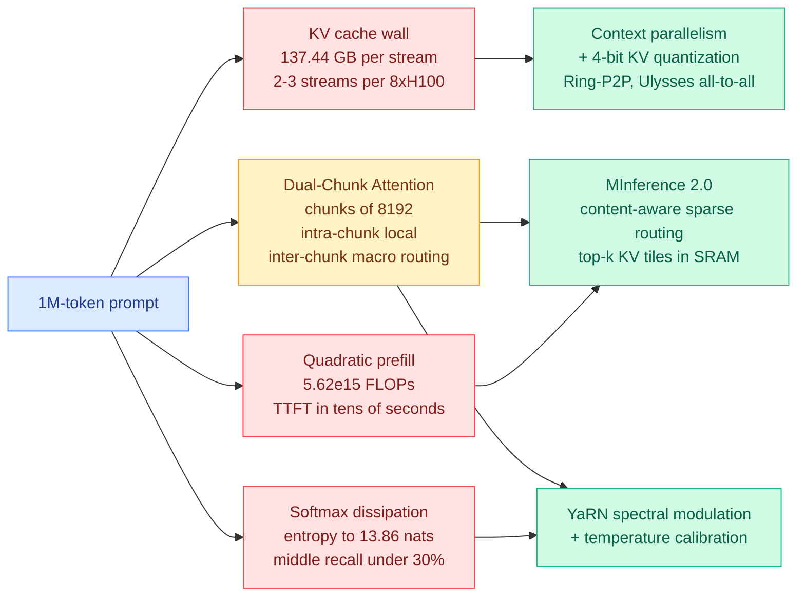

# The million-token prefill, priced: 137 GB of KV cache per user, and the three tricks the field settled on

**Date:** 2026-09-21
**Topic:** inference-efficiency (KV cache, GPU optimization)
**Source:** Ken Huang, *The Physics & Engineering of Frontier LLM Inference*, Chapter 9 · [Substack](https://kenhuangus.substack.com/p/chapter-9-ultra-long-context-mastery) · [raw](../../raw/rss/2026-09-20-agentic-ai-chapter-9-ultra-long-context-mastery-dual-chunk-attenti.md)

---

## TL;DR

The ninth chapter of an engineering series this wiki has been tracking since Chapter 1 does the
thing the series is good at, which is putting hard numbers on a constraint everyone discusses
qualitatively. Three of them matter. A one-million-token prompt requires **N² = 1.0995 × 10¹²
query-key dot products per attention head per layer**, which on an 80-layer 70B model is **5.62 ×
10¹⁵ floating-point operations for the attention core alone**, pushing time-to-first-token from
hundreds of milliseconds into tens of seconds. Storing the resulting 16-bit KV cache for that one
million tokens on that model takes **137.44 GB of VRAM for a single user stream**, so an 8-way
H100 node with 640 GB of HBM3 holds **two or three concurrent streams** before it is full. And
across a million keys the softmax distribution disperses toward its maximum entropy of **ln(N) ≈
13.86 nats**, which is the mechanical account of the "lost in the middle" pathology: retrieval
accuracy holds at the edges of the prompt and **drops below 30 percent across the middle 10 to 90
percent** of the window. The chapter then argues that 2026 production has converged on exactly
three mitigations, one per failure.

---

---

## The three mitigations

**YaRN, working in the frequency domain.** Rotary position embeddings encode position as rotations
at a spectrum of frequencies. Naively stretching them to a longer context damages the high-frequency
channels that carry local syntax. YaRN interpolates the low-frequency channels, which encode
macro-scale position, while leaving the high-frequency ones alone, and adds a temperature term to
the softmax to counteract the entropy dispersion that comes with a longer key set. The framing worth
keeping is that positional extension and attention sharpening are the same problem attacked at two
points.

**Dual-Chunk Attention, as shipped in Qwen 3.8-1M.** Slice the sequence into chunks of C = 8,192 and
decouple two kinds of attention: local attention inside a chunk, and a coarser inter-chunk
coordinate routing between them. The stated purpose is to eliminate continuous positional drift, and
the structural point is that **this is routing, at the sequence-position axis.** The model is
choosing which chunks matter for this query rather than which model or which expert.

**MInference 2.0, as dynamic sparsity.** Rather than assuming a fixed sparsity pattern, identify at
runtime which of three empirical attention topologies the head is exhibiting (vertical-slash,
block-sparse cluster, or slash-only) and evaluate only the top-k high-affinity KV tiles, inside GPU
SRAM, through fused Triton kernels. The claim is roughly 10x faster million-token prefill. This is
the most interesting of the three because the pattern selection is itself a cheap classification
decision made per head per layer at inference time.

The paywalled remainder covers Ring-P2P attention, DeepSpeed Ulysses all-to-all, 4-bit KV
quantization, and retrieval and TTFT benchmarks. The free portion is enough to carry the numbers.

---

## Relation to prior wiki pages

**Puts a denominator under the KV-cache compression thread.** [The KV cache page](kv-cache.md) has
accumulated a long run of compression, eviction, quantization and placement results this quarter,
and they are usually reported as ratios against an unstated baseline. 137.44 GB per stream at 1M
tokens on a 70B model is that baseline stated, and it reframes every one of those ratios: a 4x KV
compression is not an optimization, it is the difference between two concurrent users and eight.

**Sharpens the [DeepSeek-V4.1-Flash KV compression
(09-18)](2026-09-18-deepseek-v41-flash-kv-cache-compression.md) and [SemiAnalysis Engram offloading
(09-18)](../hardware/2026-09-18-semianalysis-engram-dram-ssd-offloading.md) results**, both of which
turn on whether large state can be paged off HBM without a throughput cliff. Chapter 9's arithmetic
explains why that question is existential rather than incremental at long context: there is no
version of a 1M-token production service that keeps everything in HBM.

**Extends the sparse-attention line.** [SAS attention sparsification
(09-14)](2026-09-14-sas-attention-sparsification-end-to-end.md) and [MISA, the mixture-of-indexer
sparse attention (05-11)](2026-05-11-misa-mixture-of-indexer-sparse-attention.md) both argued that
the right sparsity pattern is head-dependent and learnable. MInference 2.0 is the deployed version
of the same claim with the patterns enumerated rather than learned, which is the cheaper engineering
answer and a good empirical check on whether the learned version is buying anything.

**Connects to the routing page along an axis it has not formalised.** [LLM
routing](../ai-routing/llm-routing.md) currently tracks routing across models, experts, adapters,
skills and depth. Dual-Chunk Attention and MInference both route across **sequence positions**, and
MInference's runtime topology selection is a router in the strict sense: a cheap decision made per
head that determines which expensive computation runs. That axis belongs on the page.

---

## Gaps

- **The most useful numbers are behind the paywall.** TTFT benchmarks, 1M-token retrieval accuracy
  and the cluster sizing templates are subscriber-only, so the free chapter establishes the problem
  precisely and the solutions only in outline.
- **It is a synthesis, not a measurement.** The chapter explicitly draws on published work from
  DeepSeek, Moonshot, Zhipu, Alibaba, NVIDIA and Google DeepMind. The arithmetic is checkable and
  correct; the performance claims are secondhand.
- **The three mitigations are presented as complementary and are not shown to compose.** Sparse
  attention discards tiles, YaRN reshapes the position spectrum, and DCA changes what a position
  even means across a chunk boundary. Whether the retrieval degradation of the three together is
  the sum of the three separately is exactly the experiment that is missing.

---

## Related pages

- [KV cache](kv-cache.md)
- [DeepSeek-V4.1-Flash KV cache compression (09-18)](2026-09-18-deepseek-v41-flash-kv-cache-compression.md)
- [SAS: attention sparsification end to end (09-14)](2026-09-14-sas-attention-sparsification-end-to-end.md)
- [MISA: mixture-of-indexer sparse attention (05-11)](2026-05-11-misa-mixture-of-indexer-sparse-attention.md)
- [Ken Huang on route depth and width (09-17)](../ai-routing/2026-09-17-ken-huang-route-depth-and-width.md)
- [Disaggregated serving: Mooncake and DistServe (09-15)](2026-09-15-disaggregated-serving-mooncake-distserve.md)
