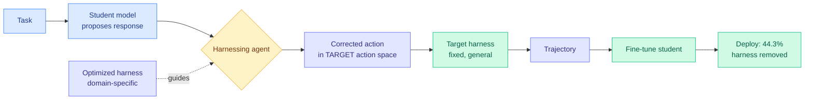

# Harness-Zero: Harness Distillation via Agent-as-Harness

**Source:** HuggingFace Daily Papers 2026-09-22 · [arxiv 2609.24974](https://arxiv.org/abs/2609.24974)
**Raw:** [raw/huggingface/](../../raw/huggingface/)

## TL;DR

If a specialized harness makes an agent better, you currently have to keep paying for that harness at deployment, and you need a different one per domain. Harness-Zero asks whether the harness's *gains* can be moved into the model's weights so the harness can be deleted. The obstacle is that the optimized harness and the deployment harness have different action spaces and different available information, so the optimized harness's traces are not valid supervision for the target one. The fix is **agent-as-harness**: a harnessing agent, guided by the optimized harness, rewrites the student's proposed responses into the target harness's action space *before* execution, turning harness guidance into legal training demonstrations. Fine-tuning on those trajectories lifts base-model macro-average task success from **23.3% to 44.3%**, which **exceeds the 41.7% the base model reaches with the specialized harness still attached**.

## The result that matters

**The distilled model beats the teacher configuration it was distilled from.** 44.3% without the harness against 41.7% with it. Two other numbers frame it: agent-as-harness beats code-as-harness for frontier LLMs using the same evolved harness, and the method **recovers 82.3% of 28 harness-induced behavior patterns** absent from the base model across knowledge work, tool use, and science.

That last figure is the honest one. It says the mechanism is genuinely transferring behaviors rather than fitting a benchmark, and it says 17.7% of them do not transfer.

## Relation to prior wiki knowledge

**This is a new axis on [knowledge-distillation](knowledge-distillation.md), and it is the first one where the teacher is not a model.** The page currently tracks eight selective-supervision axes, all of which gate or project *which tokens or prompts from a stronger model* carry supervision. Harness-Zero's teacher is a **system configuration**, and the thing being distilled is a behavioral policy induced by scaffolding. The page's central accounting argument, that on-policy distillation moves the dominant cost from compute to teacher access, changes shape here: harness access is not a proprietary API, it is code you already have, so this axis has no access cost at all.

**It answers, in the opposite direction, the question [agent-harness-engineering](../agentic-systems/agent-harness-engineering.md) has been circling since 09-17.** That page concluded that the harness is where cost is decided and the model is where capability is decided, and that the two are close to independent. Harness-Zero is the first result that **couples them deliberately**: it converts a cost-side asset into a capability-side one, then deletes the cost. If that generalizes, the clean factorization the page just adopted is a description of current practice rather than a structural fact.

**It directly attacks the routing problem named on [llm-routing](../ai-routing/llm-routing.md).** That page has recorded since 08-26 that the routable unit is the model-harness pair. Harness-Zero's stated motivation is exactly that a general agent must "either settle for a suboptimal shared harness or route among an ever-growing set of specialized ones." Its answer is to **eliminate the routing decision by internalizing the options**, which is the first proposal on this wiki to dissolve a routing problem rather than solve it.

**Tension with [RRSI (09-22)](../agentic-systems/2026-09-22-rrsi-regularized-harness-evolution.md), published the same morning.** RRSI's entire program is producing harnesses that generalize and persist. Harness-Zero's is producing harnesses that can be thrown away. Both are Google-adjacent, both land on HuggingFace the same day, and they are not obviously compatible: if harness gains are internalizable into weights, the value of a harness that generalizes across benchmarks drops sharply, because you would distill each specialist instead. Nobody has run the comparison.

## Gaps

No cost accounting for the harnessing agent itself, which runs on every training example and is presumably not cheap. The 23.3% baseline is low enough that the headline lift may not survive on a strong base model. And the claim that the specialized harness is removable at deployment is tested against that harness, not against the *best* harness available at deployment time.

## Links

- [knowledge-distillation](knowledge-distillation.md)
- [agent-harness-engineering](../agentic-systems/agent-harness-engineering.md)
- [llm-routing](../ai-routing/llm-routing.md)
