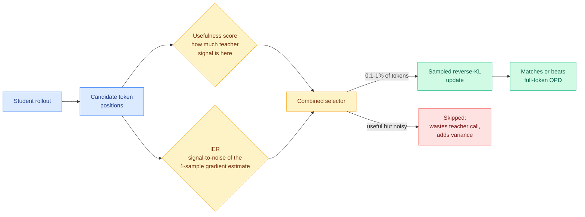

# 1% of Tokens Can Be Enough: Gradient Estimation in On-Policy Distillation (IER)

**Source:** HuggingFace Daily Papers 2026-09-22 · [arxiv 2609.24432](https://arxiv.org/abs/2609.24432)
**Raw:** [raw/huggingface/](../../raw/huggingface/)

## TL;DR

Sparse on-policy distillation (training a small student on its own generated text, with a big teacher supervising only a chosen subset of tokens) picks tokens by *usefulness*: which positions carry the most teacher signal. This paper says usefulness is only half the criterion. At a given position the gradient is estimated from a single sampled next token, and that estimate can be **noisy** even where the teacher's guidance is genuinely valuable. The authors analyze the estimation problem in information geometry and define an **information-efficiency ratio (IER)**, a signal-to-noise decomposition characterizing relative gradient-estimation error under an optimal scalar baseline. Selecting on IER alongside usefulness lets sparse configurations at **0.1% to 1% token budgets match or exceed full on-policy distillation with no selection at all**.

## Why this is the interesting one

**Every prior selective-distillation result on this wiki is a gate on the teacher. This is the first that is a property of the estimator.** The eight axes recorded on [knowledge-distillation](knowledge-distillation.md) all ask a version of "is the teacher worth listening to here" — token-level usefulness, prompt-level gating, example filtering, verifier projection. IER asks a different question: "**given that the teacher is worth listening to here, will one sample tell me what it said?**" Those are orthogonal, which is why adding IER improves existing selectors rather than replacing them. That makes it the **ninth axis and the first non-gate**, and it is the one a practitioner can bolt onto whatever they already run.

**The budget number is the headline and it moves a threshold this wiki already recorded.** TIP established that most teacher-generated tokens carry no learning signal and roughly 10% suffice. IER pushes the working range to **0.1% to 1%**, an order of magnitude below, while keeping the sampled reverse-KL objective unchanged. When a budget drops 10x and the training objective does not change, the prior number was measuring the selector, not the task.

**It partially resolves a standing tension.** [OPRD (09-09)](2026-09-09-oprd-on-policy-reverse-distillation.md), which measures the teacher's policy shift against its own reference and amplifies only the verifier-supported component of the student's gradient, argued that a projection is strictly safer than a gate because it cannot introduce a direction the verifier did not already produce. IER concedes the framing but locates a cost the projection argument ignores: **a safe direction estimated from one sample is still a high-variance direction**, and spending budget on it is wasteful even when it is not harmful. Safety and efficiency are separate properties of a supervision rule, and until today this page conflated them.

## Gaps

Mathematical and medical reasoning only, both domains with short answers and clean verification, which is exactly where the sampled-gradient variance argument is easiest. The optimal-scalar-baseline assumption underpinning the IER derivation is not stress-tested against the baselines people actually use. And "matching full OPD" is matching a baseline that this same literature has spent a year calling wasteful, so the comparison flatters.

## Links

- [knowledge-distillation](knowledge-distillation.md)
- [OPRD (09-09)](2026-09-09-oprd-on-policy-reverse-distillation.md)
- [Code](https://github.com/BruceSheng1202/IER-OPD)
