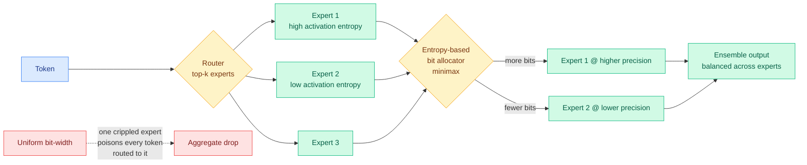

# Colla-Q: Collaborative Experts in MoE Quantization via Minimax Precision Balancing

**Source:** Kurate cs.LG weekly leaderboard #20 (2026-09-23 scrape, `tier=1`, ai_rating 5.5/10) · [arxiv 2609.18131](https://arxiv.org/abs/2609.18131)
**Raw:** [raw/kurate/2026-09-23-cs-lg.md](../../raw/kurate/2026-09-23-cs-lg.md)

## TL;DR

Quantizing a mixture-of-experts model (MoE, an architecture where each token is routed through a small subset of specialized sub-networks instead of the whole network) hurts more than quantizing a dense model of similar total size. The reason is structural: each individual expert holds relatively few parameters, so low-bit representation damages it more, and because a MoE output is an *ensemble* of routed experts, one badly damaged expert contaminates every token that routes to it. Colla-Q allocates bit-width per expert using **activation entropy**, aiming to keep every expert's post-quantization performance balanced rather than maximizing average quality. Two reported consequences: better overall MoE performance, and **reduced dependence on the calibration dataset**, so the method generalizes more consistently across calibration choices.

## The argument worth keeping

The minimax framing is the contribution. Standard quantization objectives minimize *average* reconstruction error, which is the right objective for a dense network where every parameter contributes to every forward pass. In a MoE, averaging is wrong twice over. First, an expert that is rarely routed to contributes little to the average but catastrophically to the tokens it does serve. Second, the router itself was trained against full-precision experts, so degrading experts unevenly silently changes the effective routing distribution: the router keeps sending tokens to an expert that is now much worse than it was at training time, and nothing in the loss notices.

Colla-Q's answer is to equalize rather than average. Allocate bits so that no expert falls far behind, using activation entropy as the proxy for how much precision an expert needs.

The calibration-robustness result is the sleeper finding. Post-training quantization methods are notoriously sensitive to which few hundred samples you calibrate on, and that sensitivity is a real deployment hazard because the calibration set is usually chosen by convenience. If balancing across experts genuinely reduces that sensitivity, it is worth more operationally than the accuracy delta.

## How this relates to what the wiki already knows

**Same week, same board, same structural claim as [KV-COBRA](2026-09-23-kv-cobra-bit-rank-allocation.md): uniform precision across a heterogeneous set of components is a bug, and the fix is a per-component allocator.** KV-COBRA allocates across attention heads by distortion; Colla-Q allocates across MoE experts by activation entropy. Neither cites the other. Two independent groups reaching the same design principle in different parts of the transformer in the same week is the point at which this stops being two papers and starts being a pattern: **precision is becoming a routed resource, allocated per component, rather than a global hyperparameter.**

**It extends the 2026-09-11 kv-cache entry, "precision becomes the second thing you route inside the cache,"** from the cache into the weights. The [quantization](quantization.md) page has been accumulating per-layer and per-channel allocation results for months; this is the first that makes the unit an *expert*, which matters because expert count is the dimension MoE models are scaling along.

**It intersects today's ScriptMoE result** ([All-in-One Multilingual Scene Text Recognition](../vision-audio-video/2026-09-23-scriptmoe-multilingual-str.md)), where a script-aware router dispatches each image to its top-2 experts plus a shared expert. Colla-Q says that the shared expert and the specialized experts almost certainly want different bit-widths, since the shared expert absorbs cross-script knowledge and serves every input while the specialists serve a slice. Nobody has quantized a router-with-shared-expert architecture with that asymmetry in mind.

## Gaps

Activation entropy is a proxy, and the paper does not establish that it dominates alternatives such as routing frequency, gradient sensitivity, or measured per-expert degradation. There are no results at the scale where this matters most: the mega-MoE models where expert count runs into the hundreds and total parameters into the hundreds of billions, which is exactly where quantization is not optional. And "reduced dependence on the calibration dataset" is a claim that needs a spread across several calibration sets to be credible; a single alternative set is not enough.

## Industrial implication

Open-weight MoE models are now the volume default, and today's industry signal makes that concrete: Xiaomi's MiMo-V2.6 sits at 309B total with 15B active, and open-weight models carried 78.4% of gateway token volume as of 09-20. Almost all of that traffic runs through a quantized serving stack. If per-expert allocation is worth a bit of bit-width at equal quality on a 309B/15B model, that is a direct reduction in the GPU count needed to hold the weights, which is the dominant fixed cost of serving a mega-MoE. The realistic path is that this lands in the quantization toolchains (llama.cpp, AWQ, GPTQ derivatives) as an allocation pass rather than as a new format.

## Related pages

- [quantization](quantization.md) · [kv-cache](kv-cache.md) · [llm-routing](../ai-routing/llm-routing.md)
- [KV-COBRA](2026-09-23-kv-cobra-bit-rank-allocation.md)
