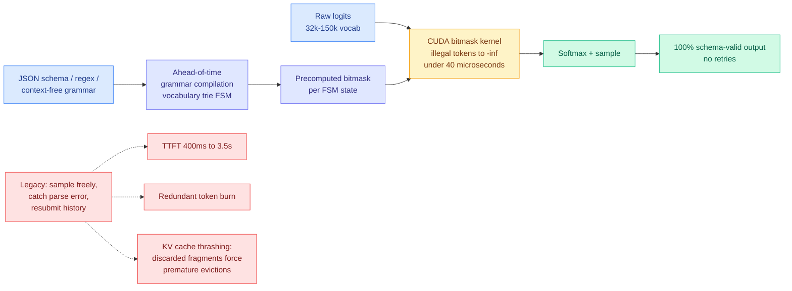

# Constrained decoding: the format problem gets solved in the kernel

**Source:** Ken Huang / DistributedApps.ai, *The Physics & Engineering of Frontier LLM Inference*, Chapter 10, 2026-09-22 · [substack](https://kenhuangus.substack.com/p/chapter-10-constrained-decoding-and)
**Raw:** [raw/rss/2026-09-22-agentic-ai-chapter-10-constrained-decoding-the-2026-production-blu.md](../../raw/rss/2026-09-22-agentic-ai-chapter-10-constrained-decoding-the-2026-production-blu.md)

## TL;DR

The final chapter of the ten-part inference series makes a claim worth extracting from the marketing around it: **constrained decoding is now effectively free, and that changes what agent architectures are reasonable.** Constrained decoding (also called grammar-guided generation or structured outputs) compiles a schema, regular expression or grammar into a finite state machine, and at every generation step sets the logits of syntactically illegal tokens to negative infinity before sampling. The output is then guaranteed to parse. This was avoided in high-throughput serving until recently because first-generation CPU-side implementations cost **20 to 50 ms per token**, stalling the GPU while the CPU walked a grammar tree. GPU-accelerated grammar compilers (SGLang's XGrammar, Outlines' trie-FSM indexers, native C++ token-masking kernels in llama.cpp and vLLM V1) now execute the same validation in **under 40 microseconds per step**, roughly a thousandfold reduction, which puts it below the noise floor of a decode step.

## The KV cache argument, which is the part this wiki did not have

The chapter's list of costs from the legacy retry paradigm contains one item that does not appear anywhere else on this wiki and deserves to:

> **KV cache thrashing.** Generating malformed tokens pollutes the serving engine's prefix and KV cache allocations with discarded context fragments, forcing premature cache evictions for concurrent users.

This is a **multi-tenant externality**, and it is a different class of cost from the two everyone already counts. Latency amplification (P99 going from 400 ms to over 3.5 s on a schema failure) and token burn (resubmitting conversation history plus error tracebacks across three to five retries) are costs borne by the failing request. Cache thrashing is a cost borne by **everyone else on the node**. One tenant's malformed JSON evicts another tenant's prefix, and the second tenant sees a cache miss with no visible cause. Nothing in a standard observability stack attributes that.

That reframes constrained decoding from a reliability feature into a **serving-efficiency feature**, which is the framing this wiki should carry.

## How this relates to what the wiki already knows

**It is the mechanical explanation for why the decision-model boom happened.** For eight days this wiki has tracked [typed-decision models](../ai-routing/2026-09-23-decision-model-ece-numbers-arrive.md), sold on the promise that they return a typed choice with a probability and "there's nothing to parse and nothing to hallucinate." The chapter shows that a constrained decoder on an ordinary LLM delivers **100% schema adherence at full generation speed** with no new model. So the decision model's format guarantee is not a novel capability, it is available in vLLM V1 today. **What the decision model adds over constrained decoding is the single forward pass and the probability, not the type safety.** Tinker's demonstration on 09-23, that any open LLM can serve the decision interface after a $5 ten-minute fine-tune because next-token prediction is already a probabilistic classifier, is the same observation from the other direction. Two independent confirmations in two days that the moat is narrower than the marketing.

**It confirms Ken Huang's own 09-21 warning, which is the honest part of his position.** He wrote then that a schema-valid key can still be the wrong key, so type safety prevents malformed output, not incorrect judgment, and a schema-valid mistake refunds the wrong customer just as fast. Chapter 10 delivers the mechanism that makes malformed output impossible and does not claim it makes the judgment right. That distinction is the whole argument against the decision-model category's framing.

**The sub-40-microsecond figure is a [gpu-kernels](../hardware/gpu-kernels.md) result and belongs on that page.** The pattern is the one that keeps recurring: a technique dismissed as too slow becomes free when someone writes the fused CUDA kernel. [Flash-dLLM (today)](2026-09-23-flash-dllm-io-aware-kv-cache.md) is the same story in KV caching, where a fused I/O-aware kernel turns a memory-bound stall into a 5-11x speedup. **Two results the same day where the kernel, not the algorithm, was the binding constraint.** @TheAhmadOsman's widely-shared feed post today made the same argument in plain language: same model, same GPU, same VRAM, wildly different performance, because one stack uses fused kernels that understand the hardware and the other does not.

## The rest of the chapter, briefly

Beyond the paywall the chapter covers edge small-language-model deployment with UC Berkeley's FreeToken MoE offloading (serving 1B-8B SLMs and 35B-753B mixture-of-experts models on consumer hardware with sub-44-second agentic checkpointing), a twelve-dimensional comparison across vLLM V1, SGLang, TensorRT-LLM, Unsloth, llama.cpp and FreeToken, Kubernetes manifests, a Prometheus and Grafana observability suite, and hardware TCO sizing. The free portion is the roadmap plus the constrained-decoding argument above. Chapters 1-9, several of which are already summarized on this wiki, covered the physics of inference, the KV cache frontier, speculative decoding, extreme quantization, hardware-aware attention kernels, disaggregated serving, mega-MoE serving, test-time compute and [ultra-long context](2026-09-21-ultra-long-context-dca-yarn-minference.md).

## Gaps

The sub-40-microsecond figure is cited from the XGrammar and Outlines literature rather than independently benchmarked here, and "per step" hides whether it includes the ahead-of-time compilation amortization for schemas that change per request, which is the common agentic case. More importantly, the chapter does not discuss the well-documented **quality** cost of constrained decoding: masking tokens to negative infinity changes the sampling distribution, and there is a body of work showing that aggressive grammar constraints can degrade reasoning quality on tasks where the model wants to think in prose before emitting structure. Presenting it as pure upside is the chapter's main analytical weakness. The second half is paywalled, so the framework comparison and TCO models cannot be checked.

## Industrial implication

The actionable claim is narrow and worth acting on: **if your agent stack still uses a parse-retry loop for structured tool calls, the cost is not just your own latency and tokens, it is cache evictions for every co-tenant on the node, and the fix is a serving-engine flag rather than a project.** The broader implication is for the decision-model buildout documented elsewhere in today's digest. A large fraction of the 160-plus decision-model integrations are gates that could equally be a constrained-decoding call on a model already in the stack, with no second vendor, no second API key, and no calibration unknown.

## Related pages

- [gpu-kernels](../hardware/gpu-kernels.md) · [kv-cache](kv-cache.md) · [llm-routing](../ai-routing/llm-routing.md)
- [Ken Huang, route depth and width (09-17)](../ai-routing/2026-09-17-ken-huang-route-depth-and-width.md) · [ultra-long context, Chapter 9 (09-21)](2026-09-21-ultra-long-context-dca-yarn-minference.md)
- [decision-model ECE numbers (today)](../ai-routing/2026-09-23-decision-model-ece-numbers-arrive.md) · [Flash-dLLM](2026-09-23-flash-dllm-io-aware-kv-cache.md)
