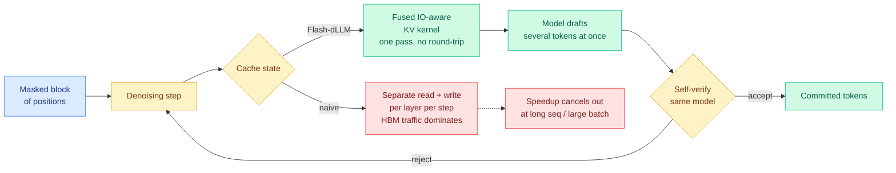

# Flash-dLLM: IO-Aware KV Caching and Parallel Decoding for Diffusion LLMs

**Source:** HuggingFace Daily Papers 2026-09-23 · [arxiv 2609.26796](https://arxiv.org/abs/2609.26796)
**Raw:** [raw/huggingface/2026-09-23-flash-dllm-io-aware-kv-caching-and-parallel-decoding-for-fas.md](../../raw/huggingface/2026-09-23-flash-dllm-io-aware-kv-caching-and-parallel-decoding-for-fas.md)

## TL;DR

Diffusion language models (dLLMs, which generate text by iteratively denoising a whole block of masked positions at once instead of emitting one token at a time left to right) have a serving problem that autoregressive models solved years ago: they have no working KV cache (the store of previously computed attention keys and values that lets a model skip recomputing old context). Prior work bolted caching on, and separately bolted on parallel decoding, and each reported a speedup. Flash-dLLM's finding is that the two interact badly. When you enable cache reuse *and* parallel token verification at the same time, the bottleneck stops being arithmetic and becomes **GPU memory I/O**: the cache is read and written far more often than it is computed against. The fix is an I/O-aware fused KV-cache kernel plus a draft-and-verify decoding loop where the dLLM is its own drafter, no auxiliary model. Training-free. **5.1x on GSM8K and 11.0x on HumanEval over Elastic-Cache**, the prior strongest dLLM accelerator.

## What the paper actually claims

1. **GPU memory I/O, not FLOPs, is the dominant cost once dLLM KV caching is switched on.** This is the load-bearing measurement. Every prior dLLM acceleration paper optimized how *much* cache to keep or how *often* to refresh it. Flash-dLLM says the cache management policy was never the binding constraint at realistic sequence lengths and batch sizes; moving the bytes was.
2. **A fused kernel removes the redundant movement.** Rather than a read pass, a compute pass and a write-back pass per layer per denoising step, the cache update and the attention consumption happen in one kernel launch, so intermediate state never round-trips through HBM (high-bandwidth memory, the off-chip DRAM on the GPU package, ~10-50x slower to reach than on-chip SRAM).
3. **The dLLM drafts and verifies itself.** Speculative decoding normally needs a second, smaller model to propose tokens cheaply. A dLLM already produces a distribution over many masked positions in a single forward pass, so the draft is free: take several positions' predictions as the draft, then verify them against the next denoising step. No auxiliary model to train, host, or keep version-matched.
4. **Speedups are largest where the I/O problem is worst.** 5.1x on GSM8K (grade-school math, short outputs) and 11.0x on HumanEval (code, longer outputs) over Elastic-Cache. The 2x gap between the two benchmarks is itself evidence for the I/O thesis: the longer the sequence, the more bytes are moved per useful FLOP.

## How this relates to what the wiki already knows

**It confirms the SemiAnalysis thesis from 09-21 in a completely different model family.** [SemiAnalysis: Computation and Data Movement for Inference](../hardware/2026-09-22-semianalysis-inference-data-movement.md) argued that the standard prefill/decode split hides the regime that actually matters, and that KV state should be treated as movable blobs rather than machine-resident memory, because data movement is the real cost. That was an argument about mixture-of-experts serving clusters. Flash-dLLM reaches the same conclusion from inside a single GPU on a non-autoregressive architecture. **Two independent lines, one claim: the cost model of modern inference is a memory-traffic model, not an arithmetic model.**

**It extends the 09-21 million-token baseline.** Ken Huang's Chapter 9, summarized in [ultra-long-context](2026-09-21-ultra-long-context-dca-yarn-minference.md), put the number on the table: 137.44 GB of KV cache per user at one million tokens on a 70B model, so an 8-GPU H100 node holds two or three concurrent streams. Flash-dLLM does not reduce that footprint. It reduces how many times you pay to move it. Those are orthogonal savings and they compose.

**It sits opposite KV-COBRA, filed the same week.** [KV-COBRA](2026-09-23-kv-cobra-bit-rank-allocation.md) attacks the same total cost by shrinking the cache (per-head rank and bit-width allocation). Flash-dLLM leaves the cache the size it is and attacks the movement. A serving stack wants both, and nobody has measured whether a compressed cache makes the fused-kernel win larger (fewer bytes to move) or smaller (less headroom to recover).

**It is the third entry on the KV cache page where the cache is not merely an expense to be minimized.** After [Cache-to-Cache](2026-09-18-c2c-cache-to-cache-communication.md), where two models communicate by fusing KV states instead of generating text, and KVMEM's paging treatment, Flash-dLLM treats the cache as a *scheduling object* whose access pattern is the design variable.

## Gaps

The evaluation is mathematical reasoning and code generation, both domains with short-to-medium outputs and strong verifiability. There is no long-context result, which is odd for a paper whose central claim is that the I/O problem grows with sequence length. The comparison is against Elastic-Cache, a dLLM-specific baseline; there is no comparison against a well-tuned autoregressive serving stack at matched quality, so the paper establishes that dLLMs are much faster than they were, not that they are competitive with what people actually deploy. And self-drafting acceptance rates are not broken out, so it is unclear how much of the 5-11x is the kernel and how much is the draft-verify loop.

## Industrial implication

If diffusion LLMs ever become deployable, this is the paper that made them deployable, because the missing piece was never quality, it was that every serving optimization the autoregressive world takes for granted had to be reinvented. More broadly, the transferable lesson is the diagnosis: **when you stack two independently validated inference optimizations, measure the memory traffic of the combination before believing the multiplied speedup.** Cache reuse and parallel verification each look free in isolation and contend for the same bus together.

## Related pages

- [kv-cache](kv-cache.md) · [speculative-decoding](speculative-decoding.md) · [gpu-kernels](../hardware/gpu-kernels.md)
- [SemiAnalysis: data movement for inference](../hardware/2026-09-22-semianalysis-inference-data-movement.md)
- [KV-COBRA](2026-09-23-kv-cobra-bit-rank-allocation.md) · [KVMEM](2026-09-23-kvmem-paged-agent-memory.md)
