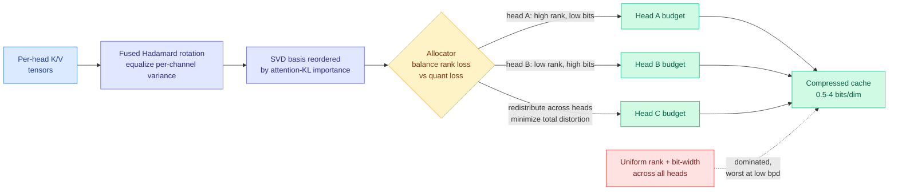

# KV-COBRA: KV Cache Compression via Co-Optimized Bit-Rank Allocation

**Source:** Kurate cs.LG weekly leaderboard #7 (2026-09-23 scrape, `tier=1`, ai_rating 6.0/10) · [arxiv 2609.24298](https://arxiv.org/abs/2609.24298)
**Raw:** [raw/kurate/2026-09-23-cs-lg.md](../../raw/kurate/2026-09-23-cs-lg.md)
**Note:** not in today's HuggingFace list. LLM-rated, community-unnoticed.

## TL;DR

Every KV cache compression paper on this wiki picks a *scheme*: low-rank projection, or quantization, or eviction, or a hybrid. KV-COBRA's claim is that the scheme was never the interesting variable. **The binding question is how you split a fixed bit budget across attention heads, and between rank truncation and bit-width within each head.** Using only textbook components, standard low-rank projection and scalar quantization, co-optimizing rank and bit-width per head beats uniform allocation, and the gap widens as the budget shrinks. Evaluated from **0.5 to 4 bits per dimension**, KV-COBRA shows the smallest accuracy degradation among tested methods at low bit-rates, **with no per-token overhead**.

## What is actually new

The paper reframes compression as a **resource-allocation problem with two currencies**. Within a head, spending budget on rank means keeping more singular directions at coarser precision; spending it on bit-width means fewer directions at finer precision. Those two losses trade off differently per head, because heads differ in how quickly their singular spectrum decays and how much per-channel outlier structure they carry. Uniform schemes implicitly assume every head sits at the same point on that trade-off. They do not.

Three supporting mechanisms make the allocator work:

- **Fused Hadamard rotation** equalizes per-channel variance before quantization. Outlier channels are the classic reason low-bit KV quantization falls apart; rotating into a basis where energy is spread makes scalar quantization behave.
- **Reordering the SVD basis by attention-KL importance** makes the solver query-aware. Rather than ranking singular directions by singular value (how much of the *cache* they explain), rank them by how much dropping them moves the attention distribution (how much of the *output* they explain). Those are not the same ordering.
- **No per-token overhead.** The allocation is computed once, not per decode step, so the win is not eaten back at runtime. This is the detail that separates a deployable method from a paper result.

The same allocator extends to joint K+V compression rather than treating keys and values as separate problems.

## How this relates to what the wiki already knows

**This is the fourth result in six weeks saying the same structural thing: the unit of a KV cache decision is the head, not the layer or the model.** The [09-11 entry on kv-cache](kv-cache.md) recorded precision becoming "the second thing you route inside the cache." The 08-25 entry recorded precision becoming a spatial decision. The [09-14 depth-sharing retrofit](kv-cache.md) found adjacent-layer KV states similar enough to substitute. KV-COBRA closes the loop by making the per-head budget an explicit optimization variable rather than a hand-tuned schedule. **Four papers, one converged claim: cache heterogeneity is real, large, and exploitable, and any method that treats the cache as uniform is leaving a lot on the table specifically at the low-bit end where the savings matter most.**

**It confirms the [quantization](quantization.md) page's outlier thesis from a new angle.** The Hadamard rotation is the same trick weight-quantization work has used for two years to tame activation outliers. Its appearance here is evidence that KV quantization and weight quantization are converging on a shared toolkit rather than remaining separate literatures.

**It pairs with Colla-Q, also on this week's Kurate board.** [Colla-Q](2026-09-19-colla-q-moe-quantization-minimax.md) allocates bit-width across mixture-of-experts experts by activation entropy. KV-COBRA allocates bit-width across attention heads by distortion. **Two papers on the same board, same week, making the same architectural argument in different parts of the transformer: uniform precision is a bug, and the fix is a per-component allocator.** That is a pattern worth naming.

**It is complementary, not competitive, with [Flash-dLLM](2026-09-23-flash-dllm-io-aware-kv-cache.md), today's HuggingFace KV-cache entry.** Flash-dLLM leaves the cache size alone and cuts how often the bytes move. KV-COBRA cuts how many bytes exist. Nobody has run them together.

## Gaps

No latency or throughput numbers are reported in the abstract, only accuracy degradation against bit-rate. "No per-token overhead" is a claim about asymptotics, not a measured end-to-end serving result, and a compression method that wins on perplexity-per-bit can still lose on tokens-per-second if the dequantization path is not fused. The allocator's own cost (a per-head SVD plus a solve) is amortized but unquantified. And there is no result at the million-token scale where, per [Chapter 9's arithmetic](2026-09-21-ultra-long-context-dca-yarn-minference.md), 137.44 GB per user makes this the difference between two and twenty concurrent streams.

## Industrial implication

The immediate action is unglamorous and cheap: if you run a quantized KV cache today at a uniform bit-width, measure per-head reconstruction error on your own traffic before assuming the uniform setting is near-optimal. The paper's strongest practical claim is that the *largest* gains appear at the *lowest* bit-rates, which is exactly the regime long-context serving is being pushed into by memory economics. A method with no per-token overhead that buys a bit or two of headroom at 1 bpd translates directly into concurrent-stream count, which is the number that determines cost per request.

## Related pages

- [kv-cache](kv-cache.md) · [quantization](quantization.md) · [memory-hierarchy](../hardware/memory-hierarchy.md)
- [Colla-Q](2026-09-19-colla-q-moe-quantization-minimax.md) · [Flash-dLLM](2026-09-23-flash-dllm-io-aware-kv-cache.md) · [ARM](../ai-routing/2026-09-23-arm-routed-memory-attention.md)
