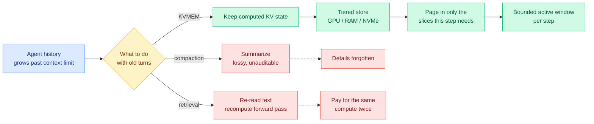

# KVMEM: paging the KV cache to give agents a million-token workspace

**Source:** X home feed, 2026-09-23 ([@rohanpaul_ai](https://x.com/rohanpaul_ai/status/2102572744378585312))
**Raw:** [raw/twitter/feed/2026-09-23-morning-ranked.json](../../raw/twitter/feed/) (gitignored, local)

## TL;DR

A long-running agent eventually fills its context window, and there are only two things the field currently does about it. **Compaction** rewrites old history into a summary, which is lossy in a way you cannot audit. **Retrieval** fetches the old text back and re-runs it through the model, which means paying for the same forward pass twice. KVMEM's move is to keep neither the summary nor the text, but **the KV cache itself**: the attention keys and values the model already computed for that history. Old context is retained as reusable KV state across a memory hierarchy of GPU memory, host RAM, and NVMe, and only the slices needed for the current step are paged back in. Reported: **DeepSWE Pass@1 rises from 43.8% to 48.4%** over compaction-only with Qwen3.8-27B, recovery is **11.4x to 53.8x faster than Compact+RAG**, and a laptop with a single 24 GB RTX 5090 sustains a **1M-token workspace at roughly 50 tokens/s**. Each step still sees only a bounded slice; this is not a 1M-token active prompt.

## Why the framing matters more than the numbers

The sentence to keep is: **KVMEM keeps the work the model already did.** Both incumbent approaches throw away computation. Compaction throws away the attention state and keeps a lossy natural-language projection of it. Retrieval throws away the attention state and keeps the input that produced it, then pays to reproduce it. Neither treats the KV cache as a durable artifact.

Treating it as durable turns the context window from a hard capacity limit into a **working-set size**, which is a much older and better-understood engineering problem. The three-tier GPU/RAM/NVMe hierarchy is the operating-systems answer to exactly this shape of problem, and the 11.4-53.8x recovery advantage over Compact+RAG is what you would expect when you replace recomputation with a page fault.

The honest caveat in the claim is doing real work: each step still sees a bounded slice. KVMEM does not make attention cheap over a million tokens. It makes the *history* addressable at a million tokens while the *attention* stays bounded. That distinction is what makes 50 tokens/s on a single consumer GPU plausible.

## How this relates to what the wiki already knows

**It resolves, partially, the open problem the [09-20 kv-cache entry](kv-cache.md) opened when it named compaction "a cache-adjacent surface the page has been ignoring."** That entry flagged that compaction is a KV-cache decision being made in the harness layer by people who do not think of it as one. KVMEM is the first result that moves the decision back into the cache layer and reports a task-success number for doing so. A 4.6-point Pass@1 gain on DeepSWE over compaction is the first evidence on this wiki that compaction is not merely lossy in principle but costly in measured task success.

**It is the second entry where the KV cache is an asset rather than an expense.** [Cache-to-Cache](2026-09-18-c2c-cache-to-cache-communication.md) had two models communicate by fusing KV states rather than exchanging text, which was the first time the page recorded the cache as something worth *sending*. KVMEM records it as something worth *storing*. Both invert the page's dominant framing, which for months was that the cache is a cost to be compressed, evicted, or quantized away.

**It gives the [agent-memory](../agentic-systems/agent-memory.md) page a third architecture.** The page previously carried text-retrieval memory and structured/graph memory. KV-state memory is a distinct third kind with a different failure mode: it cannot be inspected, edited, or transferred across model versions, because KV state is tied to a specific set of weights.

**It stands directly against [Jev-Mem](../agentic-systems/2026-09-22-jev-mem-system-one-agentic-memory.md) from 09-22,** which put a fast typed-decision model in charge of memory routing and reported 6.6x faster construction and 36.7% lower query latency by deciding *what* to store and retrieve without generation. Jev-Mem optimizes the control plane of a text-based memory. KVMEM changes the substrate. **These are not compatible designs and nobody has compared them.** Jev-Mem's decisions are auditable and model-portable; KVMEM's stored state is neither, but it loses nothing.

**It sharpens the 09-21 million-token arithmetic into a deployment claim.** Chapter 9 established 137.44 GB of KV cache per user at one million tokens on a 70B model, meaning two or three streams per 8-GPU node. KVMEM's laptop result does not contradict that, it reframes it: if most of the 137 GB can live on NVMe and only the active slice on GPU, the binding constraint moves from HBM capacity to page-in bandwidth. **That is the same substitution SemiAnalysis proposed on 09-21** when it argued KV state should be immutable blobs in a shared object store rather than machine-resident memory. Research and infrastructure analysis arriving at the same architecture within two days.

## Gaps

This is a social-feed summary of a paper, not a read of the paper itself, so the numbers are reported rather than verified here. The important unanswered questions: what is the storage footprint on NVMe for a 1M-token workspace, and at what quantization; how does page-in latency behave under multi-tenant serving rather than a single laptop user; and whether KV state paged from NVMe survives a model version bump, which it almost certainly does not, making this a cache that must be rebuilt on every deployment.

## Related pages

- [kv-cache](kv-cache.md) · [agent-memory](../agentic-systems/agent-memory.md) · [memory-hierarchy](../hardware/memory-hierarchy.md)
- [Cache-to-Cache](2026-09-18-c2c-cache-to-cache-communication.md) · [Jev-Mem](../agentic-systems/2026-09-22-jev-mem-system-one-agentic-memory.md) · [Flash-dLLM](2026-09-23-flash-dllm-io-aware-kv-cache.md)
