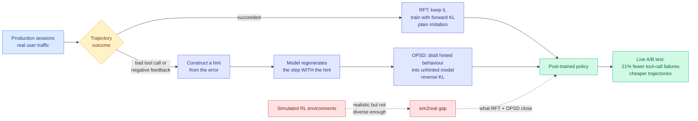

# Perplexity's OPSD: distilling a model's own hindsight back into its tool-calling policy

**Source:** Perplexity research blog, surfaced via the X home feed ([@AravSrinivas](https://x.com/AravSrinivas/status/2102497917185802737), [@denisyarats](https://x.com/denisyarats/status/2102501239988920783)) · [Blog](https://www.perplexity.ai/hub/blog/learning-from-real-world-experience)
**Raw:** [raw/twitter/feed/2026-09-23-morning-ranked.json](../../raw/twitter/feed/) (gitignored, local)

## TL;DR

Perplexity post-trained the model behind their Computer agent on **real production sessions** rather than on simulated RL environments, and reported a **21% reduction in tool-call failures in a live A/B test**. The pipeline is four stages: supervised fine-tuning, reinforcement learning, **rejection-sampling fine-tuning (RFT)**, and **on-policy self-distillation (OPSD)**. The last two are the new part and they are used specifically to close the gap between simulated environments and production traffic. RFT handles the good trajectories: keep the ones that worked, train on them with a forward KL objective, which is ordinary imitation. OPSD handles the broken ones: take a trajectory with a bad tool call or negative user feedback, **construct a hint from the error itself**, let the model regenerate the step with that hint, then distil the hinted behaviour back into the unhinted model with a reverse KL objective. The base model was GLM-5.2. Trajectories also became more cost-efficient, and user-satisfaction movement was positive but not yet statistically significant.

## The idea worth keeping

**The hint is the mechanism, and it is a hindsight channel.** A failed tool call contains information the model did not have at the moment it made the call: the error message. Feeding that error back as a hint and asking the model to try again produces a behaviour the model is already capable of but did not select. Distilling that hinted behaviour into the unhinted model transfers the correction without needing a reward model, a human label, or a stronger teacher. **The teacher and the student are the same model; the only asymmetry is that the teacher has seen the consequence.**

**The forward-versus-reverse KL split is deliberate and worth noting.** Forward KL (cross-entropy) on successful trajectories is mode-covering: keep everything that worked. Reverse KL on the hinted regenerations is mode-seeking: collapse onto the specific corrected behaviour rather than spreading probability over the failure modes around it. Using the two objectives for the two trajectory classes is a cleaner design than the usual single-objective post-training stage.

**Denis Yarats names the interesting consequence explicitly**: this shape is a plausible route to **online or continual learning**, because the training signal is generated by deployment rather than by a curated environment. Every round of traffic produces its own corrections.

## How this relates to what the wiki already knows

**It supplies a deployed instance of a pattern that has been accumulating on the distillation page as papers.** The wiki has repeatedly recorded that the useful signal in distillation is sparse and selective rather than uniform: [IER-OPD (09-22)](2026-09-22-ier-one-percent-tokens-opd.md) matched full on-policy distillation using 0.1% of tokens by picking them for gradient reliability rather than teacher disagreement, and [TIP](knowledge-distillation.md) earlier found most teacher-generated tokens carry no learning signal. **OPSD is the same selectivity applied at the trajectory level instead of the token level: train on the steps that went wrong, and only on those.**

**It is the second result today using a hindsight-informed teacher to fix a policy that lacks hindsight.** [Taste-Bench (09-23)](../agentic-systems/2026-09-23-taste-bench-long-horizon-decisions.md) distils the judgement of a teacher that has seen the outcome of a decision fork into a student that has not, and reports better fork choices and higher end-to-end SWE-bench Pro success. Two independent groups, one day, the same trick at two different granularities. **Hindsight is becoming a first-class distillation source, and this wiki has no page for it yet.**

**It is also the industry half of a research claim the wiki has been tracking from the other side.** [The 09-22 Salesforce finding](../agentic-systems/2026-09-22-harnesstax-cost-success-frontier.md) was that transplanting a stronger model's harness configuration onto a weaker model degrades it, and that fixing the weaker model's own observed failures works better. OPSD is exactly that policy, automated and shipped: do not copy a better system's behaviour, correct your own observed errors. **Research said fitted beats transplanted; a production system just reported 21% on the fitted route.**

## Gaps

This is a company blog post, not a paper. No ablation separates RFT's contribution from OPSD's, so the 21% is attributed to the pair. The base model is GLM-5.2, and it is unstated whether the approach transfers to a model that was not already post-trained in this pipeline. User satisfaction is reported as positive but not statistically significant, which the authors say they are working on, and that is the metric that would distinguish "fewer errors" from "better product." And the central risk of learning from production traffic is unaddressed: **a model trained on its own deployed trajectories inherits its own distribution, including the queries it was already good at, which is a self-reinforcing loop with no stated correction.**

## Related pages

- [knowledge-distillation](knowledge-distillation.md) · [tool-calling](../agentic-systems/tool-calling.md) · [self-evolving-agents](../agentic-systems/self-evolving-agents.md)
- [IER-OPD (09-22)](2026-09-22-ier-one-percent-tokens-opd.md) · [Taste-Bench (09-23)](../agentic-systems/2026-09-23-taste-bench-long-horizon-decisions.md)
- [Daily digest 2026-09-23](../daily-digest/2026-09/2026-09-23.md)
