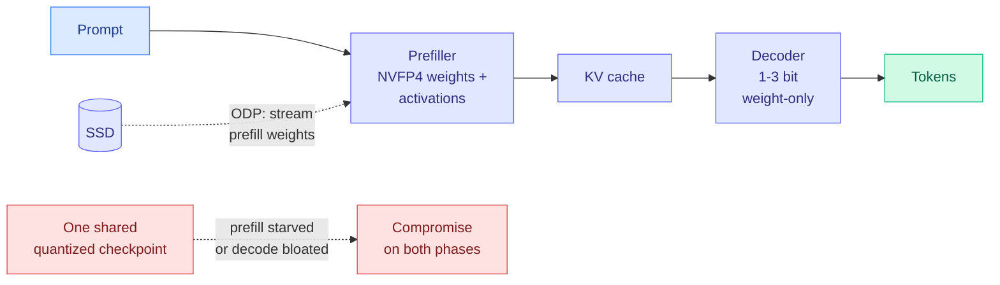

# Disaggregated Quantization: Specializing LLM Prefill and Decode

**Source:** arXiv [2609.26333](https://arxiv.org/abs/2609.26333) · Panferov, Kleinegger, Priyadarshi, Blankevoort, Alistarh (IST Austria / Qualcomm lineage) · surfaced via X home feed ([@arXivBangers](https://x.com/arXivBangers/status/2102641923064553641)) · 2026-09-22 submission
**Raw:** `raw/twitter/feed/2026-09-24-morning-ranked.json`

## TL;DR

Prefill and decode are different workloads, and they want different quantization. Prefill (processing the prompt) is compute-bound, so it benefits from low-precision *arithmetic*, meaning activations and weights both in a compute-native format like NVFP4. Decode (generating one token at a time) is memory-bandwidth-bound, so it benefits from *compact weights* and gains nothing from quantized activations. Disaggregated quantization (DQ) stops forcing one checkpoint to serve both. It keeps a weight-only low-bit decoder and trains a separate compute-native prefiller. On released Qwen3.8-27B GGUF decoders, adding an NVFP4 prefiller lifts **1-bit** decode accuracy by **32.5 points on MMLU-Pro and 35.3 on MMMU-Pro** without touching the decode checkpoint. To fit two checkpoints on one device, the prefill weights are streamed from SSD (offloaded disaggregated prefill, ODP), amortized over prompt length, giving **1.78x time-to-first-token** at 8K prompts in llama.cpp.

## Key claims

- **Removing activation quantization on decode only** improves accuracy on decode-heavy tasks at no extra inference cost, because decode was never arithmetic-bound.
- **Separate compute-native prefill weights** speed prompt processing relative to weight-only inference while matching or beating its accuracy at 2-3-bit decode.
- **1-bit decoders are rescued by a good prefiller**: +32.5 MMLU-Pro, +35.3 MMMU-Pro on Qwen3.8-27B GGUF.
- **ODP** streams the prefiller from SSD so both checkpoints fit on one device; 1.78x TTFT at 8K tokens in llama.cpp.
- Accuracy validated under disaggregated serving in vLLM, and shared-weight format disaggregation validated by PTQ up to **2.8T parameters**.

## Relation to prior wiki pages

- **Extends [SemiAnalysis's four-regime inference decomposition (09-22)](../hardware/2026-09-22-semianalysis-inference-data-movement.md)**, which argued prefill and decode sit in different compute-versus-bandwidth regimes and serving must treat them separately. DQ is that argument applied to the numeric format rather than the hardware. Disaggregated serving already splits phases across machines; DQ splits them across checkpoints.
- **Adds a tenth allocation axis to the [quantization page](quantization.md)**, whose organizing claim is "precision should be allocated, not set." Prior axes were per-head, per-expert, per-layer, per-token; DQ allocates **per inference phase**. It is the same week as [KV-COBRA (09-23)](2026-09-23-kv-cobra-bit-rank-allocation.md) and Colla-Q, both of which argued the split of the budget is the lever, not the scheme.
- **ODP is a sibling of [kimi-k3-in-c's NVMe expert streaming (09-12)](2026-09-12-kimi-k3-in-c-nvme-expert-streaming.md)** and today's [LM-CXD](../hardware/2026-09-24-lm-cxd-cxl-ssd-prefix-cache.md): cold bytes demoted to flash, with the load amortized over work that is long enough to hide it.

## Gaps

The 1-bit rescue numbers are the headline but 1-bit decoders start from a very low floor, so the absolute accuracy after rescue matters more than the delta and is not in the abstract. The prefiller must be trained, which is a real cost per model family. ODP's 1.78x is at 8K prompts; short prompts cannot amortize the SSD load and may regress. And the KV cache produced by an NVFP4 prefiller is consumed by a differently-quantized decoder, so any mismatch in representation is absorbed silently; an ablation on that interface is the thing to look for.

## Research angle

Does the prefiller need to be a quantization of the same model at all? If prefill only has to produce a KV cache the decoder can read, a *smaller* prefiller trained to emit the big model's cache is the natural next step, which would connect DQ to the YOCO-style prefill-exit architectures (see [HySparse2](2026-09-24-hysparse2-two-level-kv-sharing.md)), where only part of the network runs at prefill.

**Related:** [quantization](quantization.md) · [kv-cache](kv-cache.md) · [memory-hierarchy](../hardware/memory-hierarchy.md)
