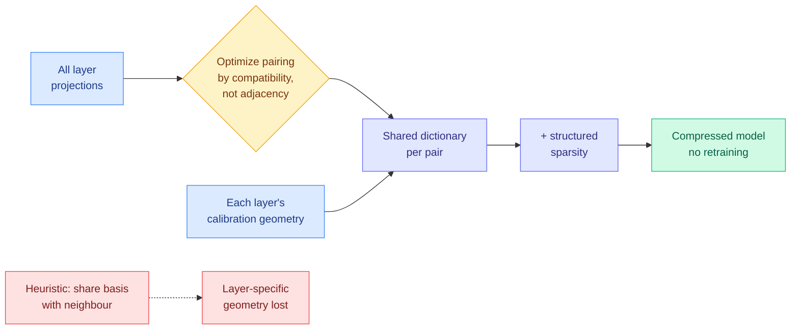

# GeoPair: Geometry-Preserving Cross-Layer Factorization for Training-Free Transformer Compression

**Source:** HuggingFace Daily Papers 2026-09-24 (13 upvotes) · arXiv [2609.25963](https://arxiv.org/abs/2609.25963) · Mohammad, Ali, Lefkimmiatis
**Raw:** `raw/huggingface/2026-09-24-geopair-geometry-preserving-cross-layer-factorization-for-tr.md`

## TL;DR

Transformers are redundant across layers, and post-training compression mostly ignores it: layers get decomposed independently, or adjacent layers get forced to share one basis by heuristic grouping. GeoPair is training-free and does two things in sequence. It **searches for which layers' projections are structurally compatible** (not just which are adjacent), then learns a **shared dictionary** for each pair that still respects each layer's own calibration geometry (the distribution of activations it actually sees). Combined with structured sparsity, it reports state-of-the-art results across architectures, scales and modalities against independent structured decompositions and heuristic pairwise factorizations.

## Key claims

- Pairings are **optimized**, not assumed from adjacency; the pipeline is described as convergent.
- The shared representation preserves each layer's distinct activation geometry instead of merging statistics.
- Beats independent structured weight decompositions and alternative pairwise factorizations across architectures, scales and modalities (numbers not in the abstract).

## Relation to prior wiki pages

- **Same claim as [WRP (09-12)](model-pruning-sparsity.md)** from the other direction: WRP estimated inter-layer redundancy from checkpoint weights to delete whole blocks; GeoPair keeps the blocks and shares their parameters. Both treat cross-layer redundancy as the compressible quantity.
- **Parallels [HySparse2 (same day)](2026-09-24-hysparse2-two-level-kv-sharing.md)**, which shares *KV caches* across layers. GeoPair shares *weights* across layers. Cross-layer sharing arrived on the weights side and the cache side on the same day.
- **Another allocation result in the week's pattern** (see [KV-COBRA, 09-23](2026-09-23-kv-cobra-bit-rank-allocation.md)): the gain comes from deciding *which* components share budget, not from a new decomposition primitive.

## Gaps

Abstract only; alphaxiv returned no overview. No compression ratio, speedup or accuracy numbers stated. Shared-dictionary factorizations reduce parameters but do not automatically reduce latency unless kernels exploit the shared basis, and no kernel story is given.

**Related:** [model-pruning-sparsity](model-pruning-sparsity.md) · [quantization](quantization.md)
