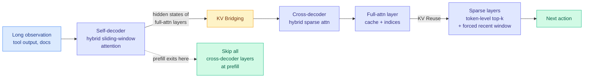

# HySparse2: Hybrid Sparse Attention with Two-Level KV Sharing

**Source:** arXiv [2609.26368](https://arxiv.org/abs/2609.26368) · Xiaomi MiMo team (Wei, Gao, Zhang, Luo et al.) · surfaced via X home feed ([@askalphaxiv](https://x.com/askalphaxiv/status/2103037759829274774)) and contextualized by [@eliebakouch's architecture comparison](https://x.com/eliebakouch/status/2102880947020427547)
**Raw:** `raw/twitter/feed/2026-09-24-evening-ranked.json` · alphaxiv overview via `connectors/alphaxiv/enrich.py 2609.26368`

## TL;DR

Agents emit short actions and ingest long observations, so their cost is dominated by **prefill** (processing incoming context) and **KV-cache storage**, not by generation. HySparse2 attacks both with two nested forms of KV sharing. At the outer level, a YOCO-style split (You Only Cache Once: a self-decoder builds a representation that a cross-decoder reuses) lets the cross-decoder's full-attention layers build their KV caches from the self-decoder's hidden states, so **prefill can exit after the self-decoder** and skip every cross-decoder layer. At the inner level, sparse layers reuse the full-attention layer's cache and selection indices, now with **token-level** instead of block-level sparsity, and a forced sliding window of recent tokens folded into the sparse selection. On an 80B-A3B mixture-of-experts model at 1M context, prefill FLOPs fall **2.92x** versus HySparse and the KV cache shrinks **6.72 GB to 2.69 GB**, while RULER-v2 at 256K rises **32.61 to 58.45**.

## Key claims

- **Prefill exit**: because every cross-decoder KV cache is constructed from self-decoder hidden states, prefill never runs the cross-decoder.
- **Token-level sparsity** replaces block-level selection for finer long-context retrieval.
- **Sliding window folded into sparse selection**, removing HySparse's separate SWA branch.
- 80B-A3B MoE: beats HySparse and Hybrid SWA on MRCR-v2, RULER-v2 and multi-turn agentic tasks after identical light post-training; lower AgentPPL and LongPPL at every tested length.
- 1M context: **2.92x fewer prefill FLOPs, KV cache 6.72 GB to 2.69 GB** (claims reported by alphaxiv; the paper frames savings in FLOPs and bytes, not measured wall-clock latency).

## Relation to prior wiki pages

- **This is the third instance of YOCO-style prefill exit becoming the default frontier-efficient design.** @eliebakouch's same-day survey of the four most advanced efficient architectures notes that DeepSeek V4.1 Flash and MiMo V3 both use YOCO (only the first part of the network is active during prefill to build the KV representation) with a token-level indexer and no linear attention, while Qwen 3.8 Next Flash and GLM 5.3 Flash use a 3:1 interleave of sparse and linear attention (Gated DeltaNet or Kimi Delta Attention, the latter covered in [Complex KDA (09-23)](../llms-foundation-models/2026-09-23-complex-kda-expressivity.md)). HySparse2 is the published mechanism behind MiMo V3's branch.
- **Converges with [ARM (09-23)](../ai-routing/2026-09-23-arm-routed-memory-attention.md) and [MInference](2026-09-21-ultra-long-context-dca-yarn-minference.md)** on the claim that long-context attention is a routing problem over tokens, not a dense computation. HySparse2's token-level indexer is the learned, per-token version.
- **Directly relevant to the [kv-cache page's](kv-cache.md) 09-23 thesis** that the cache has internal structure to be allocated. Here the structure is *layer sharing*: one computed cache serves many layers.
- **Answers part of the agentic cost question** raised by [SemiAnalysis (09-22)](../hardware/2026-09-22-semianalysis-inference-data-movement.md), which named "midfill" (reprocessing existing context during agent turns) as the regime existing serving ignores. Prefill exit cuts exactly that bill.

## Gaps

No measured wall-clock latency or throughput in the abstract, only FLOPs and bytes. Comparisons are against the team's own predecessor and a hybrid SWA baseline, not against DeepSeek's or Qwen's efficient variants. The quality claims are after "light post-training," so the full-training behaviour is unknown.

## Research angle

YOCO-style exit makes prefill cost scale with the self-decoder only. That changes the economics of [Disaggregated Quantization (same day)](2026-09-24-disaggregated-quantization-prefill-decode.md): a compute-native prefiller only needs to cover the self-decoder half. Nobody has combined phase-specific quantization with a prefill-exit architecture, and the two are complementary by construction.

**Related:** [kv-cache](kv-cache.md) · [attention-mechanisms](../llms-foundation-models/attention-mechanisms.md) · [model-pruning-sparsity](model-pruning-sparsity.md)
