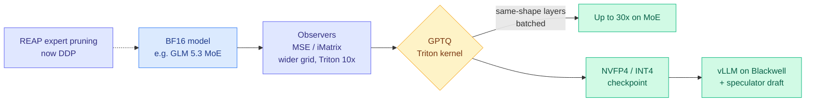

# LLM Compressor v0.14.0: GPTQ rewritten in Triton, 15x to 30x faster

**Source:** vLLM project release notes, 2026-09-22 ([release](https://github.com/vllm-project/llm-compressor/releases/tag/0.14.0)), surfaced on the X home feed via [@RedHat_AI](https://x.com/RedHat_AI/status/2102804405905175020). Companion checkpoint: [RedHatAI/GLM-5.3-NVFP4](https://huggingface.co/RedHatAI/GLM-5.3-NVFP4) ([@RedHat_AI](https://x.com/RedHat_AI/status/2103120042510401654)).
**Raw:** `raw/twitter/feed/2026-09-25-morning-ranked.json` (release notes in `articles[].content`)

## TL;DR

GPTQ is the standard post-training quantization pass. It walks a model layer by layer, rounds weights to low precision, and uses a Hessian estimate (a second-order picture of how sensitive the loss is to each weight) to push the rounding error onto weights that have not been quantized yet. It is accurate and it has always been slow. v0.14.0 ships a Triton GPTQ kernel that is **about 15x faster end to end**, and batches layers that share a shape, which reaches **about 30x on some MoE workloads** where one expert shape repeats hundreds of times. Hessian offloading is gone, and the old eager path got 1.5x to 2x faster anyway. The release also widens the grid search of the MSE and iMatrix observers (the step that picks per-block scales), which **finds better local scales for NVFP4** (NVIDIA's 4-bit floating-point format for Blackwell) and beats GPTQ for NVFP4 on internal benchmarks.

## Key contents

- **GPTQ kernel (#3128).** Triton quantization kernel, about 15x faster than the prior implementation. Same-shape layer batching gives about 1.67x more throughput per batch and up to 30x end to end on MoE. Loop invariants hoisted out of the per-column loop. An end-of-run report now lists modules that fell back to round-to-nearest.
- **Observers.** MSE and iMatrix observers take an expansion factor, making their search a superset of the "Fourosix" strategy. A new Triton grid-search kernel speeds observation about 10x with bitwise parity to the eager path.
- **REAP expert pruning** now runs under distributed DDP, with an optional e-score correction bias.
- **Model-free PTQ** gets a memory-aware dynamic GPU scheduler, mixed-precision and **KV-cache quantization** support, and profiler-based memory estimates.
- **MoE machinery.** Per-checkpoint load-mapping overrides, re-packing into fused 3D expert modules after linearization, fast loading for Nemotron 3 Ultra, GPT-OSS expert linearization. GLM 5.3 and Qwen3.8 are supported targets.
- **The stacked checkpoint.** Red Hat's GLM-5.3-NVFP4 recovers 95% or more of accuracy across its evals and is recommended with the DSpark speculator (an 8-token draft) in vLLM on Blackwell. The 4-bit format cuts bytes moved per token. Speculative decoding (a small draft proposes several tokens and the big model verifies them in one pass) cuts sequential steps. The two wins are orthogonal and compound.

## How this relates to prior wiki pages

- **Continues the pattern on [quantization](quantization.md)** that the cost wins of September are landing in the serving and tooling stack, not in new model designs. On 09-23 constrained decoding reached sub-40-microsecond kernels; today the once-per-release quantization pass got an order of magnitude cheaper.
- **Lowers the cost of [Disaggregated Quantization (09-24)](2026-09-24-disaggregated-quantization-prefill-decode.md)**, which argued prefill and decode want separate quantized checkpoints. Two checkpoints per model is only practical if quantizing is cheap. A 15x to 30x faster GPTQ removes most of that objection.
- **Timing with kernel verification.** The same day, VeriTile (Lean plus AI-assisted proofs for Triton-style kernels) circulated on the feed. A trusted reference implementation just got replaced by a new Triton kernel, which is exactly the case formal verification of kernels is for. See [gpu-kernels](../hardware/gpu-kernels.md).

## Gaps

Speedups are the project's own numbers on its own hardware. The NVFP4 observer claim is "internal benchmarks." No end-task accuracy comparison between the new Triton path and the old eager path beyond "bitwise parity" for the observer kernel.

## Research angle

When requantizing costs minutes instead of hours, per-workload or per-phase quantization (a different checkpoint per traffic mix) becomes an operational option, not a research one. The open question is whether anyone ships automated requantization in the serving loop, triggered by drift in the traffic distribution.
