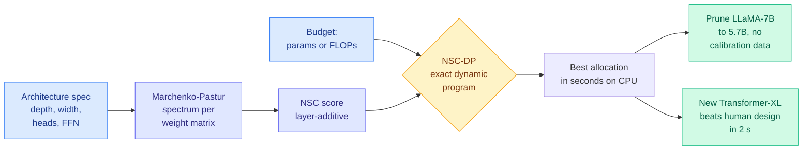

# Neural Spectral Capacity: Measuring and Designing Architectures from Network Specification Alone

**Source:** HuggingFace Daily Papers 2026-09-25 (5 upvotes), arXiv [2609.23087](https://arxiv.org/abs/2609.23087)
**Raw:** `raw/huggingface/2026-09-25-neural-spectral-capacity-measuring-and-designing-architectur.md` (abstract only; no alphaxiv overview yet)

## TL;DR

Parameter count and FLOPs say how big a network is. They do not say how well its capacity is allocated. Two architectures with the same parameter budget but different depth, width, head count or FFN size get the same score and behave differently. Neural Spectral Capacity (NSC) is a closed-form scalar built from the singular-value spectrum of each weight matrix. Under standard random initialization the Marchenko-Pastur law (the known distribution of singular values of a random matrix) gives that spectrum from the matrix shape alone, so NSC is computable from the architecture spec with **no weights, no data and no gradients**. Because NSC adds up layer by layer, an exact dynamic program (NSC-DP) finds the architecture that maximizes it under a resource budget in seconds on a CPU. The compression result is the headline for this wiki: NSC-DP **prunes LLaMA-7B to the best 5.7B model across eight commonsense tasks with no calibration data, about 5,900x faster than the strongest training-free proxy**.

## Key findings

- **Ranking where parameter count fails.** On FlexiBERT pairs that differ in parameter count by under 10%, NSC reaches Kendall τ = 0.505 against true performance, where #Params collapses to 0.082. It beats #Params, #FLOPs and representative training-free proxies across seven Transformer and CNN families.
- **Architecture search in seconds.** NSC-DP finds a Transformer-XL configuration on WikiText-103 that beats the human-designed baseline, in 2 seconds.
- **Calibration-free structured pruning.** LLaMA-7B pruned to the best 5.7B model on eight commonsense benchmarks, with no calibration set, about 5,900x faster than the strongest training-free proxy baseline.
- **An exactness guarantee.** Because the score is additive, the DP returns the global optimum of NSC under the constraint, which black-box search over other zero-cost proxies cannot promise.

## How this relates to prior wiki pages

- **Fills a gap on [model-pruning-sparsity](model-pruning-sparsity.md).** Structured pruning on this wiki has almost always needed calibration data or activation statistics to decide what to cut. NSC decides from shape alone. That is a different family from activation-aware pruning, and it only decides *how much* to keep per layer, not *which* weights.
- **Pairs with GeoPair (09-24)**, the cross-layer factorization paper that compresses by sharing structure across layers. Both treat compression as capacity allocation under a budget. GeoPair uses trained weights, NSC uses none.
- **Rhymes with LLM Compressor v0.14's REAP expert pruning** ([same day](2026-09-25-llm-compressor-v0-14-triton-gptq.md)), which prunes MoE experts using routing statistics. NSC would be the budget-setting step upstream of a pass like that.

## Gaps

The score is computed at random initialization, so it measures the capacity an allocation *could* use, not what training actually used. Whether the pruned 5.7B needs recovery fine-tuning, and how it compares to activation-aware pruners like Wanda or SparseGPT at equal size, is not in the abstract. Only commonsense tasks are reported for the LLaMA result, and LLaMA-7B is an old target.

## Research angle

The interesting test is modern MoE and hybrid models. NSC's additivity should extend to choosing expert counts and attention-to-linear-layer ratios, which is the exact design question the 3:1 sparse-linear interleave debate on [kv-cache](kv-cache.md) is arguing about. A second test: does NSC still rank correctly *after* training, using the actual trained spectrum? If trained-spectrum NSC predicts which layers can be dropped, it becomes a pruning signal, not just a budget allocator.
