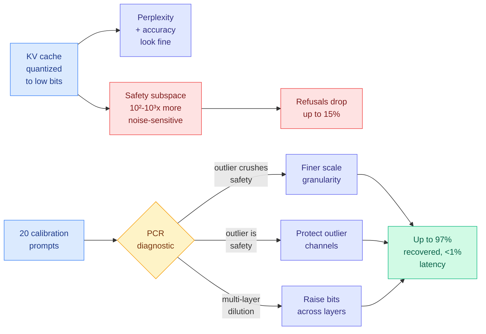

# Alignment Collapse Under KV Cache Quantization: Diagnosis and Mitigation

**Source:** arXiv [2606.09864](https://arxiv.org/abs/2606.09864) (Adarsh Kumarappan et al.), accepted to NeurIPS 2026. Code: [kv-quantization-alignment](https://github.com/Adarsh321123/kv-quantization-alignment). Surfaced on the X home feed via [@adarshk123321](https://x.com/adarshk123321/status/2103559379794731069) on the acceptance announcement.
**Raw:** `raw/twitter/feed/2026-09-26-morning-ranked.json` (arXiv abstract and repo README in `articles[].content`)

## TL;DR

KV cache quantization (storing the attention keys and values of past tokens in fewer bits to save GPU memory) is evaluated almost everywhere with perplexity and task accuracy. This paper measures the thing nobody checks: refusals. Across eleven instruction-tuned models from 3.8B to 72B and 1,894 safety prompts, low-bit KV quantization can silently remove safety behaviour while perplexity barely moves. Mistral-7B loses 15.2% of its refusals at 1.03x perplexity. There is no universal safe bit-width, and each model has its own sharp phase transition. The cause is geometric: safety features live in a low-dimensional activation subspace that is 10² to 10³ times more sensitive to quantization noise than the full space perplexity averages over. A 20-prompt diagnostic, Per-Channel Reduction (PCR), sorts each model into one of three failure modes and picks the right fix, recovering up to 97% of lost alignment in about 35 GPU-minutes with no training.

## Key findings

- **Standard metrics are blind to it.** Mistral-7B loses 15.2% of refusals at only 1.03x perplexity. The benchmarks were AdvBench, HarmBench, XSTest and two others, 1,894 prompts total.
- **No universal safe bit-width.** The collapse is a sharp, model-specific phase transition, so "4-bit KV is safe" is not a transferable rule.
- **Mechanism.** Safety features occupy a low-dimensional subspace. Quantization noise that averages out over the full representation is concentrated relative to that subspace, so it is 10² to 10³ times more damaging there.
- **Three failure modes, three different fixes.**
  - *Outlier-crushes-safety:* outlier channels set the quantization scale, and the non-outlier channels where safety lives get rounded coarsely as collateral damage. Finer granularity fixes it.
  - *Outlier-as-safety:* safety overlaps the outlier channels themselves, and finer granularity cannot help. You must protect those channels.
  - *Multi-layer dilution:* safety is spread across many layers, so per-layer fixes fail.
- **PCR predicts the right mitigation** on all nine primary models plus a held-out model from a separate family, from 20 calibration prompts. It generalizes to KIVI (a widely used 2-bit KV quantizer) with up to 97.2% recovery, where attention-score-based bit allocation fails.
- **Production-relevant.** The authors confirm the vulnerability in vLLM serving with FP8 KV cache on NVIDIA GPUs. The camera-ready adds rotation-based quantization (the Hadamard-rotation family that spreads outliers before rounding): PCR predicted the outcome in all eight model and bit-width settings, **including a case where rotation made safety worse**. Serving overhead is under 1% latency.

## How this relates to prior wiki pages

- **Contradicts the evaluation practice of every KV compression page on this wiki.** [KV-COBRA (09-23)](2026-09-23-kv-cobra-bit-rank-allocation.md) co-optimizes per-head bit-width and rank against reconstruction and accuracy. This paper says that objective can be satisfied while the safety subspace is destroyed. Allocation methods that decide precision from attention or reconstruction statistics are exactly what PCR beat.
- **Echoes [MASOV (07-26)](../responsible-ai/2026-07-26-masov-access-control-cyber-benchmark.md)**, which argued that evaluating a compressed model only on the capabilities it was compressed for misses behaviour it was never tested on. This is the first quantitative instance of that warning on the KV side.
- **Hits the rotation camp.** Rotation-based quantizers were supposed to remove the outlier problem. The finding that rotation can make safety worse means outlier removal and safety preservation are separate objectives.
- **Connects to [Disaggregated Quantization (09-24)](2026-09-24-disaggregated-quantization-prefill-decode.md)**, which runs a 1 to 3-bit decoder on a cache produced by an NVFP4 prefiller. Nobody has measured refusals across that handoff.

## Open questions

- Does weight quantization (NVFP4, GPTQ) show the same subspace fragility, or is it specific to the KV path where noise accumulates over long contexts?
- The paper's long-context analysis is new in the revision. Does the safety loss grow with context length, the way KV quantization error does?
- Could the PCR probe be run as a standard gate in quantization toolkits, next to perplexity?

## Links

- Concept pages: [kv-cache](kv-cache.md) · [quantization](quantization.md) · [responsible-ai](../responsible-ai/responsible-ai.md)
- Raw: `raw/twitter/feed/2026-09-26-morning-ranked.json`
