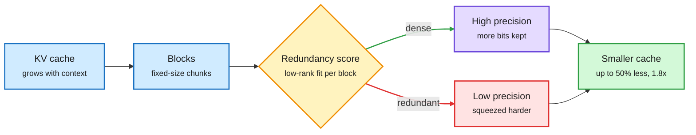

# MILO: mixed-precision KV cache by block redundancy

**Source:** X home feed ([@TeksEdge](https://x.com/TeksEdge/status/2103696064276824395)), 2026-09-26. The thread says the paper is linked in the image alt text; no arXiv id was captured. Raw: `raw/twitter/feed/2026-09-26-afternoon-ranked.json`.

## TL;DR

Once quantized weights fit in memory, the KV cache (the stored attention keys and values that grow with every token of context) becomes the next memory hog. MILO splits the cache into blocks and uses low-rank compression to measure how redundant each block is. Information-dense blocks keep more bits; redundant blocks are squeezed harder. The reported result is up to 50% less KV memory and up to 1.8x throughput on Qwen2.5. It was tested only on Qwen2.5 3B and 7B, on one Nvidia L4, for many-shot long-context prompts.

Spend the bits where the cache is not redundant

MILO's only new step is scoring each block before choosing its precision.

Blue is the cache, amber is the scoring decision, purple keeps bits, red loses bits, green is the result.

## Key points

- **Mixed precision by content, not by position.** Most KV quantizers pick precision per layer, head or token. MILO picks it per block, using low-rank reconstruction error as the redundancy signal.
- **Practical scale of the saving.** The thread's example: an 8GB cache at 128K context drops to about 4GB, so the same memory holds roughly twice the context or twice the concurrent sessions.
- **Narrow evidence.** Qwen2.5 3B/7B, one L4 GPU, many-shot long-context inference. Not a llama.cpp or vLLM feature yet.

## Relation to prior wiki pages

- Joins the bit-allocation line on [kv-cache](kv-cache.md): [KV-COBRA (09-23)](2026-09-23-kv-cobra-bit-rank-allocation.md) jointly allocates bits and rank across the cache, and MILO makes the allocation block-local.
- Same-day contrast with [FlashLoop (09-27)](../llms-foundation-models/2026-09-27-flashloop-lazy-updates.md), which compresses KV by redundancy across loop iterations. MILO finds redundancy inside one pass. Both argue that much of the cache is recoverable from a low-dimensional summary.
- Caution from [KV quantization and alignment collapse (09-26)](2026-09-26-kv-quantization-alignment-collapse.md): aggressive KV quantization can degrade safety behavior. MILO reports no safety evaluation.

## Gaps

- No arXiv id captured, so claims rest on one thread's summary.
- Two small models, one GPU class, one workload type.
- No latency breakdown for the scoring step, and no interaction test with paged attention or prefix caching.
