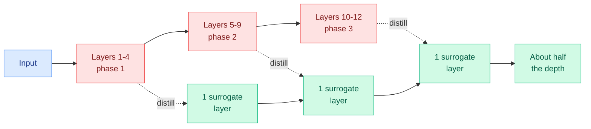

# A Smaller Transformer in Your Transformer (TWT)

**Source:** arXiv [2609.20100](https://arxiv.org/abs/2609.20100) (Dhananjay Tomar, Marius Aasan, Andreas Kleppe, Adín Ramírez Rivera; University of Oslo / Oslo University Hospital / UiT). Surfaced via the X home feed ([@askalphaxiv](https://x.com/askalphaxiv/status/2103836737474830492)), 2026-09-26.

## TL;DR

Vision Transformers settle into runs of neighboring layers whose outputs barely differ, as if each run is one "computational phase" making small edits. Prior ways of exploiting this either skip layers (which hurts accuracy) or keep the compute. TWT (Transformer-Within-Transformer) is post-hoc: it finds each redundant run and trains a single ordinary transformer layer to map straight from the phase's input to its output. On DINOv2 it keeps accuracy close to the original at about half the depth, cutting parameters and inference compute roughly in half, and on several histopathology tasks it matches or beats the full model.

## Key points

- **A unified view of block redundancy** separates the geometry (which layers are similar) from the intervention (skip, merge, or replace).
- **Depth pruning by distillation, not deletion.** Each surrogate is trained to reproduce the phase's end-to-end map, which is why it avoids the accuracy cliff of plain layer dropping.
- **Post-hoc and cheap.** No pretraining from scratch; only the surrogate layers are trained.

## Relation to prior wiki pages

- **Same claim as FlashLoop, other modality.** [FlashLoop (09-27)](../llms-foundation-models/2026-09-27-flashloop-lazy-updates.md) found later loops of a looped LM change few features. TWT finds neighboring ViT layers change little. Both turn "repeated depth mostly repeats work" into savings. Together with the looped-MoE scaling paper the same day, that is three papers in one day on depth redundancy.
- Extends [model-pruning-sparsity](model-pruning-sparsity.md) (structured depth pruning) and [knowledge-distillation](knowledge-distillation.md) (layer-group distillation as the pruning operator).

## Gaps

- Vision only (DINOv2 and histopathology). Whether LLM layer phases are as clean, especially in deep decoder stacks, is untested.
- Phase detection is static per model; input-dependent phases (a hard image needing more depth) are not handled.
- No wall-clock latency numbers beyond FLOP and parameter counts in the abstract.
