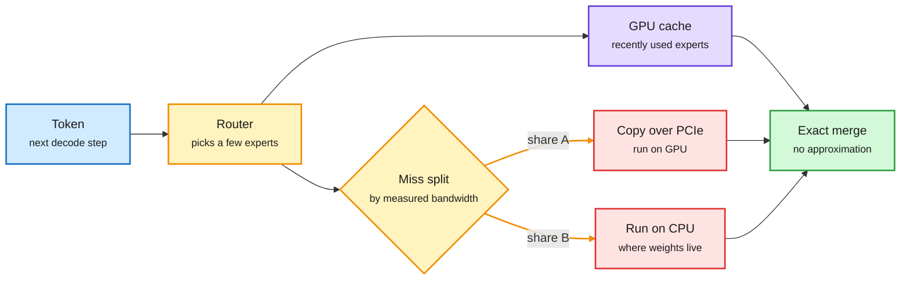

# FreeToken: Efficient Edge-Native MoE Serving with Bandwidth-Adaptive Execution

**Source:** arXiv [2608.16157](https://arxiv.org/abs/2608.16157) (Shuo Yang, Xiaoze Fan, Melissa Pan, Haocheng Xi, Zhe Wang, Shanlin Sun, Kurt Keutzer, Song Han, Matei Zaharia, Chenfeng Xu, Ion Stoica; UC Berkeley and collaborators). Code: [FlashML-org/FreeToken](https://github.com/FlashML-org/FreeToken) (Apache 2.0). Surfaced via the X home feed ([@DailyDoseOfDS_](https://x.com/DailyDoseOfDS_/status/2104141556945134028)), 2026-09-27. Raw: `raw/twitter/feed/2026-09-27-evening-210705-ranked.json`.

## TL;DR

Mixture-of-experts (MoE) models only touch a few experts per token, so the compute for one decode step fits on a consumer GPU. What does not fit is the full expert set. Experts live in system RAM and the GPU caches the recently used ones. The whole game is what happens on a cache miss. Existing engines pick one answer at load time: always copy the missing expert over PCIe, or always run it on the CPU. Both paths read the same system memory, so they compete for one bandwidth pool. FreeToken profiles each machine's PCIe and host-memory bandwidth once, then splits every step's misses between the two paths in proportion, and merges the results exactly. A second mechanism targets agent workloads: it checkpoints the prefill state at the boundaries where agent frameworks rewrite history, so an edited context only re-processes the new part. Reported: Qwen3.6-35B at 39.3 tok/s on an 8GB GPU, DeepSeek-V4-Flash 284B at 22 tok/s on 32GB, GLM-5.2 753B at 14.9 tok/s on 96GB, 2 to 4x faster than Ollama, and worst-case time to first token under 44s against 232s for llama.cpp and 946s for KTransformers.

A missing expert can come to the GPU or stay on the CPU

FreeToken's trick is splitting each step's misses between both paths, sized to the machine's measured bandwidth.

Blue is input, amber is a decision, purple is the hit path, red is the costly miss path, green is the result.

## Key points

- **The bottleneck is placement, not FLOPs.** Qwen3.6-35B activates about 3B parameters per token; DeepSeek-V4-Flash picks 6 of 256 experts per layer (about 13B of 284B active).
- **PCIe copy and CPU compute are not additive.** Both draw on host memory bandwidth. A fixed policy leaves one path idle or oversubscribed as routing shifts token by token.
- **The right split is machine-specific and not on the spec sheet.** A 5090 desktop should push nearly all misses over PCIe; an 8GB laptop should compute most of them on the CPU. FreeToken measures it once per machine.
- **Prefill is where agent workloads hurt.** Long prompts activate most experts, so MoE sparsity vanishes at prefill, and coding agents that rewrite their history force repeated re-prefill. Boundary-aligned checkpoints fix the second part.
- **Drop-in for agent tools.** Serves the OpenAI and Anthropic APIs, so Claude Code and Codex can point at a local endpoint.

## Relation to prior wiki pages

- **Extends the local-MoE practitioner line.** [ik_llama.cpp MTP + CPU offload (05-21)](2026-05-21-ik-llamacpp-mtp-cpu-offload-qwen36.md) showed hand-tuned CPU offload of expert layers running Qwen3.6-35B-A3B at 110 tok/s on a 12GB card. FreeToken turns that hand tuning into a measured, per-step policy and adds the agent-prefill piece.
- **Same "offload the sparse part" move as Engram.** [SemiAnalysis's Engram offloading study (09-18)](../hardware/2026-09-18-semianalysis-engram-dram-ssd-offloading.md) found that moving DeepSeek's lookup table off HBM made serving faster even when HBM was spare. FreeToken does the analogous thing for experts on hardware with no HBM to spare. See [conditional-memory-embeddings](conditional-memory-embeddings.md) and [memory-hierarchy](../hardware/memory-hierarchy.md).
- **Counterpoint to datacenter MoE batching.** [MoE decode batch fragmentation (09-19)](../hardware/2026-09-19-moe-decode-batch-fragmentation.md) is about experts starving at large batch; FreeToken is the batch-of-one regime where the problem is residency, not utilization.

## Gaps

- Throughput numbers are self-reported on the authors' machines; no third-party replication yet.
- Quality at the quantization levels needed for these fits is not stated in the thread.
- The bandwidth profile is taken once; behaviour under contention from other apps (which the paper names as a motivation) needs independent measurement.
