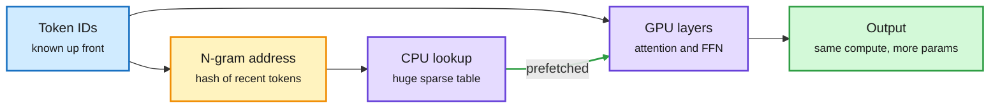

# N-gram Embedding: offload memorized patterns to sparse lookups (practitioner notes)

**Source:** Purshow's study notes, [EN PDF](https://github.com/Purshow/Purshow_Notes/blob/main/Ngram_Embedding/EN/Ngram_Embedding_EN.pdf) · [CN original](https://github.com/Purshow/Purshow_Notes/blob/main/Ngram_Embedding/CN/Ngram_Embedding_CN.pdf). Surfaced via the X home feed ([@purshow04](https://x.com/purshow04/status/2104224877234516401)), 2026-09-27. The English version is a machine translation of the Chinese original. Raw: `raw/twitter/feed/2026-09-27-evening-230005-ranked.json`.

## TL;DR

A long set of notes arguing that N-gram embeddings will be adopted by more frontier teams. The question they pose: can static, local, memorizable patterns (common multi-token phrases, names, boilerplate) live in huge sparse lookup tables, so the transformer spends its compute on composition and reasoning instead of re-deriving them? The systems argument is the stronger half. Because the lookup address depends only on token IDs, the runtime knows which rows it needs before running the layers. It can fetch and prefetch them on the CPU while the GPU computes, which takes a large block of parameters out of GPU memory and off the critical path.

Memorized patterns move to RAM; the GPU keeps the thinking

Token IDs give the lookup address before any layer runs, so the fetch can overlap GPU compute.

Blue is input, amber is the address step, purple is where work happens, green is the result.

## Key points

- **Parameters that cost memory, not FLOPs.** A table read is a memory access; adding table rows adds almost no compute.
- **Deterministic addressing is the systems unlock.** Prefetch and overlap only work because the address is known before the hidden states exist.
- **Author caveat:** the notes are a personal study and invite corrections; no new experiments.

## Relation to prior wiki pages

- **Fourth-plus voice for a named concept.** [conditional-memory-embeddings](conditional-memory-embeddings.md) already tracks this family: Engram (DeepSeek's learned multi-token lookup), MoME (context-aware addressing, 09-19), STEM and bigram memory. These notes argue the token-ID-addressed side of the open disagreement on that page, against MoME's hidden-state addressing, on systems grounds.
- **Same move as FreeToken, one level down.** [FreeToken (09-28)](2026-09-28-freetoken-edge-moe-serving.md) keeps rarely used experts in system RAM; N-gram embeddings keep memorized patterns there. Both make parameter count stop tracking GPU memory. [SemiAnalysis's Engram study (09-18)](../hardware/2026-09-18-semianalysis-engram-dram-ssd-offloading.md) is the measured version of the argument.

## Gaps

- No new benchmark; a synthesis of existing work.
- Does not quantify the quality cost when the table is quantized or served from SSD.
