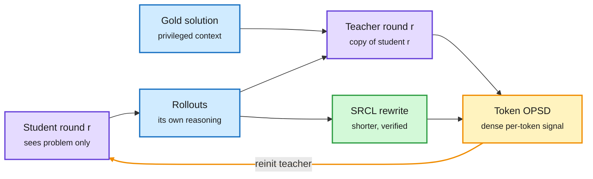

# DCE + SRCL: Recursive Self-Improvement via On-Policy Self-Distillation

**Source:** X feed post by [@arankomatsuzaki](https://x.com/arankomatsuzaki/status/2104413129799274526), 2026-09-28 · [arXiv 2609.30652](https://arxiv.org/abs/2609.30652) · Meta AI with UC Riverside
**Paper title:** "Recursive Self-Improvement via On-Policy Distillation for Reasoning"

## TL;DR

On-policy self-distillation (OPSD) needs no external teacher. The student sees only the problem. A second copy of the same model sees the problem plus a verified solution and acts as a privileged teacher, giving token-level guidance on the student's own rollouts. Earlier OPSD work froze that teacher at the starting checkpoint for stability. This paper argues the frozen teacher becomes the bottleneck: as the student learns to reflect and recover from mistakes, a teacher stuck at the old checkpoint cannot supervise those new behaviours. Dynamic Co-Evolution (DCE) re-initializes the teacher from the updated student at the start of each training round, so teacher and student improve together. Stronger revision behaviour tends to make answers longer, so Self-Refined Concise Learning (SRCL) also trains on shorter rewrites of the model's own responses that are verified to still be correct. On Qwen3-8B, DCE+SRCL reaches 65.97% Average@12 across four competition math benchmarks. That is 35.62 points above OPSD, with mean output length 7.80% shorter than DCE alone.

The teacher is the student, one round later

Each round restarts the privileged teacher from the improved student. A second path keeps answers short.

Blue is the data, purple is the model in its two roles, amber is the training step and the round loop, green is the conciseness path.

## Key findings

- **Reflection words are not reflection.** The authors argue a model can emit "Wait" or "Actually" and still not fix the underlying error. Useful supervision has to land at the prefixes where the model decides whether to stop, re-check, backtrack or correct.
- **The frozen teacher lags the student.** A probe on incorrect Qwen3-8B AIME 2024 to 2026 trajectories motivates DCE: the frozen gold-conditioned teacher gives weak guidance exactly where the improved student now needs it.
- **Co-evolution is the fix.** Re-initializing the teacher from the latest student each round lets the supervisor absorb the student's new recovery behaviour.
- **Length is controlled separately.** SRCL trains on shorter self-rewrites verified correct, cutting mean output length 7.80% relative to DCE alone.
- **Headline:** 65.97% Average@12 on four competition math benchmarks with Qwen3-8B, +35.62 points over OPSD.

## How this relates to prior wiki pages

- **In tension with Privileged, but Biased.** [Privileged, but Biased (08-10)](2026-08-10-privileged-but-biased-self-distillation.md) found that OPSD and SDPO reproduce their gains on easy tasks and teach nothing on hard ones, because a teacher that has seen one reference solution is pulled toward *that trajectory* rather than toward correctness (PI Bias). DCE locates the problem somewhere else: the teacher is stale, so let it learn. Both can be true, but they imply different fixes. DCE still conditions its teacher on a gold solution, so re-initializing the teacher each round refreshes its skill without removing the reference bias. Whether DCE's gains survive on the hard, non-math tasks where 08-10 saw OPSD fail is the test that decides between the two readings.
- **Same move as RISE, different source of the teacher.** [RISE (09-07)](2026-09-07-rise-self-extrapolating-distillation.md) also builds its teacher out of the student's own training, by extrapolating from a trailing checkpoint toward the current one, with no privileged context at all. DCE keeps the privileged context and simply updates which checkpoint reads it. Two independent groups now treat the teacher as something that must move with the student. Neither compares against the other.
- **Composes with Cal-OPD.** [Cal-OPD (09-21)](2026-09-21-cal-opd-calibrated-discrepancy.md) filters out the part of the teacher-student gap caused by the teacher's privileged conditioning. That is the natural patch for the bias risk above, and nobody has run DCE with it.
- **The OPSD baseline deserves scrutiny.** The [09-18 OPD triple](2026-09-18-on-policy-distillation-triple.md) included a study finding that privileged references add only about two points over reference-free distillation. A 35.62-point margin over OPSD implies an OPSD score near 30% on the same benchmarks, low for Qwen3-8B, which suggests the baseline degraded rather than that DCE is that much better. The same triple found that part of OPD length inflation is an EOS-token mismatch, which is relevant to how much of SRCL's length saving a tokenizer fix would already give.
- **Fifth instance of "the binding constraint is the supervisor."** See the [knowledge-distillation page](knowledge-distillation.md). DCE's fix is a supervisor that learns.

## Gaps

- **Math only.** Four competition math benchmarks, which is the domain where 08-10 showed privileged-distillation gains look best.
- One model (Qwen3-8B). No cost accounting for re-initializing and running the teacher every round.
- The comparison is to OPSD. No head-to-head with RISE, Cal-OPD, or plain RLVR at matched compute.

## Related

- [knowledge-distillation.md](knowledge-distillation.md) · [Privileged, but Biased (08-10)](2026-08-10-privileged-but-biased-self-distillation.md) · [RISE (09-07)](2026-09-07-rise-self-extrapolating-distillation.md) · [Cal-OPD (09-21)](2026-09-21-cal-opd-calibrated-discrepancy.md) · [09-18 OPD triple](2026-09-18-on-policy-distillation-triple.md) · [MOPD-Router (09-29)](2026-09-29-mopd-router-token-level-teacher-routing.md) · [LastOPD (09-29)](2026-09-29-lastopd-latent-opd-collapse.md)

**Source:** [arXiv 2609.30652](https://arxiv.org/abs/2609.30652) · [X post](https://x.com/arankomatsuzaki/status/2104413129799274526)
