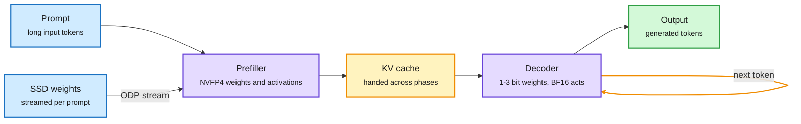

# Disaggregated Quantization: Specializing LLM Prefill and Decode

**Source:** HuggingFace Daily Papers, listed 2026-09-28 · [arXiv 2609.26333](https://arxiv.org/abs/2609.26333) · Panferov, Alistarh et al. · first logged on this wiki from the X feed on [09-24](2026-09-24-disaggregated-quantization-prefill-decode.md)
**Raw:** [raw/huggingface/2026-09-28-disaggregated-quantization-specializing-llm-prefill-and-deco.md](../../raw/huggingface/2026-09-28-disaggregated-quantization-specializing-llm-prefill-and-deco.md)

## TL;DR

Prefill and decode are two different workloads, so they should not share one quantized checkpoint. Prefill (reading the prompt) is compute-bound. It gets faster when the arithmetic itself runs in low precision, so it wants weights and activations in a compute-native format like NVFP4. Decode (writing one token at a time) is bandwidth-bound. It gets faster when the weights are small, and quantizing its activations buys nothing while costing accuracy. Disaggregated quantization (DQ) gives each phase its own number format, its own weights, and its own storage location. Three results carry the paper. Removing activation quantization on decode alone improves decode-heavy accuracy on Qwen 3 and Gemma 3 at no extra cost. A separately trained NVFP4 prefiller, bolted onto an unmodified 1-bit Qwen3.8-27B GGUF decoder, lifts MMLU-Pro by 32.5 points and MMMU-Pro by 35.3. And because a second checkpoint will not fit next to the first on one device, offloaded disaggregated prefill (ODP) streams the prefill weights from SSD, amortizing the load over the prompt length, for a 1.78x time-to-first-token speedup at 8K tokens in llama.cpp.

Two phases, two checkpoints, one KV cache between them

The prefill weights live on SSD and stream in; only the tiny decoder stays resident.

Blue is input and storage, purple is a phase-specialized model, amber is the hand-off and the decode loop, green is the result.

## Key findings

- **Decode activations should stay unquantized.** Dropping activation quantization only on the decode path improves decode-heavy tasks on Qwen 3 and Gemma 3 with no inference-cost increase, because decode is limited by weight bytes, not arithmetic.
- **A separate prefiller beats weight-only inference on both speed and accuracy.** Trained compute-native prefill weights process prompts faster than weight-only inference and match or exceed its accuracy at 2 to 3-bit decode, on both prefill-heavy and decode-heavy tasks.
- **The prefiller rescues extreme decode compression.** With released Qwen3.8-27B GGUF decoders, an NVFP4 prefiller improves the 1-bit decoder by 32.5 points on MMLU-Pro and 35.3 on MMMU-Pro, without touching the decode checkpoint.
- **SSD streaming pays for the second checkpoint.** ODP loads the prefill weights from SSD, and the load cost is amortized across the prompt, so long prompts win: 1.78x TTFT over weight-only at 8K tokens in llama.cpp.
- **It scales and it serves.** Accuracy is evaluated under disaggregated serving in vLLM, and a shared-weight version (same weights, different formats per phase) is validated with post-training quantization up to 2.8T parameters.

## How this relates to prior wiki pages

- **Confirms and extends Mix-Quant.** [Mix-Quant (05-21)](2026-05-21-mix-quant-phase-aware-quantization.md) was the first phase-aware result on this wiki: NVFP4 for prefill, BF16 for decode, because prefill tolerates quantization and decode error compounds across a long autoregressive trajectory. DQ confirms the asymmetry and goes two steps further. Mix-Quant kept one set of weights and changed only the format. DQ trains **separate prefill weights** and moves them **off the device** to SSD. It also inverts Mix-Quant's decode choice: Mix-Quant kept decode at BF16 for accuracy, DQ pushes decode weights to 1 to 3 bits and recovers accuracy through the prefiller and unquantized activations.
- **Same "split the miss path by measured bandwidth" instinct as FreeToken.** [FreeToken (09-28)](2026-09-28-freetoken-edge-moe-serving.md) splits each step's MoE expert misses between a PCIe copy to the GPU and CPU compute, sized to the machine's measured bandwidth. ODP is the prefill counterpart: accept that the weights do not fit, and choose the storage tier whose bandwidth the workload can amortize. Both are consumer-hardware results that treat placement, not FLOPs, as the binding constraint.
- **The same paper, first seen on 09-24.** The [09-24 summary](2026-09-24-disaggregated-quantization-prefill-decode.md) logged it from the X feed. Its HuggingFace listing on 09-28 is independent confirmation that the community picked it up, not a new result.
- **Adds a temporal row to the non-uniformity table** on the [quantization concept page](quantization.md), whose organizing claim is that uniform precision is the wrong default.

## Gaps

- The accuracy gains at 1-bit are measured against a 1-bit weight-only baseline, which is a low bar. The comparison that matters for deployment is DQ at 1 to 2 bits against a plain 4-bit model at the same total bytes.
- ODP's speedup depends on SSD bandwidth and prompt length. Short prompts cannot amortize the stream, and the abstract reports only 8K.
- Training a second checkpoint per model is a real cost. Cheap requantization ([LLM Compressor v0.14, 09-25](2026-09-25-llm-compressor-v0-14-triton-gptq.md)) helps with format changes but not with training a new prefiller.

## Related

- [quantization.md](quantization.md) · [kv-cache.md](kv-cache.md) · [Mix-Quant (05-21)](2026-05-21-mix-quant-phase-aware-quantization.md) · [FreeToken (09-28)](2026-09-28-freetoken-edge-moe-serving.md) · [09-24 summary](2026-09-24-disaggregated-quantization-prefill-decode.md)

**Source:** [arXiv 2609.26333](https://arxiv.org/abs/2609.26333) · [raw file](../../raw/huggingface/2026-09-28-disaggregated-quantization-specializing-llm-prefill-and-deco.md)
