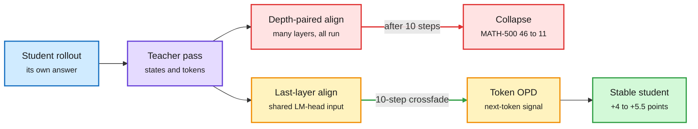

# LastOPD: Taming Collapse in Latent On-Policy Distillation

**Source:** HuggingFace Daily Papers, listed 2026-09-28 · [arXiv 2609.28845](https://arxiv.org/abs/2609.28845) · [Code](https://github.com/Muyiiiii/LastOPD)
**Raw:** [raw/huggingface/2026-09-28-lastopd-taming-collapse-in-latent-on-policy-distillation.md](../../raw/huggingface/2026-09-28-lastopd-taming-collapse-in-latent-on-policy-distillation.md)

## TL;DR

On-policy distillation (OPD) corrects a student on its own answers using the teacher's next-token distribution. That tells the student what the teacher would say, not how it got there. Latent supervision tries to add the missing part by pulling the student's hidden states toward the teacher's, and OPRD brought that into OPD. This paper reports that the recipe breaks. Distilling Qwen3-4B and Qwen3-8B into Qwen3-1.7B-Base, latent supervision alone lifts MATH-500 from 25 to 46 in 10 steps, then keeps training it down to 11 with no recovery. Worse, the alignment metric keeps improving the whole time: the best-aligned model is the worst performer. The diagnosis is a mismatch in where the signal is applied. Layers paired by relative depth do different jobs in a 1.7B and an 8B model, so pushing the student's layer 12 toward the teacher's layer 24 drags it toward states it cannot use. LastOPD keeps only the part that works. It aligns just the last-layer state, the one interface both LM heads read, and only for a 10-step crossfade into ordinary token-level OPD. Result: +5.55 and +4.02 MATH-500 points over token-only OPD with the 4B and 8B teachers, a lead on most held-out sets, and token-only OPD's final score in about half the steps.

Use the latent signal briefly, at one layer, then hand off

Depth-paired alignment helps for 10 steps and then drives collapse. LastOPD stops before that.

Blue is the rollout, purple is the teacher, red is the OPRD-style path that collapses, amber is LastOPD's short latent phase and hand-off, green is the result.

## Key findings

- **Early gain, late collapse.** Latent supervision alone: MATH-500 25 to 46 in 10 steps, then down to 11 with no recovery.
- **Better alignment, worse behaviour.** The alignment metric improves steadily through the collapse. The most aligned student is the worst one. This is a clean Goodhart case: the proxy is being optimized and the target is being destroyed.
- **The cause is layer pairing.** Depth-matched layers play different roles in models of different size, so intermediate alignment pulls the student toward representations it cannot decode.
- **The last layer is the safe interface.** Both models' LM heads read the last-layer state, so that is the one place where "match the teacher's state" has a shared meaning.
- **Timing matters as much as location.** The latent signal is used only for a 10-step crossfade into token OPD. LastOPD reaches token-only OPD's final score in about half the steps and ends 4 to 5.5 points higher on MATH-500.

## How this relates to prior wiki pages

- **Directly contradicts and refines OPRD.** [OPRD (06-05)](2026-06-05-oprd-on-policy-representation-distillation.md) argued that output-space OPD wastes the teacher and pays a sampling-variance tax over a huge vocabulary, and proposed aligning hidden states across selected layers instead, bypassing the LM head. It reported closing the student-teacher gap on AIME 2024/2025 and AIMO, and training 1.44x faster with 54% less memory. LastOPD reproduces OPRD's early benefit and then shows that continued multi-layer alignment collapses. The two are not flatly incompatible: OPRD's setting and horizon differ, and LastOPD uses a base student. But the specific claim that matching intermediate teacher states is a better long-run signal than matching tokens does not survive here. The refined claim is that the latent signal is a good warm start at one interface and a bad objective to keep optimizing.
- **Weakens one leg of the "supervisor is the binding constraint" pattern.** The [knowledge-distillation page](knowledge-distillation.md) named that pattern on 08-26 with OPRD as its first instance. LastOPD keeps the pattern (the fix is again a change to the supervisor, not the student) but replaces OPRD's fix. OPRD's version of "change the supervisor" was "change the layer." LastOPD says "change the layer, briefly, then change it back."
- **Same shape as RetireOPD's schedule.** RetireOPD (in the [09-18 OPD triple](2026-09-18-on-policy-distillation-triple.md)) found that teacher supervision is worth less as training goes on and retired the teacher once the student stopped closing the gap. LastOPD does the same thing to one kind of supervision, on a fixed 10-step clock. Two papers now say a supervision signal has a useful lifetime.
- **Another case where the measured signal is not the signal.** [IER-OPD (09-22)](2026-09-22-ier-one-percent-tokens-opd.md) argued that the reliability of an OPD signal estimate, not its size, is what matters. LastOPD's alignment curve is a sharper version: a metric that keeps improving while the behaviour it stands for collapses.

## Gaps

- One model family (Qwen3), one student size (1.7B-Base), math-centred evaluation.
- The 10-step crossfade is a fixed schedule. No adaptive trigger, and no test of whether the right length scales with model size or learning rate.
- No direct rerun of OPRD's exact setup, so the contradiction is by mechanism and by analogous setting, not a head-to-head replication.

## Related

- [knowledge-distillation.md](knowledge-distillation.md) · [OPRD (06-05)](2026-06-05-oprd-on-policy-representation-distillation.md) · [09-18 OPD triple](2026-09-18-on-policy-distillation-triple.md) · [IER-OPD (09-22)](2026-09-22-ier-one-percent-tokens-opd.md) · [MOPD-Router (09-29)](2026-09-29-mopd-router-token-level-teacher-routing.md) · [DCE+SRCL (09-29)](2026-09-29-dce-srcl-coevolving-self-distillation.md)

**Source:** [arXiv 2609.28845](https://arxiv.org/abs/2609.28845) · [raw file](../../raw/huggingface/2026-09-28-lastopd-taming-collapse-in-latent-on-policy-distillation.md)
