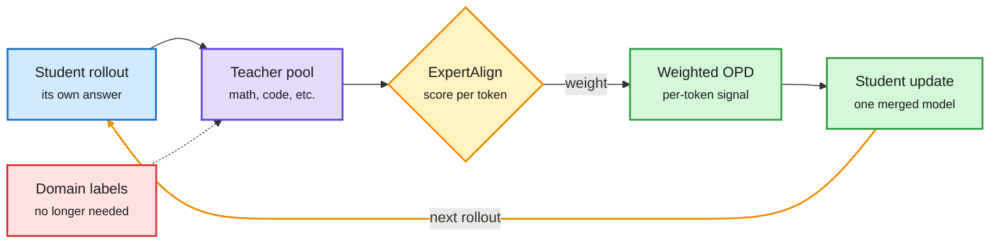

# MOPD-Router: Token-Level Teacher Routing in Multi-Teacher On-Policy Distillation

**Source:** HuggingFace Daily Papers, listed 2026-09-28 · [arXiv 2609.30837](https://arxiv.org/abs/2609.30837) · [Code](https://github.com/TURLEing/MOPD-Router)
**Raw:** [raw/huggingface/2026-09-28-mopd-router-rethinking-teacher-routing-in-multi-teacher-on-p.md](../../raw/huggingface/2026-09-28-mopd-router-rethinking-teacher-routing-in-multi-teacher-on-p.md)

## TL;DR

Multi-teacher on-policy distillation (MOPD) folds several specialist teachers into one student. The student writes its own answers, and a teacher scores each token. Current practice picks one teacher per prompt using a domain label (math prompts go to the math teacher) and keeps it for the whole rollout. That needs labeled data and ignores anything the other teachers could have added. MOPD-Router routes at every token over the whole teacher pool, with no domain labels and no separately trained router. It is a plug-in: any metric that scores teachers per token can decide who supervises. The authors propose ExpertAlign, which asks whether a teacher's correction at this token reflects the specialty that teacher gained in post-training, and compare it with two reference metrics, teacher confidence (Entropy) and teacher-student disagreement (Novelty). ExpertAlign wins in all four settings tested. On unlabeled data it beats plain averaging of teachers by 5.88 points (+12.3%). On labeled data it beats standard prompt-routed MOPD by 3.95 points (+7.8%) while ignoring the labels.

Every token picks its own teacher

No labels and no trained router. The score comes from the teachers' own corrections.

Blue is the student's rollout, purple is the teacher pool, amber is the per-token routing score, green is the training signal, red is what the method removes.

## Key findings

- **Prompt-level routing wastes teachers.** A code teacher can have something useful to say about a math proof's arithmetic step. Hard routing throws that away.
- **Specialization beats confidence and disagreement.** ExpertAlign (does this correction reflect the teacher's post-training specialty?) beats Entropy (is the teacher sure?) and Novelty (does the teacher disagree with the student?) in all four settings: unlabeled and labeled mixtures, strong-to-weak and same-size distillation.
- **Averaging loses.** On unlabeled data ExpertAlign beats Mean aggregation by 5.88 points (+12.3%).
- **Labels are not needed.** On labeled data it beats label-routed MOPD by 3.95 points (+7.8%) without using the labels.

## How this relates to prior wiki pages

- **First evidence on Motif 3's open question.** The [knowledge-distillation concept page](knowledge-distillation.md) recorded on 08-11 that [Motif 3](../llms-foundation-models/2026-08-11-motif-3-gdla-moe.md) folded six RL specialist teachers and one SFT teacher into a 314B MoE with MOPD, but never ablated it, so "whether MOPD consolidates capabilities or averages them" stayed open. MOPD-Router's Mean-aggregation baseline is the averaging option, and it loses by 5.88 points to token-level selection. That is evidence that how you merge matters and that averaging is the weak choice. It does not yet show consolidation beats simply keeping the specialists.
- **A fifth instance of "the binding constraint is the supervisor."** That pattern was named on 08-26 from OPRD (06-05, output-space OPD plateaus below the teacher), [OPDVR (08-26)](2026-08-26-opdvr-distillation-verifiable-reward.md) (a purely distributional objective caps the student at the teacher) and [QAH (08-26)](2026-08-26-quantization-aware-healing.md) (distilling from the recovered checkpoint caps the student at that checkpoint). [RISE (09-07)](2026-09-07-rise-self-extrapolating-distillation.md) built a teacher from the student's own history. MOPD-Router changes the supervisor by **choosing it per token**. The student is untouched.
- **Also scales Nemotron's recipe down to the token.** [Nemotron 3 Ultra (06-16)](../llms-foundation-models/2026-06-16-nemotron-3-ultra-moe-hybrid-mamba.md) put prompt-routed MOPD into a frontier post-training run. MOPD-Router is a direct replacement for that routing step.
- **Routing moves inside training.** On [llm-routing.md](../ai-routing/llm-routing.md) routing has meant picking a model at inference. Here the router picks a supervisor during training, at token granularity, and has no parameters of its own. It is structurally like MoE routing (per token, over a pool) except the pool is teachers and the score is computed from their outputs.

## Gaps

- Every teacher must score every token, so the per-step teacher cost grows with pool size. The abstract reports no compute accounting, the same omission the [09-18 and 09-21 entries](knowledge-distillation.md) flagged across OPD papers.
- Shared tokenizer assumed. Mixed-vocabulary teacher pools would need something like BPM's byte-prefix marginalization.
- Pool sizes and domains are not stated in the abstract. Behaviour with many overlapping teachers is unknown.

## Related

- [knowledge-distillation.md](knowledge-distillation.md) · [llm-routing.md](../ai-routing/llm-routing.md) · [Motif 3](../llms-foundation-models/2026-08-11-motif-3-gdla-moe.md) · [OPDVR](2026-08-26-opdvr-distillation-verifiable-reward.md) · [QAH](2026-08-26-quantization-aware-healing.md) · [RISE](2026-09-07-rise-self-extrapolating-distillation.md) · [LastOPD (09-29)](2026-09-29-lastopd-latent-opd-collapse.md) · [DCE+SRCL (09-29)](2026-09-29-dce-srcl-coevolving-self-distillation.md)

**Source:** [arXiv 2609.30837](https://arxiv.org/abs/2609.30837) · [raw file](../../raw/huggingface/2026-09-28-mopd-router-rethinking-teacher-routing-in-multi-teacher-on-p.md)
