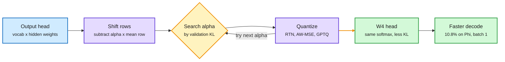

# Softmax Reparameterization for Output-Head Quantization

**Source:** HuggingFace Daily Papers, listed 2026-09-28 · [arXiv 2609.31291](https://arxiv.org/abs/2609.31291)
**Raw:** [raw/huggingface/2026-09-28-softmax-reparameterization-for-output-head-quantization.md](../../raw/huggingface/2026-09-28-softmax-reparameterization-for-output-head-quantization.md)

## TL;DR

In small language models the output head (the final matrix that turns a hidden state into one score per vocabulary word) is a large share of inference cost, because vocabularies are huge. Quantizing it is attractive and often damaging. This paper uses a free symmetry. Softmax does not change if you add the same number to every logit. So you can subtract a scalar multiple of the average vocabulary row from every row of the head, and the model's output distribution stays exactly the same in full precision. But the shifted matrix quantizes differently. The method searches that one coefficient on a validation set, picking whichever value gives the lowest KL divergence after quantization, separately for each quantizer (round-to-nearest, activation-weighted MSE, and full-Hessian GPTQ). The search includes the original head and plain mean-centering, so it can never do worse than either on the validation set. A rank-one correction handles heads with a nonlinearity such as logit soft-capping. On Phi-4-mini with AW-MSE at 4 bits, output KL falls from 0.936 to 0.256. With the decoder left in BF16, quantizing the Phi head cuts batch-one generation latency by 10.8%, and the reparameterization adds no operation at inference.

Pick the version of the head that quantizes best

Every candidate gives the same full-precision softmax. Only their rounding error differs.

Blue is the trained head, purple is the transform and quantizer, amber is the one-dimensional search, green is the result.

## Key findings

- **Gains land where baseline quantization hurts most.** Across seven heads at W4, the benefit concentrates on heads whose predictions plain quantization badly distorts. Phi-4-mini with AW-MSE: KL 0.936 to 0.256.
- **It stacks with existing tricks.** Gains survive stronger GPTQ calibration and remain complementary to exact per-channel scaling and affine quantization.
- **The coefficient transfers.** Coefficients chosen on WikiText and frozen beat mean-centering on C4 and OpenWebMath in all 18 comparisons where the chosen coefficient differs from 1, and tie in the other six.
- **At 2 bits the benefit broadens** across nearly the whole model-by-quantizer grid.
- **Lower logit error is the wrong target.** Matched residual analysis shows better output fidelity can come with *larger* logit reconstruction error, as long as the residual's Fisher-weighted cost falls. The error moves to directions the softmax does not care about.
- **Free at inference.** For shift-compatible heads there is no extra operation and packed W4 execution is preserved.

## How this relates to prior wiki pages

- **A new axis for the quantization table.** The [quantization concept page](quantization.md) organizes its results under "uniform precision is the wrong default," with rows for phase, layer, tile, token, block order, execution state and normalization position. Every row decides *how many bits* go where. This paper decides *which weights* get quantized: among functionally equivalent representations of the same function, choose the one that rounds best. That is a representation-choice axis, and it composes with every existing row.
- **Mechanistic partner to "Why does PTQ work?"** [Why Does Post-Training Quantization Work? (09-11)](2026-09-11-why-post-training-quantization-works.md) found that the LM head's geometry preserves the scores of top-ranked tokens and pushes quantization error into the vocabulary tail, which is part of why PTQ survives. This paper's Fisher-weighted result is the same idea turned into a method: you can accept more raw logit error if you steer it into directions that do not change the output distribution. Both say logit MSE is the wrong measure of head quality.
- **Same family as rotation-based outlier taming.** The 09-23 [KV-COBRA](2026-09-23-kv-cobra-bit-rank-allocation.md) entry noted that a Hadamard rotation before quantization equalizes channel variance. Rotations and this row shift are both exact reparameterizations applied before rounding. The difference: a rotation needs an inverse at inference or a fused partner, while this shift is absorbed by softmax for free.

## Gaps

- Small models only (Phi-4-mini and similar heads). In large models the head is a smaller share of cost, so the latency win shrinks.
- The 10.8% latency figure is with the rest of the decoder in BF16. In a fully quantized model the head's share, and the win, may differ.
- Only a scalar multiple of one vector (the mean row) is searched. Richer equivalent transforms were not explored.

## Related

- [quantization.md](quantization.md) · [Why PTQ works (09-11)](2026-09-11-why-post-training-quantization-works.md) · [KV-COBRA (09-23)](2026-09-23-kv-cobra-bit-rank-allocation.md) · [Disaggregated Quantization (09-29)](2026-09-29-disaggregated-quantization.md)

**Source:** [arXiv 2609.31291](https://arxiv.org/abs/2609.31291) · [raw file](../../raw/huggingface/2026-09-28-softmax-reparameterization-for-output-head-quantization.md)
