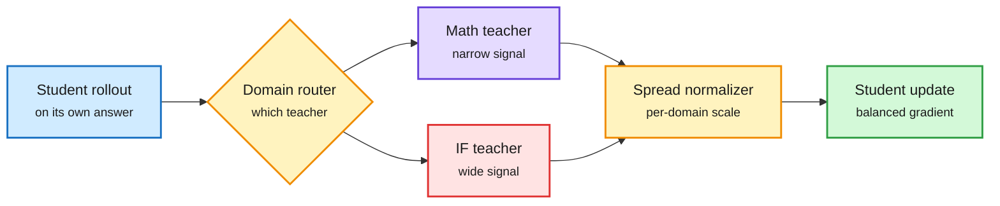

# DN-MOPD: The Loudest Teacher Wins in Multi-Teacher Distillation

**Source:** HuggingFace Daily Papers, listed 2026-09-29 (141 upvotes, #3 of the day) · [arXiv 2609.35347](https://arxiv.org/abs/2609.35347)
**Raw:** [raw/huggingface/2026-09-29-beyond-teacher-assignment-domain-normalized-multi-teacher-on.md](../../raw/huggingface/2026-09-29-beyond-teacher-assignment-domain-normalized-multi-teacher-on.md)

## TL;DR

Multi-teacher on-policy distillation (MOPD) merges several RL-trained specialists (math, code, instruction following) into one student: the student answers, and the specialist for that prompt's domain scores every token. On Qwen3.5 at three sizes, the authors find MOPD's student does **not** beat a student taught by the single best specialist, and it gets little of the math specialist's gain. The reason is scale, not routing. Instruction-following feedback is several times more spread out than math feedback, so it dominates the gradient. **DN-MOPD** keeps the routing and divides each domain's feedback by its measured spread. It improves the six-benchmark average at every size, across three seeds and two length limits, and recovers most of the lost math gain. Controls show the gain comes mostly from turning instruction-following *down*, and fixed weights close to the measured ones work about as well.

Routing picks the teacher. Normalization sets its volume.

Without rescaling, the teacher with the widest signal drowns out the others.

Blue is the student's rollout, amber is routing and the new normalizer, purple is the drowned-out teacher, red is the dominating teacher, green is the update.

## Same-day distillation papers (the supervisor pattern keeps growing)

- **[LSPD, arXiv 2609.35505](https://arxiv.org/abs/2609.35505):** shows OPD's reverse-KL objective is KL-regularized policy optimization, then imports value-based RL tools (optimistic exploration, off-policy replay). +1.59 Avg@16 on six math benchmarks; the fully off-policy variant matches vanilla OPD using only the first 25% of rollout batches. A rollout-cost result.
- **[OLIVE, arXiv 2609.36246](https://arxiv.org/abs/2609.36246):** the student writes a prefix, the teacher continues it, and the student trains with cross-entropy on the teacher's continuation. Needs only teacher *text*, not logits; beats OPD at similar GPU-hours; +13% over offline SFT on ScienceWorld using only GPT-5.4-mini outputs.
- **[DCSD, arXiv 2609.34848](https://arxiv.org/abs/2609.34848):** splits credit *direction* (from belief-margin probes) from credit *magnitude* (marginal information gain) so a wrong teacher cannot flip or inflate a token's update. +8.45 math, +7.01 multimodal over base.
- **[AlignOPSD, arXiv 2609.33391](https://arxiv.org/abs/2609.33391):** for long-horizon agents, privileged feedback at timestep t may refer to a decision the student makes at a different step. Re-align supervision to decisions before assigning credit. +5.5 to 8.7% over GRPO on ALFWorld, WebShop, Search-QA.
- **Vision token pruning via self-distillation:** [SCOPD, arXiv 2609.34044](https://arxiv.org/abs/2609.34044) and [LT-OPD, arXiv 2609.32353](https://arxiv.org/abs/2609.32353) both train a heavily pruned VLM against its own full-token copy on its own rollouts. LT-OPD lifts retained performance at 5% visual tokens from 68.6% to 82.3% on Qwen3.5-4B, with 85% less KV cache and prefill FLOPs.

## How this relates to prior wiki pages

- **Direct follow-on to [MOPD-Router (09-29)](2026-09-29-mopd-router-token-level-teacher-routing.md),** which picked a teacher per token by ExpertAlign and beat label-routed MOPD by 7.8%. DN-MOPD says routing is only half the design: even perfect routing loses if one teacher's signal is several times louder. The two are complementary and nobody has combined them.
- **Seventh instance of the 08-26 pattern** on the distillation page ("the supervisor is the binding constraint"): OPRD (06-05, match hidden states), OPDVR and QAH (08-26), MOPD-Router, DCE, LastOPD (09-29), and now DN-MOPD (how loud the supervisor is). The unit of design keeps shrinking: which teacher, then when, then where, now how strongly.
- **Gap:** no teacher-compute accounting, the same omission the distillation page has flagged since 09-18. Only Qwen3.5.

## Related

- [Knowledge distillation concept page](knowledge-distillation.md)
