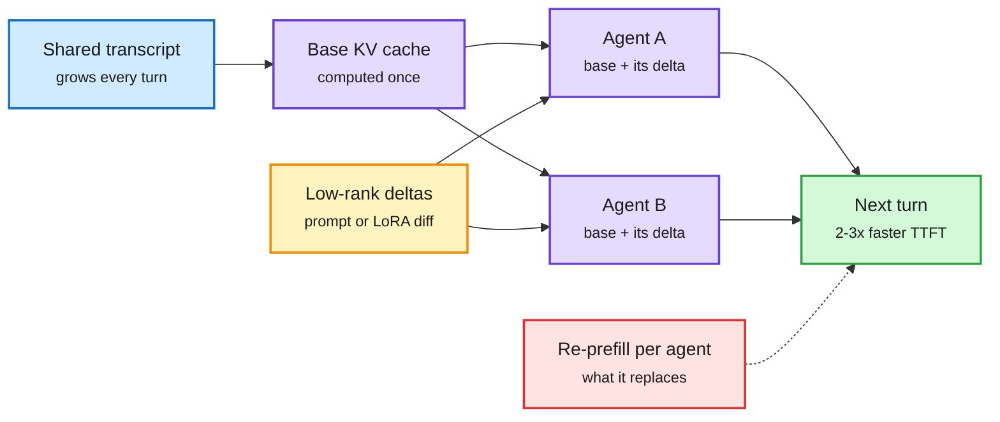

# KVCMAS and PReCache: Sharing One KV Cache Across Many Agents

**Source:** HuggingFace Daily Papers, listed 2026-09-29 · [KVCMAS, arXiv 2609.34060](https://arxiv.org/abs/2609.34060) · [PReCache, arXiv 2609.34054](https://arxiv.org/abs/2609.34054) · related: [TokenCast, arXiv 2609.35760](https://arxiv.org/abs/2609.35760)
**Raw:** [KVCMAS](../../raw/huggingface/2026-09-29-kvcmas-efficient-kv-cache-correction-for-shared-context-in-m.md) · [PReCache](../../raw/huggingface/2026-09-29-precache-efficient-kv-cache-sharing-for-multi-lora-agents-vi.md) · [TokenCast](../../raw/huggingface/2026-09-29-tokencast-forecasting-token-consumption-during-llm-agent-exe.md)

## TL;DR

Multi-agent systems often run several "agents" on one base model. Each agent has its own role, set either by a different system prompt or by a different LoRA adapter (a small low-rank weight patch). They all read the same growing shared transcript. The waste: each agent recomputes the KV cache (the stored attention keys and values for past tokens) for that same transcript, because its own prefix or adapter makes the cache slightly different. Two papers fix this for the two ways agents get specialized.

- **KVCMAS** (prompt-specialized agents) stores how each agent's cache *deviates* from the shared one as a compact low-rank correction, and chains corrections from agent to agent without a separate reference prefill. The first agent's cache stays exact. 2.0x faster time-to-first-token (TTFT) than no sharing, and up to 3.7x lower peak GPU memory than a prior correction method.
- **PReCache** (LoRA-specialized agents) computes one base-weights cache for the shared context and, at the same time, a small per-agent low-rank cache. Each agent reads the base cache plus its own low-rank piece. A second variant rebuilds the shared cache from adapter-free hidden states so one agent's adapter does not leak into the next agent's view. Up to 3.1x faster TTFT and 2.3x throughput; the accurate variant loses 1.1 points on average.

One shared cache, plus a thin per-agent layer

Both papers store only what makes each agent different, as a low-rank piece.

Blue is the shared context, purple is cache and agents, amber is the per-agent low-rank delta, green is the result, red is the per-agent re-prefill that goes away.

## Key findings

- **KVCMAS:** supports dynamically changing shared context (prior delta methods handled only recurring context relations or needed memory-heavy online state). Matches or beats prior sharing methods on accuracy, lowest TTFT under high concurrency, 2.0x TTFT speedup, up to 3.7x less peak memory.
- **PReCache:** training-free. PreLRShared: up to 3.1x TTFT, 2.3x per-request throughput. ReBaseShared: best accuracy retention, -1.1 points average vs no sharing. Two schedules: reconstruct after each turn (single stream) or alongside execution (concurrent serving).
- **Same-day companion, TokenCast:** agent token use varies over 10x across runs of the same task because every call re-reads the growing context. TokenCast forecasts total spend as the run unfolds (32.8 ms per run, no extra LLM calls) and in budget-control replay uses 21.3% fewer tokens than a fixed budget. It is the accounting side of the same problem: the shared context re-read by every call is the dominant cost.

## How this relates to prior wiki pages

- **Extends cross-layer and cross-request KV sharing to cross-agent sharing.** The KV cache page logged cross-layer sharing (HySparse2, 09-24) and host-DRAM tiering (HiSparse, 09-29). These two add a third axis: the same tokens, seen through different roles.
- **Low-rank deltas keep recurring as the cache's compression unit.** [FlashLoop (09-27)](../llms-foundation-models/2026-09-27-flashloop-lazy-updates.md) stored each loop's KV as a low-bit delta from the previous loop. KVCMAS and PReCache store each agent's KV as a low-rank delta from the base. Same idea: the cache varies along a small subspace, so store the variation.
- **Gap:** neither paper tests with prefix caching already on (vLLM and SGLang share identical prefixes automatically), so the gain over a production baseline is unclear. Neither reports how the delta rank grows over very long agent runs.

## Related

- [KV cache concept page](kv-cache.md)
- [Multi-agent systems](../agentic-systems/multi-agent-systems.md)
