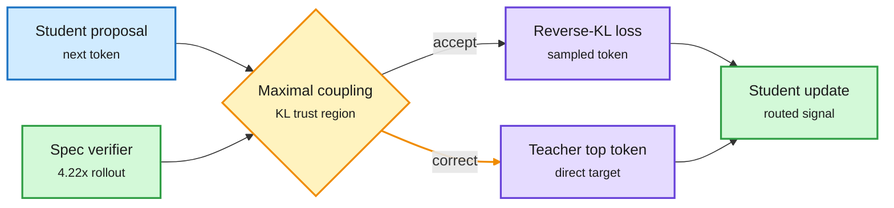

# On-Policy Distillation Gets Scaling Laws, a Trust Region, and a Dissection

**Source:** HuggingFace Daily Papers, listed 2026-09-30 (eight OPD papers in one list). SAKI and Self-Play Search Distillation are also on this week's Kurate cs.AI top 20 (cross-source confirmed, HF + Kurate).
**Papers:** [Scaling Properties of Same-Family OPD, 2609.32722](https://arxiv.org/abs/2609.32722) (219 upvotes) · [SAKI, 2609.36601](https://arxiv.org/abs/2609.36601) · [KL-free OPD / C-MOPD, 2609.33791](https://arxiv.org/abs/2609.33791) · [SCOUT, 2609.38360](https://arxiv.org/abs/2609.38360) · [OPD via sparse crosscoders, 2609.35210](https://arxiv.org/abs/2609.35210) · [PMOPD, 2609.34605](https://arxiv.org/abs/2609.34605) · [ActFirst-OPD, 2609.36608](https://arxiv.org/abs/2609.36608) · [SPSD, 2609.30936](https://arxiv.org/abs/2609.30936)
**Raw:** [scaling](../../raw/huggingface/2026-09-30-scaling-properties-of-same-family-on-policy-distillation.md) · [SAKI](../../raw/huggingface/2026-09-30-saki-maximal-coupling-routed-teacher-supervision-for-on-poli.md) · [KL-free](../../raw/huggingface/2026-09-30-do-we-really-need-kl-divergence-for-on-policy-distillation-o.md) · [SCOUT](../../raw/huggingface/2026-09-30-on-the-off-policy-teacher-in-on-policy-distillation.md) · [crosscoders](../../raw/huggingface/2026-09-30-understanding-on-policy-distillation-a-mechanistic-interpret.md) · [PMOPD](../../raw/huggingface/2026-09-30-pmopd-task-ordering-cycling-and-parameter-update-subspace-pr.md) · [ActFirst](../../raw/huggingface/2026-09-30-act-first-reason-later-accelerating-on-policy-distillation-f.md) · [SPSD](../../raw/huggingface/2026-09-30-self-play-search-distillation-for-large-language-model-reaso.md)

## TL;DR

On-policy distillation (OPD: the student writes its own answer and a teacher scores every token of it) got its first scaling laws, a principled trust region, and an explanation of what it actually changes inside the student, all on one day.

- **Scaling Properties** (219 upvotes): early OPD gains rise roughly linearly in the square root of reverse KL from the student's start point (a "useful-transfer" regime). In **every weak-to-strong pair, the student's peak beats its own teacher**, so a small RL-trained expert can lift a much larger student. Power laws show peak score improves with teacher size only up to about the student's size, and at matched teacher score, **smaller teachers transfer better**.
- **SAKI** (HF + Kurate): roll out with the teacher able to correct the student inside a KL trust region, using maximal coupling. Where the teacher accepted the student's token, train with ordinary reverse KL. Where it corrected, train directly on the teacher's top token. The correction rate is exactly the total-variation distance, so one radius controls both drift and intervention. An engine-resident speculative verifier makes rollouts **4.22x faster** at matched workload.
- **KL-free OPD:** replace the KL loss with +1/-1 per token (push toward the teacher where it is more confident, away where less) and training looks almost the same. Only the direction on a **small subset of high-disagreement tokens** matters. C-MOPD lets every teacher supervise every sample and beats routed multi-teacher OPD on math and code.
- **SCOUT:** the teacher is off-policy too. It was trained to continue its own prefixes, not the student's, and its continuations get worse as student prefixes grow. Periodically RL-train the teacher on student prefixes.
- **Sparse crosscoders:** OPD creates no new features and copies none of the teacher's. Over 98% of the student's frequent features stay within 20% of their firing rate. **OPD reweights features the student already has.** The usual SFT warm-up does part of that reweighting in advance.
- **PMOPD:** per-task updates in multi-teacher OPD collapse into low-dimensional subspaces fast. Project out interfering directions: +2.54 (Qwen2.5-7B) and +2.09 (Llama-3.1-8B) average.
- **ActFirst-OPD:** for multi-turn agents, act first using a reference trajectory and generate the reasoning later, asynchronously. 1.8x to 4.9x faster wall-clock training.
- **SPSD** (HF + Kurate): convert MuZero-style board-game search trees into chains of thought. Qwen3-4B-Base math average 24.1 to 36.6 from game data alone.

SAKI: one trust region sets both drift and correction

Accepted tokens get the usual OPD loss. Corrected tokens get direct teacher supervision.

Blue is the student's proposal, amber is the coupling decision, purple is the two loss types, green is the update and the speed-up.

## How it relates to prior wiki pages

- **The supervisor pattern on [knowledge-distillation](knowledge-distillation.md) reaches its eighth and ninth instances.** Since 08-26 the page has tracked "the binding constraint is the supervisor": MOPD-Router (09-29, pick the teacher per token), DN-MOPD (09-30, rescale each teacher's loudness). SCOUT now trains the supervisor itself, and SAKI changes when the supervisor intervenes.
- **The KL-free and crosscoder results answer the "what is OPD doing" question together.** If only the direction on a few high-disagreement tokens matters, and OPD only reweights existing features, then OPD is a cheap steering signal, not knowledge transfer. That fits TIP (04-16, most teacher tokens carry no signal) and contradicts the framing of DCE+SRCL (09-29, amplified on X as "recursive self-improvement via OPD").
- **Scaling Properties revises how to pick a teacher.** "Smaller teachers transfer better at matched score" and "student beats teacher weak-to-strong" mean the largest available teacher is often the wrong choice, which is a direct compute saving. It also sharpens the 09-30 [Distillation Defenses](../responsible-ai/2026-09-30-distillation-defenses-break-after-rl.md) worry: a weaker leaked signal can still lift a stronger student.
- **C-MOPD vs MOPD-Router and DN-MOPD:** C-MOPD supervises every sample with every teacher (no routing), MOPD-Router routes per token, DN-MOPD routes per prompt but rescales. Three answers to the same multi-teacher problem in three days, and no head-to-head yet.
- **Gap across the cluster:** almost everything is Qwen at 0.6B to 8B on math. None reports teacher compute, the omission this page has flagged since 09-18.

## Links

- Concept: [Knowledge distillation](knowledge-distillation.md) · [LLM routing](../ai-routing/llm-routing.md)
- Digest: [2026-10-01](../daily-digest/2026-10/2026-10-01.md)
