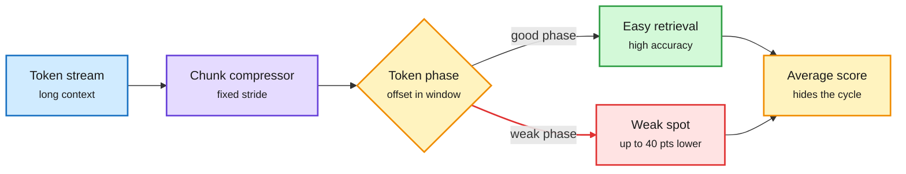

# Periodic Weak Spots: Phase Sensitivity from Chunked KV-Cache Compression

**Source:** HuggingFace Daily Papers, listed 2026-09-30 (86 upvotes) · [arXiv 2609.36322](https://arxiv.org/abs/2609.36322)
**Raw:** [raw/huggingface/2026-09-30-periodic-weak-spots-phase-sensitivity-from-chunked-kv-cache.md](../../raw/huggingface/2026-09-30-periodic-weak-spots-phase-sensitivity-from-chunked-kv-cache.md)

## TL;DR

Chunked KV-cache compression squeezes every window of consecutive tokens (say every 4 or 8) into fewer cache entries at a fixed stride. That saves memory and attention work for long contexts. This paper finds it also creates a hidden coordinate: a token's **phase**, its position inside the compression window. The same fact can be easy to retrieve at one phase and hard at another. In large open-weight models that use such compression, long-context retrieval accuracy swings by **up to 40 percentage points across phases**, a periodic pattern that averaged benchmark scores hide. The authors reproduce it by pretraining small transformers from scratch with several compression designs, and causal interventions show **phase specialization**: different attention components handle different phases. A simple idealized model shows gradient flow itself favors this sharp specialization.

Where a token lands inside the chunk decides whether it can be found

The compression stride creates a position the model never sees directly, and accuracy cycles with it.

Blue is input, purple is the compressor, amber is the hidden phase and the misleading average, green is the good path, red is the weak spot.

## Key findings

- **Up to 40-point retrieval gaps across phases** in large open-weight models with chunked compression.
- **Reproducible from scratch** across multiple KV-compression designs, so it is not one model's quirk.
- **Mechanism:** attention components specialize by source phase (causal interventions). Gradient-flow analysis of an idealized retrieval model predicts that specialization.
- **Evaluation fix:** report retrieval across phases, not averaged over positions. Needle tests at random offsets can miss it.

## How it relates to prior wiki pages

- **A warning label for the 09-29 and 09-30 [kv-cache](kv-cache.md) entries.** GLM-5.3's DSA indexer (09-29 SemiAnalysis page) scores pools of 4 consecutive tokens, and the llama.cpp GLM-5.3-Flash merge on 09-30 adds the same "k-pool" indexer. Pooling at a fixed stride is exactly the setup this paper studies. Nobody has measured phase sensitivity on GLM-5.3.
- **Contrasts with [CoWindow Attention (09-30)](../llms-foundation-models/2026-09-30-massalloc-cowindow-attention.md).** CoWA partitions history by position across heads, so each head covers a slice. If those slices have fixed boundaries, the same phase question applies at head level.
- **Echoes the measurement-crisis thread.** Like Behavioral Shadows (09-30, post-training effects appear on unrelated decisions), the failure is invisible in averaged metrics.
- **Open fixes the paper does not test:** randomized or staggered stride offsets per layer or head, or phase-jittered training data. These are cheap to try.

## Links

- Concept: [KV cache](kv-cache.md)
- Digest: [2026-10-01](../daily-digest/2026-10/2026-10-01.md)
