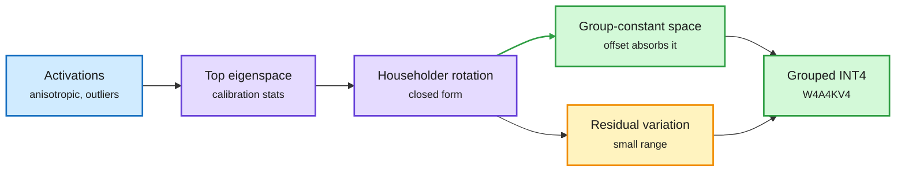

# PrismQuant and Quantized-Softmax Pretraining: Fit the Data to the Quantizer

**Source:** HuggingFace Daily Papers, listed 2026-09-30 · [PrismQuant, arXiv 2609.32429](https://arxiv.org/abs/2609.32429) ([code](https://github.com/ForeverBlue816/PrismQuant)) · [Pretraining with Quantized Softmax, arXiv 2609.33591](https://arxiv.org/abs/2609.33591)
**Raw:** [PrismQuant](../../raw/huggingface/2026-09-30-prismquant-optimal-null-space-rotations-for-grouped-quantize.md) · [Quantized softmax](../../raw/huggingface/2026-09-30-pretraining-transformers-with-quantized-softmax-in-attention.md)

## TL;DR

**PrismQuant** (NTU, Qualcomm AI Research) starts from an observation: a big activation is not the problem in 4-bit grouped quantization. A big *spread inside a group* is. Asymmetric grouped INT4 stores a scale and an offset per group, and the offset absorbs any value shared by every element of the group for free. So the "group-constant" directions are a range-free subspace. PrismQuant rotates the activations so their highest-energy directions land in that subspace. The optimal rotation has a closed form (a Ky Fan trace maximization), built from cheap Householder reflections with no gradient training. Under W4A4KV4 (4-bit weights, activations and KV cache), Llama-3.1-70B reaches 3.85 perplexity and 72.46% zero-shot average, **0.22 points below full precision**. On Llama-3.1-8B: **1.51x prefill, 1.22x decode** versus FP16, 56% less decode peak memory, and only 2.35% more decode latency than Hadamard rotation.

**Quantized softmax in pretraining** studies what happens when the softmax inside attention is approximated during training, not just inference. Approximating exp with K+1 grid values changes the gradients too. With hard rounding at K=4, some choices (min-max calibration plus a pre-normalization straight-through surrogate) leave a large loss gap, but fixed-window calibration with a post-normalization surrogate gets the gap to +0.019 nats at K=4, and +0.004 at K=16 (124M model, 2.5B tokens).

Rotate the big directions into the part the offset already pays for

Hadamard spreads energy evenly. PrismQuant puts it where the quantizer's offset absorbs it.

Blue is input activations, purple is the rotation math, green is energy the quantizer represents for free, amber is what is left to quantize.

## How it relates to prior wiki pages

- **Second "choose the representation before allocating bits" result in three days on [quantization](quantization.md).** Softmax Reparameterization (09-29) subtracted a multiple of the mean vocabulary row from the output head: invisible in full precision, but it changes rounding error. PrismQuant does the same for activations: rotations are invisible in full precision, but choosing them for the quantizer's geometry beats generic outlier-flattening (QuaRot, SpinQuant, Hadamard).
- **Quantized softmax pairs with [Rowmax-H15 on Blackwell (09-30)](../hardware/2026-09-30-rowmax-softmax-approximation-blackwell.md),** which used power-of-two softmax weights in FlashAttention-4 at inference (12.4-25.8% faster FP8 forward, +0.09-0.49% perplexity). Today's paper asks whether you can train with that kind of approximation from the start. At 124M, yes, if the surrogate sits after normalization. Scale is the open question.
- **KV4 matters for the [kv-cache](kv-cache.md) page:** PrismQuant's KV4 numbers come with a 56% decode-memory cut on 8B, at near-Hadamard latency.

## Links

- Concepts: [Quantization](quantization.md) · [GPU kernels](../hardware/gpu-kernels.md)
- Digest: [2026-10-01](../daily-digest/2026-10/2026-10-01.md)
