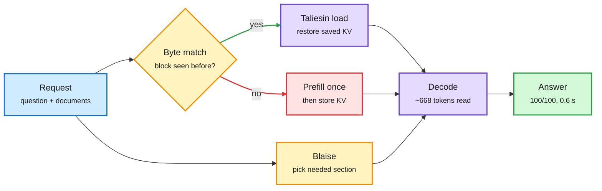

# Galahad: Byte-Exact KV Memory Makes Reading a Document a One-Time Cost

**Source:** HuggingFace Daily Papers, listed 2026-10-01 · [arXiv 2609.39358](https://arxiv.org/abs/2609.39358)
**Raw:** [raw/huggingface/2026-10-01-working-around-the-compute-ceiling-byte-exact-memory-in-gala.md](../../raw/huggingface/2026-10-01-working-around-the-compute-ceiling-byte-exact-memory-in-gala.md)

## TL;DR

LLM serving is stateless across requests. Ask a second question about a document and the server recomputes the document's attention state from token one. On seven real-world datasets the authors measure that **98.7% of prompt tokens were text the model had already read**. Galahad is a memory layer for vLLM, SGLang and llama.cpp with two parts. **Taliesin** saves the KV cache (the stored attention keys and values for every past token) for a block of text and reloads it whenever a later request contains the same bytes, so no prefill is repeated. **Blaise** keeps the documents and passes the model only the section a question needs. On a 97,000-token corpus with 100 hidden facts (Gemma 4 31B), Taliesin alone answers 98/100 at 3.0 s and 572 J per question versus 10/100, 9.3 s and 2,754 J without it (that run could only hold the last 12K tokens). With Blaise added, the model reads about 668 tokens per question and answers 100/100 at 0.59 to 0.64 s and about 200 J on all three runtimes; a tuned RAGFlow pipeline got 77. Storing the corpus costs about 100 s and 28 kJ once, recovered after 13 questions. Restored state is bit-identical (all 262,144 logits matched), it worked with all 30 models tested under vLLM, and it fails closed: any load that fails its checks is recomputed.

The document is read once, then only looked up

Byte-matched KV blocks skip prefill; a section picker keeps each question small.

Blue is input, amber is a lookup or selection step, purple is cached compute, red is the one-time prefill cost, green is the result.

## Key findings

- **98.7% of prompt tokens are re-reads** across seven real-world datasets. Prefill on repeated text is the biggest avoidable cost in document workloads.
- **Energy per question drops about 13x** (2,754 J to about 200 J) with KV reload plus section selection; one-time storage pays back after 13 questions.
- **Bit-identical restore** across restart, rehydration and hot-load; fails closed by recomputing.
- **Beats a tuned RAG pipeline** (100 vs 77) because the model can attend to the stored corpus rather than to retrieved fragments.

## How it relates to prior wiki pages

- **Extends the 10-01 "pay the prefill once" thread.** The 10-01 Media Zone explained CAG (cache-augmented generation: precompute and store KV for static documents). Galahad is the production version across three runtimes with an integrity check.
- **Partly answers the 10-01 Looking Ahead on edit-aware caching.** [Context Language Models (10-01)](../agentic-systems/2026-10-01-context-language-models.md) showed that editing the middle of a context breaks prefix caching. Galahad keys blocks by their bytes rather than only by prefix, which is the kind of non-prefix reuse that prediction asked for. It does not say how block KV computed in one position is reconciled with a new position, so whether it handles mid-context edits is unclear from the abstract.
- **Complements the cross-agent sharing of [KVCMAS/PReCache (09-30)](2026-09-30-kvcmas-precache-multi-agent-kv-sharing.md).** Those share one transcript's KV across agents; Galahad shares one document's KV across requests and time.
- **Demand-side match:** Micron's 10-01 quarter showed NAND up about 8x on data-center SSDs ([10-01](../hardware/2026-10-01-micron-quarter-hbm-nand-kv.md)). Persistent KV stores like this are what that storage gets bought for.

## Gaps

- The headline recall test is synthetic (100 planted facts). Production mixes of shared and unique text will see smaller savings than 98.7%.
- Storage cost of saved KV (bytes per token at 31B) is not in the abstract; at long context it may dominate.
- The framing around a "compute ceiling" cites a non-peer-reviewed argument; the engineering result stands without it.

Related: [KV cache](kv-cache.md) · [Test-time compute allocation](test-time-compute-allocation.md) · [Memory hierarchy](../hardware/memory-hierarchy.md)
