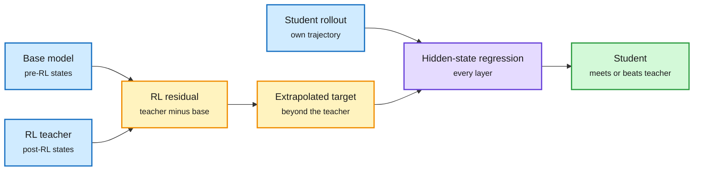

# On-Policy Distillation, Day Two: RIDE, Length Self-Distillation, OASIS and Selective Supervision

**Source:** HuggingFace Daily Papers, listed 2026-10-01 (seven distillation papers; RIDE was the day's #2 at 231 upvotes)
**Papers:** [RIDE / The Teacher Is a Direction](https://arxiv.org/abs/2609.36484) · [Length Self-Distillation](https://arxiv.org/abs/2609.38854) · [OASIS](https://arxiv.org/abs/2609.37915) · [S²D-OPD](https://arxiv.org/abs/2609.29142) · [DuoOPD](https://arxiv.org/abs/2609.33711) · [PivotOPD](https://arxiv.org/abs/2609.40285) · [AdviSD](https://arxiv.org/abs/2609.38142)
**Raw:** `raw/huggingface/2026-10-01-the-teacher-is-a-direction-*.md`, `-mitigating-the-length-scaling-tax-*.md`, `-overcoming-scaling-limits-*.md`, `-not-every-token-is-worth-distilling-*.md`, `-duoopd-*.md`, `-pivotopd-*.md`, `-advisd-*.md`

## TL;DR

On-policy distillation (OPD: the student generates its own answers and a teacher scores each token, so the student learns on the states it actually visits) had eight papers on 10-01. Seven more arrived today, and they sharpen one idea: **the useful signal is a direction, and it lives in a few places.**

- **RIDE** (RL-Induced Direction Extrapolation). Reinforcement learning shifts a model's hidden states away from its base checkpoint, and that shift can be measured at every layer. RIDE computes the residual between the RL teacher and its pre-RL base and pushes the student's hidden states *past* the teacher along that residual. Output-space extrapolation (the earlier way to let a student surpass its teacher) is noisy because the LM head shrinks most hidden-state change before it reaches the logits. RIDE matches or beats the RL teacher on all four base/teacher pairs and is the only method whose mean does so.
- **Length Self-Distillation (LSD).** RL makes answers longer even on problems the model already solves, a waste the authors call the length-scaling tax. LSD routes already-solved prompts to OPD against an EMA copy of the model itself and keeps the RL loss for unsolved ones. The tax falls from 19.0% to -3.7% on single-turn reasoning and from 31.4% to 13.7% on agentic tasks, with equal or better accuracy. No external teacher.
- **OASIS.** On-policy self-distillation (OPSD: the teacher is the same model given a reference solution) stops working with scale: its gain drops from 3.05 points at 1.7B to 0.14 at 8B. The cause is supervising unverified student rollouts. OASIS supervises mostly verified rollouts and needs only final-answer labels; it holds a 3.2 to 3.8 point gain through 8B.
- **S²D-OPD.** Direct-OPD (using the token log-ratio between a small model's post-RL and pre-RL checkpoints as the reward) can stay large even where the two checkpoints barely differ. Keeping only the top 10% of states by teacher-reference divergence improves accuracy in 7 of 8 settings, with no extra forward passes.
- **DuoOPD, PivotOPD, AdviSD.** DuoOPD uses whether the teacher and student each got the answer right to decide how feedback flows (+2.58 and +5.98 points over OPD). PivotOPD (NVIDIA) finds over half of failed agent rollouts contain an early "pivotal mistake" and distills both prevention and recovery (+5.5% on ALFWorld at 1.7B, +3.2% on SWE-bench Verified for a Nemotron student). AdviSD trains a small advisor to steer frozen Gemini and Claude executors, keeping only corrections that change the executor's response.

RIDE moves the student past the teacher, not onto it

The RL shift is measured inside the network, where it has not yet been flattened by the output head.

Blue is input models and rollouts, amber is the direction and its extrapolated target, purple is the training step, green is the result.

## How it relates to prior wiki pages

- **Confirms the 10-01 "OPD only reweights" finding.** The [10-01 OPD page](2026-10-01-opd-scaling-laws-saki-kl-free.md) reported a crosscoder study showing OPD creates no new features, and a KL-free paper showing only the update direction on a few high-disagreement tokens matters. Today RIDE makes "direction" literal (a residual vector per layer) and S²D-OPD makes "few tokens" literal (top 10% of states). Three papers in two days now say the same thing; that crosses the wiki's threshold for a pattern.
- **Extends "smaller teachers transfer better."** The 10-01 scaling-law paper found a small RL expert can lift a larger student past itself. S²D-OPD and RIDE both transfer an RL *delta* from a teacher pair, not the teacher's outputs, which is why teacher size matters less. LSD goes furthest: the teacher is the student's own moving average.
- **Bears on distillation security.** If the transferable signal is a sparse direction, the 09-30 [Distillation Defenses](../llms-foundation-models/2026-09-30-behavioral-shadows-active-taskless-distillation.md) result (output-level defenses break once the attacker adds RL) and OpenAI's 10-01 Moonshot disclosure describe defenders protecting a large surface while the attack needs a small one.
- **Ties to the length/cost thread.** LSD is a training-time cure for the "cheap per token, many tokens per task" problem the 10-01 digest flagged with Gemini 4 Argon.

## Gaps

- All results are at 1.7B to 8B students on math and agent suites; nobody has shown RIDE at frontier scale or outside reasoning.
- RIDE needs the teacher's pre-RL checkpoint, which closed labs never release; it is an open-weights method.
- None report wall-clock training cost against plain RL, which is the number that decides adoption.

Related: [Knowledge distillation](knowledge-distillation.md) · [RL for LLMs](../llms-foundation-models/rl-for-llms.md)
