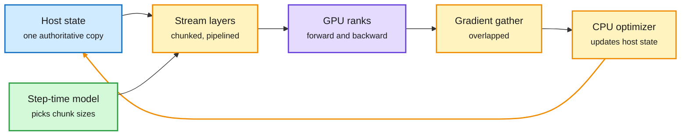

# SlideDP: Full Fine-Tuning Beyond GPU Memory Across Several GPUs

**Source:** HuggingFace Daily Papers, listed 2026-10-01 · [arXiv 2609.34162](https://arxiv.org/abs/2609.34162) · [code](https://github.com/RegiaYoung/SlideDP)
**Raw:** [raw/huggingface/2026-10-01-slidedp-scaling-host-resident-llm-fine-tuning-across-multipl.md](../../raw/huggingface/2026-10-01-slidedp-scaling-host-resident-llm-fine-tuning-across-multipl.md)

## TL;DR

Host-resident training keeps the model's weights and optimizer state in CPU memory and streams layers to the GPU as needed, so a model bigger than GPU memory can be fully fine-tuned. With several GPUs on one host, each data-parallel rank used to pull its own copy of every layer over the same PCIe links and fight for the same CPU, so adding GPUs barely helped. **SlideDP** keeps one authoritative copy of the state on the host, separates how data travels from how it is stored, and pipelines three things across ranks and chunks: sending parameters out, gathering gradients back, and running the CPU optimizer step. An analytical step-time model picks chunk sizes and activation policy for a given GPU memory budget. Results: **1.46x to 2.64x** geometric-mean throughput over SlideFormer, MegaTrain and ZeRO-Offload; on four H100s with a large batch it processes over 1M tokens per step and beats GPU-resident FSDP2's measured peak by 11.2%; it supports 256K-token sequences on Qwen3-14B; and it fine-tunes **Qwen2.5-72B on four RTX 4090s**.

One copy on the host, many GPUs fed in a pipeline

The fix is to stop each GPU from fetching its own copy of every layer.

Blue is host memory, amber is the pipelined loop, purple is GPU compute, green is the planner.

## How it relates to prior wiki pages

- **Cost lens for the OPD wave.** Every distillation recipe on [10-01](2026-10-01-opd-scaling-laws-saki-kl-free.md) and [10-02](2026-10-02-opd-wave-ride-lsd-oasis.md) tests at 1.7B to 8B because full fine-tuning of larger students needs a cluster. A 72B full fine-tune on four consumer GPUs moves that ceiling.
- **Memory hierarchy thread.** Same logic as SSD-tier KV caches ([memory hierarchy](../hardware/memory-hierarchy.md)): put capacity in cheap memory and hide the transfer with pipelining.

## Gaps

- Throughput for the 4x4090 72B run is not given in the abstract; it may be slow enough to matter only for small datasets.
- Beating FSDP2's "measured peak" uses a larger batch than FSDP2 could fit, so it is not a like-for-like comparison.

Related: [GPU kernels](../hardware/gpu-kernels.md) · [Memory hierarchy](../hardware/memory-hierarchy.md)
