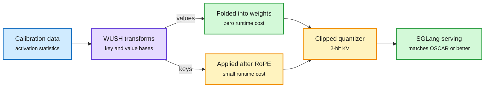

# WUSH-KV: 2-bit KV-Cache Quantization with Data-Adaptive Transforms

**Source:** HuggingFace Daily Papers, listed 2026-10-01 · [arXiv 2609.38121](https://arxiv.org/abs/2609.38121)
**Raw:** [raw/huggingface/2026-10-01-wush-kv-kv-cache-quantization-with-data-adaptive-transforms.md](../../raw/huggingface/2026-10-01-wush-kv-kv-cache-quantization-with-data-adaptive-transforms.md)

## TL;DR

KV cache memory and bandwidth grow with context length and batch size, so squeezing each cached number into 2 bits is one of the biggest serving levers. Low-bit quantization fails when a few channels carry outliers, so methods first apply a **rotation** (a change of basis that spreads outliers across channels) before rounding. Most use a fixed transform such as a Hadamard matrix. WUSH-KV instead builds the transform **from calibration data**, using the second-order statistics (covariances) of both sides of the matrix product the cache feeds into. Keys and values get separate transforms. The value transform is folded into the model weights, so it costs nothing at runtime; the key transform is applied after RoPE (the rotary position encoding). Paired with the QuEST INT clipped quantizer, the authors prove the transform is near-optimal under mild assumptions. Integrated into SGLang with OSCAR-style percentile-clipped affine quantization, **2-bit WUSH-KV matches or beats the OSCAR transform on every model and task tested**.

A learned rotation makes the cache easy to round

The value rotation is free because it folds into weights; only keys pay a runtime transform.

Blue is data, purple is the learned transform, amber is runtime work, green is free or final.

## Key findings

- **Data-aware beats fixed rotations** on layerwise reconstruction error and end-to-end perplexity among tested transforms.
- **Near-optimality proof** for the WUSH transform with the QuEST INT quantizer.
- **2-bit KV in a real engine (SGLang)**, at least on par with OSCAR across models and downstream tasks.

## How it relates to prior wiki pages

- **Third rotation-for-quantization paper in a week.** [PrismQuant (10-01)](2026-10-01-prismquant-quantized-softmax.md) rotated activations to fit the quantizer and reached W4A4KV4 within 0.22 points on 70B. WUSH-KV pushes the KV side to 2 bits with a data-derived rotation. The 09-11 page on [why post-training quantization works](2026-09-11-why-post-training-quantization-works.md) argued rotations succeed by making the rounding error look like isotropic noise; a covariance-matched transform is the direct optimization of that idea.
- **Interacts with the 10-01 phase finding.** [Periodic Weak Spots (10-01)](2026-10-01-periodic-weak-spots-chunked-kv-phase.md) showed averages hide position-specific KV failures. WUSH-KV reports averages only; a per-position retrieval test at 2 bits would be the right stress test.

## Gaps

- Calibration-data dependence: no held-out-domain test of the learned transforms is reported in the abstract.
- No throughput or memory numbers in the abstract; the key-side transform adds a matmul per decode step.

Related: [Quantization](quantization.md) · [KV cache](kv-cache.md)
