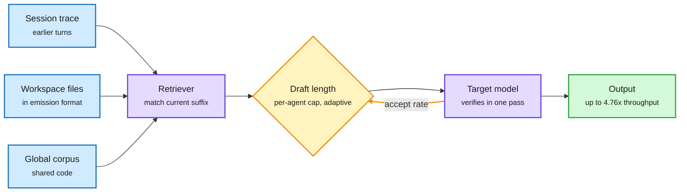

# AgSpec: Coding Agents Repeat Themselves, So Copy the Draft

**Source:** HuggingFace Daily Papers, 2026-10-02 · [arXiv 2610.01108](https://arxiv.org/abs/2610.01108)
**Raw:** [raw/huggingface/2026-10-02-agspec-pushing-the-limits-of-retrieval-based-speculative-dec.md](../../raw/huggingface/2026-10-02-agspec-pushing-the-limits-of-retrieval-based-speculative-dec.md)

## TL;DR

Speculative decoding guesses several tokens cheaply, then lets the big model verify them in one pass; every accepted guess is a decode step saved. Retrieval-based drafters guess by copying a continuation from existing text, with no draft model at all. Coding agents are ideal for this because they keep re-emitting code, logs and earlier attempts. But existing retrieval drafters miss in agent pipelines for two reasons: the reusable text is not in their corpus (or is stored in a different format from what the agent writes), and they use one fixed draft length although acceptance varies by agent and drifts over turns. AgSpec fixes both. It retrieves from three corpora (the live session trajectory, the workspace files the agent opened, indexed in the agent's own output format, and a global corpus), caps each agent's draft length from an offline profile, and adapts it online from verification feedback. On two repository-level multi-agent coding benchmarks it beats five retrieval drafters and EAGLE-3 (a trained draft-head method) in most settings, with up to **4.37x throughput at batch 1 and 4.76x at batch 16** over plain autoregressive decoding.

The agent's own history is the draft model

Three corpora feed the drafter; a per-agent cap keeps guesses the right length.

Blue is a text source, purple is retrieval and verification, amber is the adaptive length loop, green is the output.

## Key findings

- **Speedup holds at batch 16** (4.76x), where speculative decoding usually loses its edge because the GPU is already busy.
- **Format matters:** indexing opened files in the agent's emission format (how it would print them) is part of the gain.
- **Generalizes** to coding benchmarks without a repository or multi-agent pipeline.

## How it relates to prior wiki pages

- **The draft model keeps disappearing.** [Speculative decoding page](speculative-decoding.md): 09-18 "the draft model becomes optional"; 09-30 WaveFront used a looped model's early loops as drafts. AgSpec drafts from the agent's own trajectory. Three different ways in three weeks to get drafts for free.
- **Same reuse logic as Galahad (10-02) and HeteroFold (10-03).** Agent workloads are dominated by repeated text; Galahad skips its prefill, AgSpec skips its decode.

## Gaps

- Gains depend on how repetitive the agent is; open-ended reasoning traces will see less.
- No numbers on tail latency or interaction with prefix caching under a real serving scheduler.

## Related

[Speculative decoding](speculative-decoding.md) · [KV cache](kv-cache.md)
