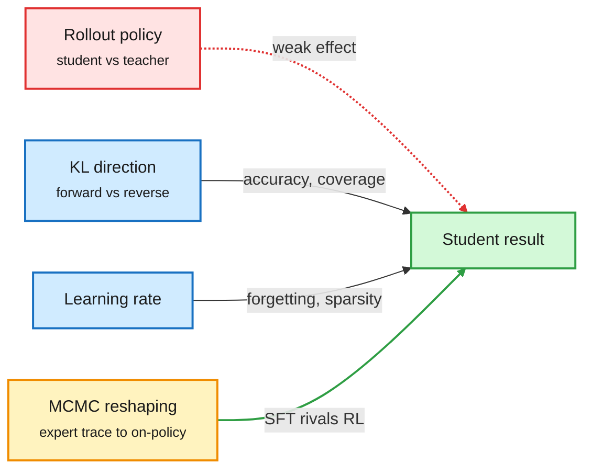

# Distillation, Day Three: Rollout Policy Matters Less Than the KL Direction

**Sources:** HuggingFace Daily Papers 2026-10-02: [On-Policy or Off-Policy? arXiv 2609.35259](https://arxiv.org/abs/2609.35259) · [Neighborhood OPSD, arXiv 2609.39687](https://arxiv.org/abs/2609.39687) · [Smaller Models, Better Rejects, arXiv 2609.38987](https://arxiv.org/abs/2609.38987). X feed: [Finetuning with Sampling](https://aakaran.github.io/finetuning_with_sampling/) (Harvard; [@aakaran31](https://x.com/aakaran31/status/2106037829059133903), [@du_yilun](https://x.com/du_yilun/status/2106044151892693270)); [alphaXiv self-distillation wiki](https://www.alphaxiv.org/wiki/self-distillation).
**Raw:** [On/Off-policy](../../raw/huggingface/2026-10-02-on-policy-or-off-policy-learning-a-systematic-study-of-disti.md) · [N-OPSD](../../raw/huggingface/2026-10-02-better-supervision-is-nearby-neighborhood-on-policy-self-dis.md) · [Rejects](../../raw/huggingface/2026-10-02-smaller-models-better-rejects-preference-distillation-scalin.md)

## TL;DR

The controlled study is the anchor. It separates three things earlier SFT-vs-RL comparisons mixed together: rollout policy (who wrote the training sequences, student or teacher), token-level KL direction, and learning rate, across Llama3 and Qwen2.5 on science, medical and arithmetic reasoning. Result: **rollout policy is not the main driver**. KL direction shapes accuracy and output coverage. Forward KL (make the student cover everything the teacher might say) is robust to who wrote the rollouts; reverse KL (make the student commit to the teacher's main mode) is sensitive and prefers student rollouts. **Learning rate, not on-policyness, governs forgetting and update sparsity.** On-policy data still helps on harder Countdown variants, but that edge does not reliably survive a later RLVR stage (RL with verifiable rewards).

Three companions push the same way. **Finetuning with Sampling** (Harvard) keeps SFT's off-policy expert data but runs an MCMC sampler (Metropolis-Hastings) that moves each expert trace toward what the model itself would write, while staying faithful to the expert's answer. SFT on those samples rivals RL and on-policy distillation, often generalizing better and forgetting less. **Neighborhood OPSD** adds small parameter perturbations of the privileged teacher, builds a pool of frozen "nearby" experts that correct different positions, and routes each student state to the best one: +2.75, +1.67, +1.94 Average@12 on AIME/HMMT for Qwen3 1.7B/4B/8B. **Smaller Models, Better Rejects** finds that in preference distillation, rejected answers from *smaller* frozen models train stronger 7B to 72B students than the student's own failures, at lower compute, and lower-likelihood rejects beat higher-likelihood ones.

Three knobs, and the famous one is the weakest

Controlled study of strong-to-weak distillation.

Red is the knob that matters least, blue the two that matter, amber the sampling fix, green the trained student.

## How it relates to prior wiki pages

- **Explains the 10-01 finding.** The crosscoder study (10-01) said OPD only reweights features the student already has. If on-policy rollouts are not the active ingredient, that is what you would expect: the gain comes from the objective, not the data's origin.
- **Complicates the 10-02 "teacher is a direction" pattern.** [RIDE and the OPD wave (10-02)](2026-10-02-opd-wave-ride-lsd-oasis.md) argued the useful signal is a sparse direction. The new study says learning rate controls update sparsity, so some of the sparsity those papers credit to the method may be a hyperparameter effect. Open question.
- **Smaller rejects echo SAKI and Distillation Defenses (Kurate, 09-29).** Cheap, structured negatives are enough; the teacher does not have to be large on both sides.
- **alphaXiv's self-distillation wiki** (built from author interviews) lists the field's failure modes: biased teacher guidance, forgetting across successive updates, unclear measurement. The study's learning-rate finding is the cleanest handle on the second.

## Gaps

- The study stops at 8B-class students and reasoning tasks; agentic distillation is untested.
- Finetuning with Sampling's compute cost per trace (MCMC steps) is not compared with RL's rollout cost.

## Related

[Knowledge distillation](knowledge-distillation.md) · [RL for LLMs](../llms-foundation-models/rl-for-llms.md) · [Sampling vs RL (10-03)](../llms-foundation-models/2026-10-03-sampling-vs-rl-ppt-sharpening-tax.md)
