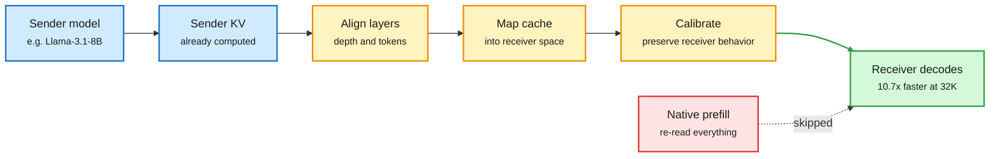

# HeteroFold: Hand a KV Cache to a Model From a Different Family, Skip the Prefill

**Source:** HuggingFace Daily Papers, 2026-10-02 · [arXiv 2609.32259](https://arxiv.org/abs/2609.32259)
**Raw:** [raw/huggingface/2026-10-02-prefill-free-cross-family-kv-cache-transfer-for-heterogeneou.md](../../raw/huggingface/2026-10-02-prefill-free-cross-family-kv-cache-transfer-for-heterogeneou.md)

## TL;DR

Multi-agent systems now mix model families: a Llama planner, a Mistral coder, a Qwen checker. When they talk in text, every receiver has to prefill (run the full attention pass over) the shared context the sender already processed. Reusing the sender's KV cache (the stored attention keys and values) would skip that, but two different families disagree on tokenizer, depth and the geometry of their keys and values. HeteroFold keeps both models frozen and does three things: aligns the two layer stacks, maps the sender's cache into the receiver's space, and calibrates the mapped cache so the receiver behaves as if it had read the text itself. At 32K context, Llama-3.1-8B to Ministral-3-14B is **10.7x faster than native prefill** and 1.18x to 1.47x faster than the prior prefill-free baselines (Dense Latent, KV Ridge). It is best on all four long-context benchmarks across six transfer directions and matches text communication on a multi-agent benchmark.

The receiver never reads the transcript

Three frozen-model steps turn a foreign cache into a usable one.

Blue is the sender side, amber is the three transfer steps, red is the prefill that gets skipped, green is the receiver's output.

## Key findings

- **Both models stay frozen.** No fine-tuning of sender or receiver; the transfer is a fitted mapping plus calibration.
- **Best cache transfer on all four long-context benchmarks** across six direction pairs, and most short-context settings.
- **Matches text-based communication** on a multi-agent benchmark, so the speedup does not cost task quality there.
- **10.7x over native prefill at 32K**, 1.18x to 1.47x over Dense Latent and KV Ridge.

## How it relates to prior wiki pages

- **Answers the open question from C2C (09-18).** [C2C (09-18)](2026-09-18-c2c-cache-to-cache-communication.md) projected one model's cache into another with a trained per-layer fuser and gate. The 09-18 note asked how much cache structure two independently trained models share. HeteroFold is the first entry that crosses *families* with tokenizer and depth mismatch, and does it without training either side. Partial answer: enough structure is shared that a mapping plus calibration recovers receiver behavior.
- **Extends the cross-agent sharing axis.** [KVCMAS and PReCache (09-30)](2026-09-30-kvcmas-precache-multi-agent-kv-sharing.md) shared one cache across agents built on the *same* base model. HeteroFold removes the same-base requirement. The sharing ladder on the [KV cache page](kv-cache.md) is now cross-layer, cross-tier, cross-agent, cross-family.
- **Complements Galahad (10-02).** [Galahad](2026-10-02-galahad-stateful-kv-reuse.md) reuses a cache across *requests* to one model; HeteroFold reuses it across *models*. Both attack the same waste: re-reading text already read.

## Gaps

- The largest pair is 8B to 14B. Frontier-scale and MoE receivers are untested.
- The mapping is fitted per direction pair. How much calibration data each new pair needs, and how fast it goes stale after a model update, is not reported.
- No end-to-end serving numbers (memory traffic of moving the cache between GPUs or nodes) beyond the prefill comparison.

## Related

[KV cache](kv-cache.md) · [Multi-agent systems](../agentic-systems/multi-agent-systems.md) · [C2C (09-18)](2026-09-18-c2c-cache-to-cache-communication.md)
