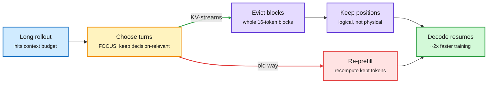

# KV-streams and FOCUS: Compact the Agent's Context Without Paying Twice

**Sources:** [KV-streams repo](https://github.com/Emilianopp/KV-streams) (surfaced on the X Following feed via [@_avichawla](https://x.com/_avichawla/status/2105966570690461851)) · FOCUS, [arXiv 2609.37590](https://academy.dair.ai/papers/focus-training-free-decision-preserving-context-compression-for-llm-agents-2609.37590) (Microsoft M365 Research, via [@dair_ai](https://x.com/dair_ai/status/2105915729812050342))
**Raw:** `raw/twitter/feed/2026-10-02-*-ranked.json` (private feed capture; linked article bodies enriched by the farmer)

## TL;DR

Two pieces on the same problem: long agent runs outgrow their context, so something must be dropped. **KV-streams** fixes the *cost* of dropping. In agentic RL (reinforcement learning on multi-turn agent rollouts), most systems "re-prefill" after compaction: they build a shorter sequence and push every kept token through the model again, rebuilding the KV cache each time. KV-streams is a vLLM 0.19 fork that instead evicts the oldest post-prompt blocks straight out of the live cache. Two fixes make that legal. Keys were already rotated by RoPE (rotary position encoding) at their original position, so the cache tracks logical position separately from physical slot. And vLLM stores KV in 16-token blocks behind a block table, so KV-streams drops whole blocks and repacks the table so the attention kernel never reads a hole. The reported effect is nearly **2x faster agent RL training**. **FOCUS** fixes *what* to drop. It asks which past interaction units the agent's next decisions causally depend on, keeps those, drops the rest, and needs no training, so it runs in front of closed-API models. It cuts peak context by up to **48%** and raises task success by up to **8.9 points** over keeping full history.

Compaction without a second prefill

Cut dropped turns out of the live cache instead of rebuilding a shorter one.

Blue is input, amber is the selection decision, red is the wasted recompute path, purple is the in-place cache edit, green is the result.

## Key points

- **Eviction is block-granular.** The scheduler evicts the oldest post-prompt blocks one `compaction-stride` at a time once a request exceeds `compaction-window-size`. The request becomes physically shorter, so attention also gets cheaper.
- **Position bookkeeping is the subtle part.** New queries and keys continue the original position count; kept keys keep their original rotations. Get this wrong and the model sees a scrambled history.
- **FOCUS is training-free and model-agnostic.** It reports a 73% cut in "dependency" alongside the 48% peak-context cut.
- **Evidence quality:** KV-streams is a 4-star research repo with an X explainer, no paper yet; the 2x is the authors' claim. FOCUS has an arXiv abstract and DAIR curation.

## How it relates to prior wiki pages

- **Same failure as Context Language Models (10-01).** [CLMs (10-01)](../agentic-systems/2026-10-01-context-language-models.md) found that editing the context breaks prefix caching and built Suffix Cache Reuse (35% less server compute). KV-streams is the training-side version: compaction normally destroys the cache; keep it alive instead.
- **Same direction as Galahad (10-02).** [Galahad](2026-10-02-galahad-stateful-kv-reuse.md) measured that 98.7% of prompt tokens are re-reads. KV-streams removes a different re-read: the one compaction forces.
- **FOCUS vs learned compressors.** Prior wiki compressors were trained ([MemFold](../agentic-systems/agent-memory.md) style soft memory, distilled compressors). FOCUS claims test-time causal selection beats them without data.
- **Practitioner echo:** NVIDIA's Long-Transduction (accuracy falls 62.8% from 4K to 128K on simple repetitive work) says long histories hurt quality, not only cost. FOCUS's gain in success rate is consistent.

## Related

[KV cache](kv-cache.md) · [Agent memory](../agentic-systems/agent-memory.md) · [RL for LLMs](../llms-foundation-models/rl-for-llms.md)
