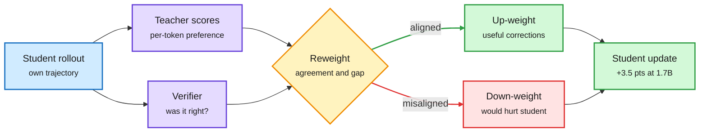

# R²-OPD: reward-aligned reweighting for on-policy distillation

**TL;DR.** On-policy distillation (OPD: the student generates its own answers and a stronger teacher scores every token) weights every token's correction equally. That treats "the teacher would have written something else here" as if it always helped. It doesn't: a correction can push the student off a path it was about to finish correctly, or onto one it cannot execute. R²-OPD (arXiv 2609.35517, Kurate cs.LG #10) uses two signals to reallocate supervision continuously: whether the trajectory's verified outcome agrees with the teacher's correction, and how strongly teacher and student disagree. Reward-aligned corrections get more weight; dense feedback is kept rather than hard-filtered. It **beats standard OPD on all seven math benchmarks**, by **+3.5 points average for a 1.7B student and +2.4 for 4B**, and +1.6 on code.

Not every teacher correction deserves the same weight

Outcome agreement decides how loud each token's correction is.

Blue is the student's rollout, purple the two scorers, amber the reweighting, green kept signal, red damped signal.

## Key findings

- Formalizes the mismatch between local teacher preference and the student's continuation value, with sufficient conditions under which reallocation improves first-order task progress over uniform OPD.
- Highest average accuracy among compared methods in both cross-size and same-size distillation.

## How this relates to prior wiki pages

- **Fourth token-weighting answer to "which teacher tokens matter".** TIP (04-16) found most teacher tokens carry no signal and kept about 10%; SAKI (10-01) used maximal coupling to route teacher supervision only where student and teacher distributions diverge; MOPD-Router (09-29) picked a teacher per token. R²-OPD is the first on this wiki to weight by the *verified outcome* of the student's own continuation, which ties OPD to RLVR rewards. See [knowledge-distillation](knowledge-distillation.md).
- **Tension with 10-03's distillation-dynamics study**, which found KL direction and learning rate matter more than rollout policy. If learning rate shapes update sparsity, some of R²-OPD's gain could come from effectively changing the step size on misaligned tokens. Unresolved.
- **Sharpening Tax (10-03)** argued post-training mostly sharpens what the base already knows. R²-OPD's down-weighting of corrections the student "cannot reliably execute" is consistent with that: distillation helps most where the student is already close.

## Gaps

- Math and code only, 1.7B and 4B students. Needs a verifier, so it does not apply to open-ended tasks where OPD is most attractive.

**Raw source:** [Kurate cs.LG leaderboard](../../raw/kurate/2026-10-04-cs-lg.md); paper linked above.
