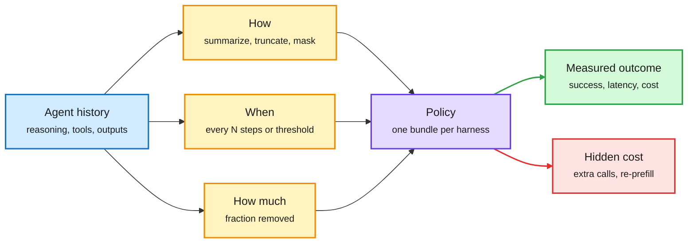

# Beyond Token Savings: a systematic study of context compression in LLM agents

**TL;DR.** A UT Austin group (Satish, Sinha, Kawada, Yadwadkar; arXiv 2609.32961) splits an agent's context-compression policy into three separate decisions: **how** to compress (the mechanism), **when** to trigger it, and **how much** to remove. They vary each one across three open-weight models on SWE-bench Verified and Terminal-Bench 1.0, in nearly **35,000 agent runs**, and measure success, tokens, end-to-end latency and estimated cost. The headline: **fewer tokens is not the same as faster or cheaper**. On Terminal-Bench with Qwen, policies that use about a third of the tokens can take **20% to 80% longer** than the uncompressed agent, because summarization calls and extra steps add wall-clock time. The motivating trace is large: in 13 million GitHub Copilot sessions, sessions that need compaction account for **44.2% of tokens served**, and the median compaction removes **72.8%** of the context.

A compression policy is three knobs, and token count measures none of them well

Each knob moves latency and success differently, and the best setting changes with the model.

Blue is the input history, amber are the three decisions, purple is the bundled policy, green is what you should measure, red is the cost token counts hide.

## Key findings

- **Token savings and speed diverge.** On Terminal-Bench with Qwen, about one third the tokens can mean 20% to 80% longer runs.
- **The trigger matters most for call count.** Step-triggered policies cut the most tokens per step but need 10% to 27% more model calls. Stacked threshold-triggered policies cut tokens by 22% to 55% with call counts close to full context.
- **Policies do not transfer across models.** The same policy (OTRC) reaches 51.3% with Qwen but drops Devstral to 38.7% and makes it slower. Raising the trigger threshold from 10K to 20K lifts Qwen from 50.7% to 73.3% on a SWE-bench subset, while Devstral stays near 72%.
- **Similar scores hide different solved sets.** Two policies with similar overall success solve different tasks, so a per-task router over compression policies is plausible.

## How this relates to prior wiki pages

- **The cost-side check on a week of "learned compaction" papers.** AutoCompact ([10-04](../agentic-systems/2026-10-04-autocompact-learned-compaction.md)) trained the agent to decide when to compact and gained 9.2 points on SWE-bench Verified, but never reported latency or cache cost. FOCUS ([10-03](2026-10-03-kv-streams-and-focus-context-compaction.md)) cut peak context 48% training-free. Context Language Models ([10-01](../agentic-systems/2026-10-01-context-language-models.md)) let the model edit its own context as a file. This study says token reduction is the wrong scoreboard for all three: measure wall-clock and dollars per solved task.
- **Explains the AutoCompact gap flagged on 10-04.** That page's Gaps note warned that every compaction invalidates the prefix cache (the stored KV states of an unchanged prompt prefix), so learned compaction could raise the bill. This study measures the related latency effect directly: compression adds summarization calls and steps.
- **Matches the Kepler cost audit (10-04)**, where a perfect ARC-AGI-3 run cost $778, mostly in cache reads. If most agent input is cheap cache hits, cutting tokens saves little money but each compaction forces a fresh prefill.
- **Confirms "no universal policy"**, the same lesson as the multi-harness RL result (10-03: same weights scored 62% vs 33% by harness). Context policy, like harness, is model-specific.
- Updates [kv-cache](kv-cache.md), [test-time-compute-allocation](test-time-compute-allocation.md) and [agent-memory](../agentic-systems/agent-memory.md).

## Gaps

- Open-weight models only (Qwen, Devstral and one more). Frontier APIs with cheap cache reads may shift the cost picture further against aggressive compaction.
- Cost is estimated, not billed. Prefix-cache invalidation is not modeled explicitly per provider.
- No learned policy (AutoCompact style) in the comparison grid, so "learned beats fixed" remains untested on latency.

## Research angle

The natural next step is a cost model that predicts, per model and per task, the latency and dollar effect of a compaction before it happens, using cache-hit share, prefill speed and expected extra calls. That turns compaction into a routing decision over policies. A second open question: does KV-level compression (dropping cache entries without re-prefill, like KV-streams on 10-03) remove the latency penalty this study measures for text-level summarization?

**Raw source:** X Following feed, 2026-10-05 ([@omarsar0](https://x.com/omarsar0/status/2106927371366596692)); paper linked above.
